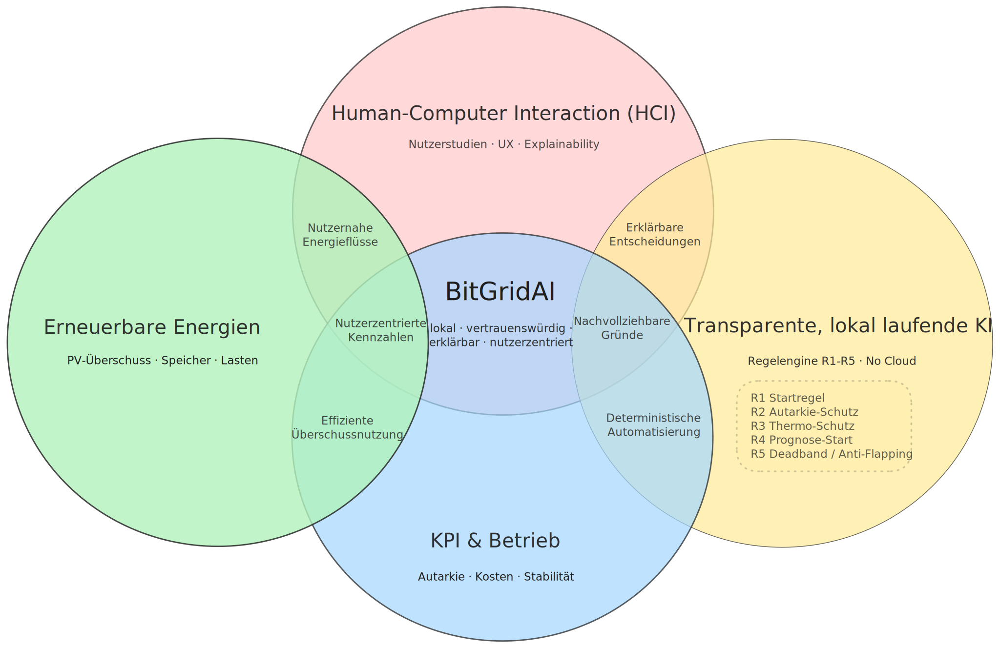

# 01 – Einführung und Ziele / Introduction and Goals

> **Kurzüberblick:**
>
> BitGridAI erforscht lokale, erklärbare Energieautomatisierung ohne Cloud.  
> PV-Überschuss wird als flexible Last (u. a. Bitcoin-Mining) genutzt.  
> Fokus: Transparenz, Vertrauen, Sicherheit und Wiederholbarkeit.

> **TL;DR (EN):**
>
> BitGridAI researches local, explainable energy automation with no cloud.  
> PV surplus is used as a flexible load (incl. Bitcoin mining).  
> Focus: transparency, trust, safety, and reproducibility.

---

## Zweck / Purpose

BitGridAI untersucht, wie lokale Energieautomatisierung **erklärbar, vertrauenswürdig und nutzerzentriert** gestaltet werden kann. Das Projekt verbindet Human-Computer Interaction (HCI), erneuerbare Energien und **transparente, lokal laufende KI** zu einem einheitlichen Systemansatz.

> BitGridAI explores how **local** energy automation can become **explainable, trustworthy, and user-centered**.  
> It combines Human-Computer Interaction (HCI), renewables, and **transparent on-device AI** into one cohesive approach.

Die Regelengine (R1–R5) ist das operative Gewissen von BitGridAI: 
- **R1 Startregel** sorgt dafür, dass Mining nur bei ausreichendem PV‑Überschuss und sinnvollem Strompreis startet. 
- **R2 Energie & Autarkie-Schutz** schützt Energiehaushalt und Autarkie, indem der Speicher genügend Reserve für Haushalt behält.
- **R3 Thermo- & Hardware-Schutz** überwacht Thermik und Hardware und bremst oder stoppt die Last bei Übertemperaturen. 
- **R4 Prognose-Start** koppelt Schaltentscheidungen an robuste Kurzfrist‑Prognosen, bevor der nächste Block geplant wird.
- **R5 Stabilität / Anti-Flapping** sichert Stabilität durch Deadband/Anti‑Flapping, damit das System nicht nervös an‑ und ausschaltet.

> The rule engine (R1–R5) is the operational conscience of BitGridAI:
> - **R1 Start Rule** ensures mining only begins when PV surplus is sufficient and the electricity price is reasonable.
> - **R2 Energy & Self-Sufficiency Protection** safeguards the household energy budget and self-sufficiency by keeping enough battery reserve for the home.
> - **R3 Thermal & Hardware Protection monitors** thermals and hardware, throttling or stopping the load if temperatures exceed limits.
> - **R4 Forecast Start links switching decisions** to robust short-term forecasts before the next block is scheduled.
> - **R5 Stability / Anti-Flapping** enforces stability via a deadband/anti-flapping window so the system doesn’t nervously switch on and off.

Das System orientiert sich an Bitcoin-nahen Leitmotiven. Der Grundsatz „*Bitcoin ist Zeit*“ beschreibt einen stabilen, zyklischen Takt, der im Bitcoin-Netzwerk durch die etwa zehnminütige Blockzeit entsteht. BitGridAI übernimmt diesen zeitlichen Rahmen als determinischen Automatisierungsrhythmus, um Schaltentscheidungen zu glätten, Lastwechsel zu synchronisieren und instabiles Flapping zu vermeiden. 

*Proof of Work* dient gleichzeitig als klar definierte energetische Schnittstelle und als flexible Last, die lokal erzeugte Überschussenergie nicht ungenutzt lässt, sondern in durch physikalische Arbeit abgesicherte Wertschöpfung überführt. Auf diese Weise können im Privathaushalt PV-Erzeugungsspitzen gezielt abgefangen, das Verteilnetz entlastet, der Eigenverbrauch gesteigert und netzschädliche Rückspeisespitzen reduziert werden. BitGridAI trifft alle Entscheidungen vollständig lokal, deterministisch und erklärbar entsprechend den Regeln R1 bis R5, wodurch Stabilität, Dezentralisierung und Sicherheit gegenüber einer globalen Skalierungslogik priorisiert bleiben.

> The system is guided by Bitcoin-aligned design principles. The notion that “*Bitcoin is time*” refers to the stable, cyclical rhythm created by the network’s approximately ten-minute block interval. BitGridAI adopts this temporal structure as a deterministic automation cadence that smooths switching behaviour, synchronizes load transitions, and prevents unstable flapping.
>
> *Proof of Work* functions simultaneously as a clearly defined energetic interface and as a flexible load that ensures locally generated surplus energy is not wasted but instead converted into value secured through physical work. In a residential setting, this makes it possible to absorb PV generation peaks, reduce stress on the distribution grid, increase self-consumption, and mitigate harmful feed-in spikes. BitGridAI executes all decisions locally, deterministically and with full explainability according to rules R1 to R5, ensuring that stability, decentralization and safety are prioritized over global optimization or cloud-dependent control models.

---

## Ziele / Goals
1. **Erklärbare Energieautomatisierung entwickeln**: BitGridAI verfolgt das Ziel, ein Energiemanagementsystem zu schaffen, das sämtliche Entscheidungen vollständig transparent begründet. Jede Aktion (Start, Stop, Hold, Level-Set) wird mit Reason, Trigger und Parametern dokumentiert und in einem versionierten, auditierbaren Format gespeichert. Dadurch entsteht eine robuste Grundlage für Vertrauen, wissenschaftliche Nachvollziehbarkeit, Wiederholbarkeit und XAI-basierte Evaluation realer Energiesysteme.

3. **Stärkung von Nutzervertrauen, Kontrolle und mentalen Modellen**:   Das System stellt verständliche, konsistente und zeitnahe Erklärungen bereit, die Nutzer in die Lage versetzen, Energieentscheidungen korrekt zu interpretieren, zu hinterfragen und bei Bedarf zu überschreiben. Interfaces, Decision-Timeline und Next-Block-Vorschau fördern ein stabiles mentales Modell über Energieflüsse, Systemlogik und Handlungskonsequenzen.
   
4. **Umsetzung eines vollständig lokalen, datensouveränen Energiesystems**:   Die Architektur ist vollständig lokal-first ausgelegt. Messwerte, Regelwerke, Modelle, Erklärungen und Logs verbleiben auf dem Edge-Gerät und werden nicht an externe Dienste übertragen. Diese Ausrichtung erhöht Datenschutz und Betriebssicherheit und verhindert intransparentes Cloud-Tuning.
   
5. **PV-Überschuss zielgerichtet in flexible Lasten überführen**:   Überschussenergie aus photovoltaischer Erzeugung wird sinnvoll genutzt, statt ungenutzt zu bleiben oder netzschädlich rückgespeist zu werden. Proof-of-Work-basierte Mining-Lasten fungieren dabei als dynamisch regulierbarer Energiesenke, welche Überschussenergie kontrolliert in physikalisch abgesicherte Wertschöpfung überführt.
   
6. **Block-Rhythmus als stabile Entscheidungsbasis nutzen**:   Der durch Bitcoin etablierte zehnminütige Blocktakt dient als deterministische Zeiteinheit im System. Dieser Rhythmus reduziert Schaltflattern, synchronisiert Lastwechsel und schafft ein stabiles, vorhersehbares Automatisierungsmodell.
 
7. **Nachhaltigkeit durch Lastverschiebung und Autarkie fördern**:   Die Architektur ist darauf ausgerichtet, Eigenverbrauch zu erhöhen, Batterieentladung strategisch zu steuern und Netzbezug spürbar zu reduzieren. Nachhaltigkeit wird sowohl technisch (Energieeffizienz) als auch menschzentriert (Bewusstsein, Verhalten, Klarheit) adressiert.
   
8. **Offene Forschung und Wiederverwendbarkeit ermöglichen**:   Alle Datenformate, Modelle und Tools sind reproduzierbar strukturiert. Ziel ist eine offene, nachvollziehbare Forschungsumgebung, die in Lehre, Projekten und zukünftigen Studien wiederverwendet werden kann.

> 1. Develop explainable energy automation: BitGridAI aims to create an energy management system in which all decisions are fully transparent and justified. Every action (start, stop, hold, level-set) is documented with its reason, trigger, and parameters and stored in a versioned, auditable format. This provides a rigorous foundation for trust, scientific traceability, reproducibility, and XAI-based evaluation of real-world energy systems.
>
> 2. Strengthen user trust, control, and mental models: The system provides clear, consistent, and timely explanations that enable users to correctly interpret, question, and—if necessary—override energy decisions. Interfaces such as the decision timeline and next-block preview support the formation of stable mental models regarding energy flows, system logic, and behavioral consequences.
>
> 3. Implement a fully local, data-sovereign energy system: The architecture follows a strict local-first approach. Measurements, rule sets, models, explanations, and logs remain on the edge device and are never transmitted to external services. This increases privacy, operational resilience, and reproducibility while preventing any form of opaque cloud-side optimization.
>
> 4. Convert PV surplus into flexible loads with purpose: Surplus energy from photovoltaic generation is meaningfully utilized rather than wasted or fed into the grid in destabilizing peaks. Proof-of-Work mining loads serve as a dynamically controllable energy sink that transforms surplus energy into physically secured value creation.
>
> 5. Use the block rhythm as a stable decision cadence: The ten-minute block interval established by Bitcoin provides the deterministic time unit for scheduling. This rhythmic structure reduces switching noise, synchronizes load transitions, and creates a stable, predictable automation model.
>
> 6. Promote sustainability through load shifting and self-sufficiency: The architecture is designed to increase self-consumption, manage battery discharge strategically, and measurably reduce grid import. Sustainability is addressed both technically (energy efficiency, demand shaping) and human-centrically (awareness, behavior, clarity).
>
> 7. Enable open research and reusability: All data formats, models, and tools follow a reproducible structure. The goal is to provide an open, transparent research environment that can be reused in teaching, projects, and future studies.

---

## Qualitätsziele / Quality Goals
| Qualität | Beschreibung |
|---|---|
| **Transparenz** | Jede Entscheidung ist nachvollziehbar (Reason, Trigger, Parameter). |
| **Autonomie** | Vollständig lokaler Betrieb; keine externen Abhängigkeiten. |
| **Nachhaltigkeit** | Effiziente Nutzung erneuerbarer Energie & Lastverschiebung. |
| **Vorhersagbarkeit** | Deterministische Regeln, Deadband/Anti-Flapping. |
| **Sicherheit** | Thermo-Schutz und Fail-States (Stop → Safe). |
| **Reproduzierbarkeit** | Offene Daten, modulare Architektur, klare KPIs. |

> | Quality | Description |
> |---|---|
> | **Transparency** | Every decision is explainable (reason, trigger, parameters). |
> | **Autonomy** | Fully local stack; no external dependencies. |
> | **Sustainability** | Efficient use of renewables and load shifting. |
> | **Predictability** | Deterministic rules, deadband/anti-flapping. |
> | **Safety** | Thermal protection and fail states (stop → safe). |
> | **Reproducibility** | Open data, modular architecture, clear KPIs. |

---

## MVP – Definition / MVP – Definition
Ein **lokales, KI-gestütztes System**, das …
- PV-Überschuss erkennt und **Mining als flexible Last** ansteuert.  
- Entscheidungen **erklärt** (Explainability-Layer in der UI).  
- **R1–R5** konsequent anwendet:  
  - **R1 Startregel** – Mining läuft nur, wenn genug PV-Überschuss vorhanden ist und der Strompreis stimmt.  
  - **R2 Autarkie-Schutz** – der Speicher bleibt so gefüllt, dass Haushalt/Essentials weiterlaufen können.  
  - **R3 Thermo-Schutz** – zu hohe Geräte- oder Raumtemperaturen bremsen oder stoppen das System automatisch.  
  - **R4 Prognose-Start** – erst wenn die Kurzfrist-Prognose stabil genug aussieht, wird der nächste Block geplant.  
  - **R5 Deadband / Anti-Flapping** – Entscheidungen bleiben für ein Zeitfenster gültig, damit nichts hektisch an/aus springt.  
- vollständig **lokal** läuft (Home Assistant oder als Docker-Container innerhalb von umbrelOS, Rule-Engine, On-device-LLM).  
- **Block-aligned** denkt (10-Min-Takt) für robuste Schaltentscheidungen.

> A **local, AI-assisted system** that …  
> • detects PV surplus and **drives mining as a flexible load**;  
> • **explains** its decisions (UI explainability layer);  
> • applies **R1–R5** (start, autonomy, thermal, forecast, deadband);  
> • runs **entirely on-prem** (Home Assistant, rule engine, on-device LLM);  
> • uses a **10-minute block rhythm** for stable scheduling.

---

## KPIs / Success Metrics
| KPI | Zielwert | Messmethode/Quelle |
| --- | --- | --- |
| **Netzbezug-Reduktion** | ≥ 25 % weniger Import in Testzeitraum (30 Tage) | Vergleich `grid_import_kwh` gegen Baseline-Log |
| **Flapping-Rate** | ≤ 2 Start/Stop-Wechsel pro Tag (≥ 60 % Reduktion ggü. Baseline) | `DecisionEvent`-Analyse (`start`/`stop`) |
| **Erklärungs-Abdeckung** | ≥ 98 % der Decisions mit `reason/trigger/params` | Timeline-Export (`explain_coverage`) |
| **Vertrauens-Score** | ≥ 4/5 Likert in Prosumer-Studien (n=10) | Research-Panel Survey |
| **Thermal-Safety-Events** | 0 ungeplante Übertemperaturen `t_miner > 85 °C` | Health-Log + Sensorwerte |
| **Energy-to-Sats-Effizienz** | ≥ 45 sats/kWh (rolling 7 Tage) | `energy_to_value`-Dataset |
| **Hodl/Export-Traceability** | 100 % Blockfenster loggen `preferred_path` + Rationale | Append-only Hodl-Log |
| **PoW-Sicherheitsverletzungen** | 0 ungeklärte Hashrate-/Effizienzabweichungen | `miner_state` + KPI-Alerts |

> | KPI | Target | Measurement |
> | --- | --- | --- |
> | **Grid import reduction** | ≥ 25 % less import during a 30-day trial | Compare `grid_import_kwh` vs. baseline |
> | **Flapping rate** | ≤ 2 start/stop switches per day (≥ 60 % drop) | `DecisionEvent` start/stop analysis |
> | **Explanation coverage** | ≥ 98 % of decisions emit `reason/trigger/params` | Timeline export (`explain_coverage`) |
> | **Trust score** | ≥ 4/5 Likert in prosumer study (n=10) | Research panel survey |
> | **Thermal safety events** | 0 unplanned `t_miner > 85 °C` | Health log + sensors |
> | **Energy-to-sats efficiency** | ≥ 45 sats/kWh (rolling 7 days) | `energy_to_value` dataset |
> | **Hodl/export traceability** | 100 % of block windows log `preferred_path` plus rationale | Append-only hodl log |
> | **PoW safety violations** | 0 unexplained hashrate deviations | `miner_state` + KPI alerts |

---

## Zusammenfassung / Summary

BitGridAI definiert einen **lokalen, erklärbaren Energie-MVP**: klare Ziele, Qualitätskriterien und KPIs sichern Transparenz, Sicherheit und Nachhaltigkeit; R1–R5 geben jedem Entscheidungszyklus einen nachvollziehbaren Rahmen.  
Das Kapitel verankert damit, warum BitGridAI existiert, welche Resultate erwartet werden und wie Erfolg messbar bleibt – die Basis für alle folgenden arc42-Abschnitte.

> BitGridAI’s vision is a **local-first, explainable energy automation MVP** with explicit goals, guardrails, and KPIs that keep transparency, safety, and sustainability measurable.  
> This chapter grounds every later decision by spelling out the mission, rule set (R1–R5), and success metrics.

---

*Weiter mit **[02 Rahmenbedingungen / Constraints](./02_constraints.md)**.*
