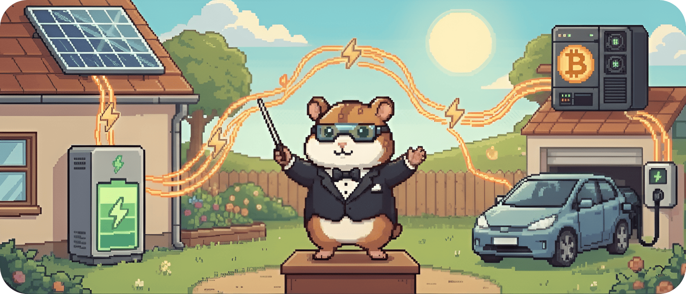

# 01.1 - Anforderungen & Überblick

Willkommen im Herzstück des Projekts. ♥️

Bevor wir uns in die technischen Details stürzen, müssen wir die Gretchenfrage klären: Was bauen wir hier eigentlich?

**BitGridAI** ist unsere Antwort darauf, wie lokale Energiesysteme in Zukunft aussehen müssen: intelligent, dezentral und vor allem *einfach* für dich als Endanwender.

&nbsp;

## Das Kernproblem & Unsere Lösung

**Das Problem 🏝️:** PV-Anlagen erzeugen den meisten Strom mittags. Wird dieser Strom nicht genutzt oder gespeichert, bleibt er lokal *gestrandet* und verliert seinen größten Wert: den Ersatz von teurem Netzstrom zu anderen Zeiten. Statt maximalem Eigenverbrauch entstehen Abregelung, Netzbelastung und unnötige Kosten.

**Unsere Lösung 🎼:** Wir bauen den „*lokalen Dirigenten*“. BitGridAI ist die Software-Plattform, die verschiedene Erzeuger und Verbraucher miteinander verbindet. Mit KI-gestützten Prognosen optimiert sie Energieflüsse vollautomatisch im Hintergrund und erklärt, warum sie so entscheidet.

**Das Ziel 🎯:** Mehr von deinem eigenen Strom selbst nutzen, weniger teuren Netzstrom beziehen und das lokale Netz entlasten, automatisch und zuverlässig mit voller Datenhoheit bei dir zu Hause.

## Wesentliche Features (Was das System draufhaben muss)

Wir konzentrieren uns auf vier Kernfunktionen, die das System ausmachen:

**1. Hardware-agnostische Konnektivität:** Standardprotokolle; echtes Plug-and-Play ohne Vendor Lock-in.

**2. KI-basierte Optimierung**: 12-h Prognosen für Erzeugung und Verbrauch; intelligente Speicher- und Ladestrategien.

**3. Intuitive Nutzersteuerung & Transparenz:** Responsives Web-UI mit Echtzeit-Energieflüssen; einfache Präferenzen, volle Transparenz.

**4. Lokale Autonomie & Resilienz:** Kernfunktionen laufen lokal auf Edge-Device; Betrieb und Optimierung auch ohne Internet.

> 💡 Hinweis zum MVP-Scope *(Was ist in Version 1.0 drin?)*
>
> Für das erste Release konzentrieren wir uns auf einen klar abgegrenzten Funktionsumfang. Ziel ist es, den zentralen Nutzen von BitGridAI zuverlässig abzubilden und nachvollziehbar zu machen.
> 
> **1. Mining als flexible Last**: *PV-Überschüsse werden erkannt und genutzt, indem Mining-Hardware automatisch gestartet, gestoppt oder gedrosselt wird.*
> 
>**2. Explainability-Layer:** *Eine lokale Benutzeroberfläche zeigt Entscheidungen im zeitlichen Verlauf. Ein On-Device-Explain-Agent erklärt, warum das System so schaltet.*
> 
>**3. Lokale Geräteanbindung:** *PV-Anlagen, Speicher, Smart Meter und Miner werden über gängige Schnittstellen wie MQTT, REST und Modbus angebunden.*
> 
>**4. Messbare Wirkung:** *Zentrale Kennzahlen wie Netzbezug, Schalthäufigkeit und Erklärungsabdeckung werden erfasst. Der sichere Betrieb hat dabei immer Vorrang.*
> 
>**5. Analyse & Replay:** *Systemläufe können nachvollzogen und in einfachen Szenarien erneut abgespielt werden, inklusive Export für Analyse und Forschung.*

&nbsp;

## Wesentliche Anwendungsfälle (Top Use Cases)

| ID | Titel | Beschreibung | Akteur |
| :--- | :--- | :--- | :--- |
| **UC-1** | **Maximierung Eigenverbrauch** | BitGridAI erkennt PV-Überschuss und entscheidet dynamisch, ob Speicher geladen oder Mining gestartet wird. | System |
| **UC-2** | **Netzdienliches Laden** | Anpassung an externe Signale, ohne den Nutzerkomfort zu gefährden. | System |
| **UC-3** | **Manueller Override** | Du brauchst "Boost"? Du kriegst Boost. Das System priorisiert sofort deinen Wunsch, auch wenn es unwirtschaftlich ist. | Nutzer |
| **UC-4** | **Sicherheitsüberwachung** | Kritische Temperatur? BitGridAI fährt das betroffene Subsystem sofort kontrolliert herunter (`Stop -> Safe`). | Safety |

&nbsp;

## Abgrenzung (Was wir NICHT bauen) 🚫

Genauso wichtig wie das, was wir tun, ist das, was wir bewusst *nicht* tun:
* Wir bauen keine eigene Hardware (Wechselrichter, etc.).
* Wir bauen keine Abrechnungsplattform für Stromtarife (Billing).
* Wir sind kein SCADA-System für riesige Kraftwerke, sondern fokussieren uns auf "Residential & Small Commercial".
* Wir übernehmen keine **Verwahrung von Bitcoin (Custody)**. Wir steuern die Mining-Hardware lediglich an (Start/Stop), aber die Erträge fließen direkt in dein eigenes Wallet. Deine Keys, deine Coins.

---
> **Nächster Schritt:** Nachdem wir geklärt haben, *was* wir bauen, schauen wir uns an, nach welchen Maßstäben wir die Qualität messen.
>
> 👉 Weiter zu **[01.2 - Qualitätsziele](./012_quality_goals.md)**
>
> 🔙 Zurück zur **[Kapitelübersicht](./README.md)**
