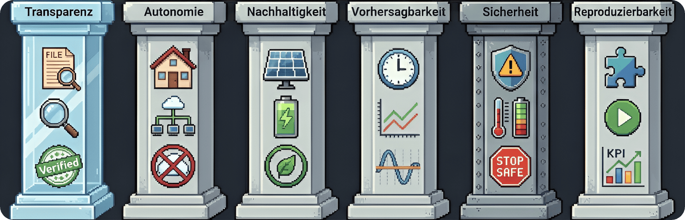

# 01.2 - Qualitätsziele

Qualität ist kein Zufall.

Hier definieren wir schwarz auf weiß, was "gut" für **BitGridAI** bedeutet. Es geht uns nicht nur um technische Spezifikationen, sondern um das Vertrauen der Nutzer und die messbare Nachhaltigkeit des Gesamtsystems.

Wir bauen kein System, das nur "funktioniert", sondern eines, das man versteht und dem man gerne die Kontrolle über sein Hausnetz überlässt.

&nbsp;

## Unsere zentralen Qualitätsmerkmale

Diese sechs Säulen tragen unsere Architektur. An ihnen messen wir jede Designentscheidung:

| Qualität | Was bedeutet das für uns? |
| :--- | :--- |
| **Transparenz🔍** | Keine Blackbox. Jede Entscheidung des Systems ist nachvollziehbar – mit Grund, Auslöser und Parametern dokumentiert. Wir versionieren alle Erklärungstexte, damit man auch später noch versteht, *warum* das System so gehandelt hat. Das ist die Basis für Vertrauen und wissenschaftliche Auswertungen. |
| **Autonomie🏠** | Wir sind radikal "local-first". Der gesamte Stack läuft bei dir zu Hause, ohne Cloud-Zwang oder externe KI-Dienste. Das bedeutet: Deine Daten gehören dir (digitale Souveränität), das System funktioniert auch ohne Internet (belastbare Offline-Modi), und du hast die volle Kontrolle. |
| **Nachhaltigkeit🌱** | Wir verschwenden nichts. PV-Überschuss wird nicht abgeregelt, sondern sinnvoll in flexiblen Lasten genutzt. Durch intelligente Lastverschiebung erhöhen wir deinen Eigenverbrauch und deine Autarkie. Zudem helfen wir dir mit verständlichen Infos, selbst nachhaltigere Entscheidungen zu treffen. |
| **Vorhersagbarkeit⏱️** | Kein nervöses Hin und Her. Durch deterministische Regeln, ein "Deadband" gegen schnelles Schalten und den stabilen **10-Minuten-Blocktakt** verhält sich das System ruhig und vorhersehbar. Du kannst dich darauf verlassen, was als Nächstes passiert. Prognosen nutzen wir nur, wenn sie stabil sind. |
| **Sicherheit🛡️** | Safety First. Wir haben eingebaute Schutzmechanismen für Temperatur und Batterieladestand (SoC). Wenn's kritisch wird, geht das System in einen definierten, sicheren Zustand ("Stop → Safe"), um deine Hardware zu schützen. Auch diese Sicherheitsabschaltungen sind erklärbar und werden protokolliert. |
| **Reproduzierbarkeit🔄** | Für die Wissenschaft. Alle Daten, Modelle und Logs sind standardisiert. Das ermöglicht es, Szenarien exakt "abzuspielen" (Replays) und Ergebnisse objektiv zu vergleichen – egal ob für deine eigene Analyse oder für Forschungsprojekte. |

&nbsp;

## KPIs / Erfolgsmetriken

Wie messen wir objektiv, ob wir unsere Ziele erreichen? Wir haben harte Zahlen (Key Performance Indicators) definiert, an denen wir uns messen lassen:

| KPI (Messgröße) | Unser Ziel | Wie wir das messen |
| :--- | :--- | :--- |
| **Netzbezug-Reduktion** | **≥ 25 % weniger** Stromzukauf im Testzeitraum (30 Tage) | Vergleich des aktuellen `grid_import_kwh` mit einem Basiswert (Baseline-Log). |
| **Flapping-Rate (Nervosität)** | **≤ 2 Start/Stop-Wechsel** pro Tag (≥ 60 % Reduktion) | Wir zählen die `DecisionEvents` für `start` und `stop` in den Logs. |
| **Erklärungs-Abdeckung** | **≥ 98 %** aller Decisions haben dokumentierten Grund, Auslöser & Parameter | Analyse des Timeline-Exports auf Vollständigkeit (`explain_coverage`). |
| **Vertrauens-Score** | **≥ 4/5 Punkten** in Nutzerumfragen (Likert-Skala, n=10) | Durchführung von Befragungen im Research-Panel. |
| **Thermal-Safety-Events** | **0 ungeplante Übertemperaturen** (> 85 °C) | Überwachung des Health-Logs und der Sensorwerte. |
| **Energy-to-Sats-Effizienz** | **≥ 45 sats/kWh** (im rolling 7-Tage-Schnitt) | Auswertung des `energy_to_value`-Datasets. |
| **Traceability (Nachweisbarkeit)** | **100 %** der Blockfenster loggen den gewählten Pfad und die Begründung | Prüfung des manipulationssicheren "Append-only Hodl-Log". |

---
> **Nächster Schritt:** Nachdem wir geklärt haben, was "gut" für BitGridAI bedeutet, schauen wir uns an, für wen wir das alles eigentlich machen.
>
> 👉 Weiter zu **[01.3 - Stakeholder](./013_stakeholder.md)**
>
> 🔙 Zurück zur **[Kapitelübersicht](./README.md)**
