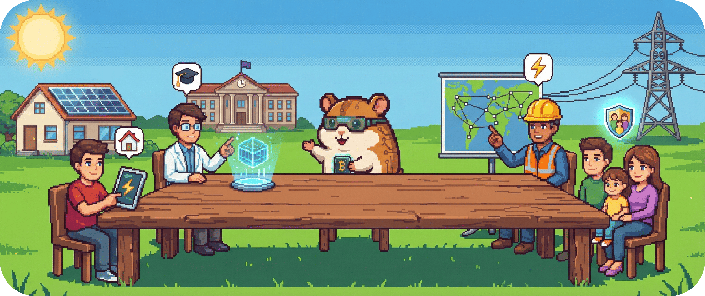

# 01.3 - Stakeholder

Für wen machen wir das alles eigentlich?

Willkommen am runden Tisch (oder am eckigen?) von **BitGridAI**. Software wird nicht für Computer geschrieben, sondern für Menschen. In diesem Kapitel schauen wir uns an, wer ein Interesse an unserem Projekt hat, wer es nutzen wird und wer vielleicht sogar skeptisch ist.

Wir müssen ihre Brille aufsetzen, um zu verstehen, was das System leisten muss, damit es ein Erfolg wird.

&nbsp;

## Unsere wichtigsten Interessengruppen

Wir haben vier Hauptgruppen identifiziert, deren Bedürfnisse unsere Architektur maßgeblich beeinflussen:

| Wer? (Stakeholder) | Was treibt sie an? (Interessen & Bedürfnisse) |
| :--- | :--- |
| **Nutzer (Prosumer) 🏠** | Das bist wahrscheinlich du. Du hast eine PV-Anlage, vielleicht ein E-Auto oder einen Speicher. Du willst ein System, das du verstehst und dem du vertrauen kannst. Du möchtest die Kontrolle behalten, Entscheidungen nachvollziehen und notfalls auch mal eingreifen können. Dein Ziel: Mehr Eigenverbrauch, weniger Kosten und eine intelligente Nutzung deines Speichers, ohne Ingenieur sein zu müssen. |
| **Forschung & Wissenschaft 🎓** | Die Community, die BitGridAI weiterentwickelt und studiert. Sie braucht eine offene, transparente Umgebung, in der Daten und Modelle standardisiert und **reproduzierbar** sind. Das Ziel ist es, die Ergebnisse in Lehre und Forschung nutzen zu können und eine solide Basis für die wissenschaftliche Auswertung von nachvollziehbaren KI-Systemen (XAI) in realen Energiesystemen zu schaffen. |
| **Verteilnetz(betreiber) ⚡** | Die Leute, die das Stromnetz stabil halten. Sie profitieren davon, wenn BitGridAI die Leistungsspitzen deiner PV-Anlage lokal abfängt (z.B. durch Mining als flexible Last), bevor sie ins Netz eingespeist werden. Weniger Rückspeisespitzen bedeuten ein stabileres Netz für alle, ohne teuren Netzausbau. |
| **Das "System Haus" (als Einheit) 👨‍👩‍👧‍👦** | Die wichtigste Einheit, die einfach funktionieren muss. Die oberste Priorität ist die Sicherung der Grundversorgung. Unsere Schutzregeln (wie **R2**) stellen sicher, dass der Batteriespeicher immer eine eiserne Reserve für den Haushalt bereithält. Wird es knapp, stoppt BitGridAI sofort alle flexiblen Lasten, damit das Licht anbleibt. |

---
> **Nächster Schritt:** Damit wissen wir, für wen wir BitGridAI bauen. Jetzt wird es ernst: Wir verlassen die Zielebene und schauen uns die harten Leitplanken an, die unsere Architektur einschränken.
>
> 👉 Weiter zu **[02 - Randbedingungen](../02_archtecture_constraints/README.md)**
>
> 🔙 Zurück zur **[Kapitelübersicht](./README.md)**
