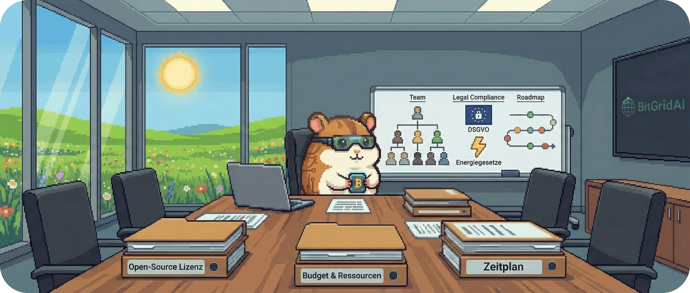

# 02.2 - Organisatorische Randbedingungen (Organizational Constraints)

Geld, Zeit und Paragrafen. Willkommen in der Realität der Projektplanung.

Während die technischen Randbedingungen definieren, was physikalisch möglich ist, geben die organisatorischen Rahmenbedingungen vor, unter welchen Umständen wir arbeiten dürfen. Sie sind die Leitplanken für Budget, Zeitplan und rechtliche Compliance.

Unsere Architektur kann noch so brillant sein – wenn sie das Budget sprengt oder gegen Gesetze verstößt, wird sie nie Realität.

 

&nbsp;

## Die Liste der organisatorischen Fakten

Wir müssen unsere Lösung innerhalb folgender nicht-technischer Grenzen entwickeln:

| ID | Randbedingung | Beschreibung & Konsequenz |
| :--- | :--- | :--- |
| **OC-1** | **Projektstatus: Open-Source-Forschung** 🎓 | BitGridAI ist ein Forschungsprojekt, das der Öffentlichkeit zur Verfügung gestellt wird. **Konsequenz:** Der Quellcode muss unter einer geeigneten Open-Source-Lizenz (z.B. MIT oder Apache 2.0) veröffentlicht werden. Die Dokumentation muss öffentlich zugänglich und reproduzierbar sein. Es gibt keinen harten kommerziellen Druck, aber den Anspruch an wissenschaftliche Exzellenz. |
| **OC-2** | **Budget & Ressourcen** 💰 | Das Projekt hat ein begrenztes Budget, primär für Hardware-Prototypen und Testumgebungen. **Konsequenz:** Wir können keine teuren kommerziellen Software-Lizenzen oder Cloud-Services nutzen. Der Fokus liegt auf kostenlosen Open-Source-Tools und günstiger Commodity-Hardware (siehe TC-1). |
| **OC-3** | **Zeitplan & Meilensteine** 📅 | Das Projekt folgt einem definierten Forschungszeitplan. **Vorgabe:** Ein erster funktionierender Prototyp (MVP) muss bis Q3 2026 für ein Feldtest-Deployment bereitstehen. **Konsequenz:** Die Architektur muss "inkrementell" lieferbar sein. Wir starten mit einem MVP-Kern und erweitern später. |
| **OC-4** | **Teamstruktur & Rollen** 👥 | Das Kernteam ist klein und agil, mit Fokus auf Forschung und Entwicklung. Es gibt keine dedizierte QA- oder DevOps-Abteilung. **Konsequenz:** Entwickler sind auch für Tests und Deployment verantwortlich ("You build it, you run it"). Die Architektur muss wartungsarm und einfach zu testen sein. |
| **OC-5** | **Rechtliche Vorgabe: DSGVO & Datenschutz** 🛡️ | Da wir Daten aus Privathaushalten verarbeiten, gilt die Datenschutz-Grundverordnung (DSGVO) als oberstes Gebot. **Konsequenz:** Die "Local-First"-Strategie ist nicht nur technisch, sondern auch rechtlich motiviert. Personenbezogene Daten (Verbrauchsprofile) dürfen das Haus nicht verlassen, es sei denn, der Nutzer stimmt explizit für Forschungszwecke zu (Opt-in). |
| **OC-6** | **Rechtliche Vorgabe: Energiegesetze** ⚡ | Das System greift aktiv in die Energieflüsse ein (z.B. Steuerung von Einspeisung). **Konsequenz:** Wir müssen sicherstellen, dass die Eingriffe konform mit lokalen Netzanschlussbedingungen (TAB) und relevanten Normen (z.B. zur maximalen Schieflast) sind. Die Architektur muss "Netz-freundliches" Verhalten priorisieren. |

---
> **Nächster Schritt:** Damit haben wir das Spielfeld definiert. Jetzt legen wir die Spielregeln fest. Im nächsten Abschnitt definieren wir die architektonischen Konventionen, die für alle gelten.
>
> 👉 Weiter zu **[02.3 - Konventionen](./023_conventions.md)**
>
> 🔙 Zurück zur **[Kapitelübersicht](./README.md)**
