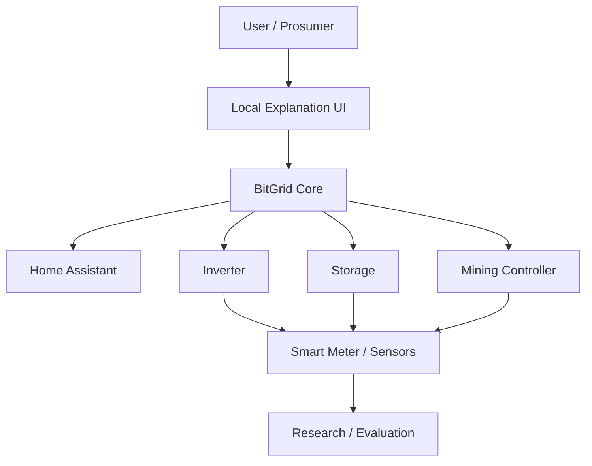

# 03 – Systemkontext / System Context

> **Kurzüberblick:**
> 
> BitGridAI sitzt **lokal** zwischen Erzeugung, Speicher und flexiblen Lasten.
> Es verbindet **physische Energieflüsse** mit **digitalen Entscheidungen** (R1–R5) im **10-Min-Blocktakt** – transparent, erklärbar, reversibel.

> **TL;DR (EN):**
> 
> BitGridAI is a **local** mediator between generation, storage and flexible loads.
> It links **physical energy flows** with **digital decisions** (R1–R5) in a **10-minute block rhythm**—transparent, explainable, and reversible.

---

## Überblick / Overview

BitGridAI agiert als lokales Bindeglied zwischen Energieerzeugung, Verbrauch und nutzerzentrierter Automatisierung.
Es verbindet physische Energieflüsse mit digitalen Entscheidungsprozessen, um **transparente, erklärbare und reversible Steuerung** zu ermöglichen.

> BitGridAI acts as a local interface between energy generation, consumption, and user-centered automation.
> It connects physical energy flows with digital decision processes, enabling **transparent, explainable, and reversible control**.

---

## Akteure / Actors

| Rolle                       | Beschreibung                                                                  |
| --------------------------- | ----------------------------------------------------------------------------- |
| **Nutzer / Prosumer**       | Betreibt PV, Speicher und flexible Lasten; kann Vorgaben/Overrides setzen.    |
| **BitGrid Core**            | Lokale Entscheidungslogik (R1–R5), BlockScheduler, Logging, Explainability.   |
| **Externe Systeme**         | Home Assistant, Wechselrichter, Zähler/Sensorik, Speicher, Mining-Controller. |
| **Forschende / Entwickler** | Analysieren Verhalten, evaluieren Erklärbarkeit, entwickeln Module.           |

> | Role                         | Description                                                             |
> | ---------------------------- | ----------------------------------------------------------------------- |
> | **User / Prosumer**          | Operates PV, storage and flexible loads; can set preferences/overrides. |
> | **BitGrid Core**             | Local decision logic (R1–R5), block scheduler, logging, explainability. |
> | **External Systems**         | Home Assistant, inverters, meters/sensors, storage, mining controllers. |
> | **Researchers / Developers** | Analyze behavior, evaluate explainability, build modules.               |

---

## Externe Systeme / External Systems

| System                        | Schnittstelle          | Zweck                                                     |
| ----------------------------- | ---------------------- | --------------------------------------------------------- |
| **Home Assistant**            | MQTT / REST            | Austausch von Zuständen, Kommandos, UI-Einbindung.        |
| **PV-Wechselrichter**         | Modbus/TCP / API       | Erzeugungs-, Spannungs- und Statusdaten.                  |
| **Smart Meter / Zähler**      | MQTT / SML / API       | Netzbezug/-einspeisung, Phasenleistung, Momentanwerte.    |
| **Energiespeicher**           | API / MQTT             | SoC, Lade-/Entladeleistung, Prioritäten.                  |
| **Mining-Controller**         | LAN / API              | Leistungsstufen, Start/Stop, Temperatur-/Lüfterdaten.     |
| **Preis/Forecast (optional)** | Datei / lokaler Dienst | Tarife, PV-/Lastprognosen für R1/R4 (lokal verarbeitet).  |
| **Erklär-UI**                 | WebSocket / REST       | Visualisierung von Energieflüssen & Entscheidungsgründen. |

> | System                    | Interface        | Purpose                                                      |
> | ------------------------- | ---------------- | ------------------------------------------------------------ |
> | **Home Assistant**        | MQTT / REST      | State/command exchange, UI integration.                      |
> | **PV Inverter**           | Modbus/TCP / API | Generation, voltage and status data.                         |
> | **Smart Meter**           | MQTT / SML / API | Grid import/export, phase power, instant values.             |
> | **Energy Storage**        | API / MQTT       | SoC, charge/discharge power, priorities.                     |
> | **Mining Controller**     | LAN / API        | Power levels, start/stop, temp/fan data.                     |
> | **Price/Forecast (opt.)** | File / local svc | Tariffs and PV/load forecasts for R1/R4 (processed locally). |
> | **Explainability UI**     | WebSocket / REST | Energy flow & rationale visualization.                       |

---

## Kontextdiagramm / Context Diagram

---

## Systemgrenzen / System Boundaries

* **Innerhalb von BitGridAI / Inside BitGridAI**

  * **Decision & Rule Engine** (R1–R5), **BlockScheduler** (10-Min-Takt).
  * **EnergyState (SSoT)**, **KPI/Logging**, **Explainability-Layer**.
  * **Lokale Adapter** für PV, Speicher, Zähler, Mining (MQTT/REST/Modbus).

* **Außerhalb von BitGridAI / Outside BitGridAI**

  * Physische Hardware (PV, Speicher, Miner), fremde UIs, Home Assistant Core.
  * Externe Forschungstools/Statistik-Pakete.
  * Optionale lokale Dienste (Tarif/Forecast), sofern nicht im Core gehostet.

> **Inside BitGridAI:**
>
> * **Decision & Rule Engine** (R1–R5), **BlockScheduler** (10‑minute cadence).
> * **EnergyState (SSoT)**, **KPI/logging**, **explainability layer**.
> * Local adapters for PV, storage, meters, mining (MQTT/REST/Modbus).

> **Outside BitGridAI:**
>
> * Physical hardware (PV, storage, miner), third‑party UIs, Home Assistant core.
> * External research/analytics tools.
> * Optional local services (tariff/forecast), if not hosted in the core.

---

## Kommunikationsflüsse / Communication Flows

1. **Energiefluss / Energy Flow (physisch)**
   PV → Speicher → Lasten (u. a. Miner) → Netz (Import/Export).
2. **Datenfluss / Data Flow (digital)**
   Sensoren/Zähler → **EnergyState** (SSoT) → UI/Logging → Forschung.
3. **Entscheidungsfluss / Decision Flow (logisch)**
   **R1–R5** + Policies → Aktion (Start/Stop/Level) → **DecisionEvent** + Erklärung.

> 1) Physical: PV → Storage → Loads → Grid
> 2) Digital: Sensors/meters → **EnergyState** → UI/logs → Research
> 3) Logical: **R1–R5** + policies → action → **DecisionEvent** + rationale

---

## Domänenobjekte & Events / Domain Objects & Events

* **EnergyState** – Single Source of Truth für Messwerte, Prognosen, SoC, Temperatur, Preise.
* **Surplus** – berechnete Größe (Erzeugung – Last ± Speicherstrategie).
* **BlockInterval (10 min)** – Zeitscheibe für Entscheidungen & Deadband.
* **Decision** – Ergebnis der Regelprüfung inkl. **Reason/Trigger/Parameter**.
* **Events** – `EnergyStateChangedEvent`, `DecisionEvent`, `DeadbandActivatedEvent`.

> **Objects**: EnergyState, Surplus, BlockInterval, Decision.
> **Events**: EnergyStateChangedEvent, DecisionEvent, DeadbandActivatedEvent.

---

## Haupt-Schnittstellen / Primary Interfaces

* **MQTT Topics** (Beispiele):

  * `energy/state/#`, `miner/cmd/set`, `miner/state/#`, `explain/events/#`.
* **REST Endpunkte** (lokal):

  * `POST /decisions`, `GET /state`, `GET /timeline`, `POST /override`.
* **Datei-/DB-Ablage**:

  * Append-only Logs (Parquet/SQLite), versionierte YAML-Konfiguration.

> MQTT, REST and local storage provide stable, auditable contracts for integrations.

---

## Kontextzusammenfassung / Context Summary

BitGridAI positioniert sich **zwischen physikalischer Infrastruktur und menschlicher Entscheidungsautonomie**.
Es übersetzt komplexe Energiedaten in nachvollziehbare Handlungsmodelle und stärkt so **Vertrauen, Kontrolle und Transparenz**.

> BitGridAI sits **between physical infrastructure and human decision autonomy**.
> It translates complex energy data into understandable action models that foster **trust, control, and transparency**.

*Weiter mit **[04 – Lösungsstrategie / Solution Strategy](./04_solution_strategy.md)**.*
