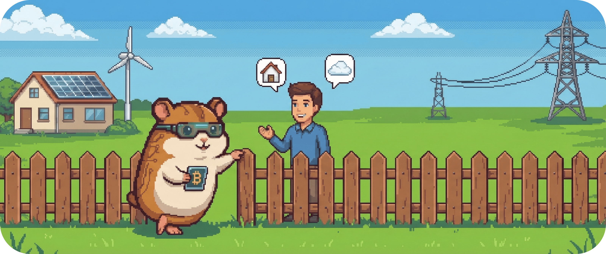
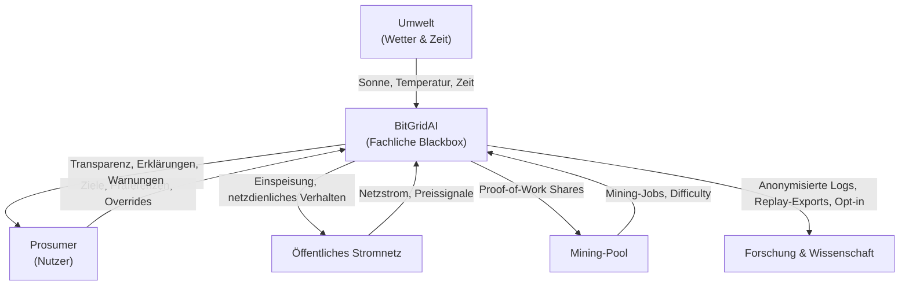

# 03.1 Fachlicher Kontext (Business Context)

Bevor wir Kabel ziehen, Logs analysieren oder Services zerlegen, sollten wir einen Schritt zurücktreten.

*Wer spricht hier eigentlich mit wem – und warum?*

In diesem Kapitel betrachten wir **BitGridAI als Blackbox**, eingebettet in seine natürliche Umgebung. Uns interessiert nicht, *wie* intern entschieden wird, sondern *wer* von außen Erwartungen an das System heranträgt, *welche Informationen fließen* und *welche Ereignisse BitGridAI aus dem Schlaf holen*.

Kurz gesagt: **Wer klopft an die Tür von BitGridAI – und wen ruft das System an, wenn es etwas zu melden hat?**

---

## Die fachlichen Nachbarn

BitGridAI lebt nicht im luftleeren Raum. Es interagiert fachlich mit fünf zentralen Akteuren, die jeweils eigene Erwartungen mitbringen – und im Gegenzug bestimmte Leistungen erhalten. Die folgende Tabelle zeigt diese Nachbarschaften aus fachlicher Sicht, **bewusst ohne technische Details**.

| Kommunikationspartner             | Was kommt rein? (Input)                                                                                                                       | Was geht raus? (Output)                                                                                            | Beziehung & Beschreibung                                                                                                                                                        |
| :-------------------------------- | :-------------------------------------------------------------------------------------------------------------------------------------------- | :----------------------------------------------------------------------------------------------------------------- | :------------------------------------------------------------------------------------------------------------------------------------------------------------------------------ |
| **Der Prosumer (Nutzer) 🏠**      | **Ziele & Befehle:** • Präferenzen (z.B. „E-Auto morgen früh voll“) • Manuelle Overrides („Boost jetzt!“) • Konfigurationsänderungen | **Transparenz:** • Aktuelle Energieflüsse • Erklärungen („Warum läuft der Miner?“) • Hinweise & Warnungen | Der Mensch hinter dem System. Er erwartet Komfort und Rendite, aber kein Mikromanagement. Greift er ein, hat sein Wort stets Vorrang vor jeder Automatik.                       |
| **Die Umwelt (Wetter & Zeit) ☀️** | **Fakten:** • Sonneneinstrahlung • Außentemperatur • Zeitlicher Takt                                                                 | –                                                                                                                  | Der wichtigste Taktgeber. Die Sonne entscheidet über Produktion, die Zeit strukturiert den Rhythmus. BitGridAI kann die Umwelt nicht beeinflussen – nur klug auf sie reagieren. |
| **Das öffentliche Stromnetz ⚡**   | **Energie & Signale:** • Netzstrom bei Unterdeckung • Preisinformationen (optional)                                                     | **Energie & Entlastung:** • Einspeisung von Überschüssen • Netzdienliches Verhalten                          | Das Sicherheitsnetz. BitGridAI versucht, es möglichst wenig zu brauchen – verlässt sich aber darauf, wenn es darauf ankommt.                                                    |
| **Der Mining-Pool ⛏️**            | **Arbeit:** • Mining-Jobs und Schwierigkeitsparameter                                                                                      | **Rechenleistung:** • Validierte Proof-of-Work-Shares                                                           | BitGridAI stellt Rechenleistung bereit – mehr nicht. Die Belohnung fließt direkt vom Pool zum Wallet des Nutzers, bewusst non-custodial.                                        |
| **Forschung & Wissenschaft 🎓**   | – (im Normalbetrieb)                                                                                                                          | **Wissen:** • Anonymisierte Betriebsdaten • Replay-Exports                                                   | Ein stiller Beobachter. Nur mit ausdrücklicher Zustimmung des Nutzers werden Daten für Analyse und Forschung bereitgestellt.                                                    |

---

## Externe Auslöser (Business Events)

BitGridAI arbeitet ereignisgetrieben. Fachlich lassen sich drei Arten von Auslösern unterscheiden, die das System zum Handeln bringen:

1. **Zeit-Trigger – der Herzschlag:**
   In festen Abständen beginnt ein neuer Entscheidungszyklus. BitGridAI schaut sich die Lage an, wägt Optionen ab und legt eine Strategie für die nächste Runde fest.

2. **Daten-Trigger – wenn sich etwas ändert:**
   Zieht eine Wolke auf oder ändert sich der Strompreis, verschieben sich die Rahmenbedingungen. Das System reagiert darauf, indem es seine Strategie anpasst.

3. **Nutzer-Trigger – der Eingriff:**
   Der Prosumer greift ein: „Jetzt laden“, „Jetzt stoppen“. Solche Eingriffe stechen jede Automatik und werden gemäß ihrer fachlichen Priorität umgesetzt.

---

> **Nächster Schritt:** Wir kennen jetzt die Nachbarn und wissen, wer mit wem spricht. Im nächsten Kapitel schauen wir genauer hin: **Über welche Leitungen, Schnittstellen und Protokolle laufen diese Gespräche eigentlich?**
> 
> 👉 Weiter zu **[03.2 Technischer Kontext](./032_technical_context.md)**
> 
> 🔙 Zurück zur **[Kapitelübersicht](./README.md)**
