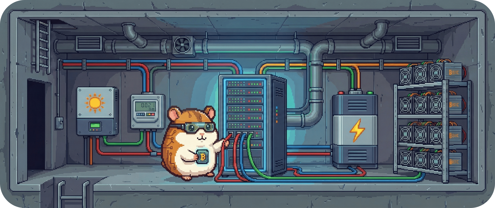

# 03.2 - Technischer Kontext (Technical Context)

Die Sicht unter der Haube.

Nachdem wir im fachlichen Kontext geklärt haben, wer mit BitGridAI spricht und warum,
konkretisieren wir nun die technische Perspektive:
Welche Systeme sind angebunden, über welche Protokolle wird kommuniziert
und wo verläuft die technische Grenze von BitGridAI?

BitGridAI ist als **lokaler Orchestrator** in einem abgeschlossenen LAN konzipiert.
Es koppelt Energieerzeugung, -messung, -speicherung und Mining-Hardware über etablierte
Protokolle, hält einen konsistenten `EnergyState` als **Single Source of Truth (SSoT)**
und trifft erklärbare Entscheidungen für Nutzer und Forschung.

&nbsp;

## Externe Systeme & Schnittstellen

BitGridAI kommuniziert mit folgenden Nachbarsystemen.
Die Kommunikation erfolgt primär über **MQTT**, **REST** und **Modbus**.

| System | Schnittstelle | Datenrichtung | Zweck & Beschreibung |
| :--- | :--- | :--- | :--- |
| **Home Assistant** 🏠 | MQTT / REST | In / Out | Integration ins Smart Home. Austausch von Statusdaten (`State`) und Empfang von Kommandos über das UI von Home Assistant. |
| **PV-Wechselrichter** ☀️ | Modbus TCP / API | In | Auslesen von Erzeugungsleistung, Spannungen und Fehlerstatus. |
| **Smart Meter / Sensorik** 📏 | MQTT / SML / API | In | Die „Augen“ des Systems. Import-/Exportdaten am Netzanschlusspunkt, Phasenleistung und Momentanwerte (häufig via SML-Lesekopf). |
| **Energiespeicher** 🔋 | API / MQTT | In / Out | Lesen des Ladezustands (SoC) sowie Setzen von Lade- und Entlade-Limits oder Prioritäten. |
| **Mining-Controller** ⛏️ | LAN / API / SSH | Out | Steuerung der Miner: Start/Stop, Leistungsstufen (Power/Hashrate) sowie Überwachung von Temperatur und Lüftern. |
| **Preis-/Forecast-Dienst** 🔮 | Datei / lokaler Dienst | In | Liefert Tarife und Prognosen (u.a. für Regel R1/R4). Läuft typischerweise als lokaler Sidecar. |
| **Erklär-UI** 🖥️ | WebSocket / REST | Out | Frontend für den Nutzer. Echtzeit-Visualisierung von Energieflüssen und Entscheidungsgründen. |
| **Research / Replay Node** 🎓 | Datei / CLI | Out | Bereitstellung anonymisierter Logs, KPI-Berechnung und Durchführen von „Was-wäre-wenn“-Replays (nur Opt-in). |

&nbsp;

## Grenzen & Datenflüsse (Boundaries & Flows)

Wir unterscheiden strikt zwischen dem, was **im** System passiert
(Entscheidungshoheit), und dem, was **außerhalb** liegt (Ausführung).

**Inside BitGridAI:**
- `EnergyState` (Single Source of Truth, SSoT)
- `Rule Engine` (R1–R5) und `BlockScheduler` (10-Minuten-Takt)
- `Explain-Agent` sowie KPI- und Logging-Komponenten
- Lokale Adapter zur Protokoll-Übersetzung

**Outside BitGridAI:**
- Physische Hardware (PV, Speicher, ASICs)
- Externe UIs (Browser, Home Assistant Core)
- Optionale lokale Forecast-Dienste

### Zentrale Kommunikationsflüsse

1. **Sensing (Input):**  
   Sensoren, Meter und APIs → Adapter → Aktualisierung des `EnergyState`.

2. **Decision (Processing):**  
   Der `BlockScheduler` triggert die Regelbewertung.
   Die Rule Engine liest den aktuellen Zustand und erzeugt ein `DecisionEvent`.

3. **Actuation (Output):**  
   DecisionEvents → Adapter → Physische Befehle an Miner oder Speicher.

4. **Feedback (User & Research):**  
   Overrides oder Research-Toggles → Rule Engine → Rückmeldung an UI und Logging.

&nbsp;

## Domain-Events (Interne Sprache)

Zur Entkopplung der internen Komponenten kommuniziert BitGridAI über klar benannte Events.
Diese spiegeln die technische Realität in einer stabilen, verständlichen Sprache wider:

- `EnergyStateChangedEvent` – Neue Messwerte sind eingetroffen.
- `DecisionEvent` – Eine Regel hat entschieden (z.B. „Start Mining aufgrund von Überschuss“).
- `DeadbandActivatedEvent` – Eine Änderung wurde bewusst unterdrückt, um Flapping zu vermeiden.
- `ExplainSessionCreated` – Der Nutzer fordert eine Erklärung an.
- `ResearchToggleChanged` – Umschalten des erweiterten Logging- bzw. Research-Modus.

---
> **Nächster Schritt:** Wir wissen jetzt, wie BitGridAI technisch vernetzt ist.
> Als Nächstes betrachten wir die **Lösungsstrategie** – also warum diese Architektur
> gewählt wurde und weshalb „Local First“ dabei eine zentrale Rolle spielt.
>
> 👉 Weiter zu **[04 - Lösungsstrategie](../04_solution_strategy/README.md)**
> 
> 🔙 Zurück zur **[Kapitelübersicht](./README.md)**
