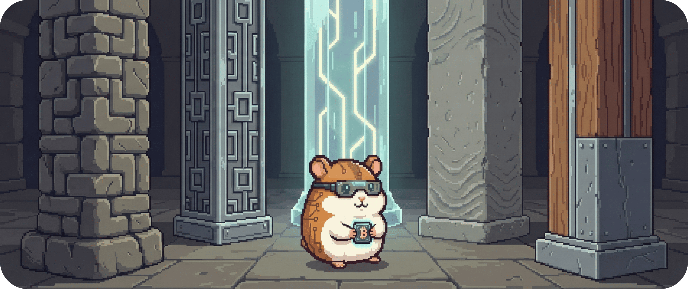

# 04.1 - Leitende Architekturprinzipien (Haltung)

Willkommen bei den Grundpfeilern.

In diesem Kapitel geht es nicht um Klassen, Protokolle oder Datenformate – sondern um Haltung. Die hier beschriebenen Prinzipien sind die **Spielregeln**, nach denen BitGridAI entworfen wird. Sie sind nicht verhandelbar und prägen jede größere Architekturentscheidung.

Wenn Kapitel 2 die äußeren Leitplanken beschreibt, dann definieren diese Prinzipien die **innere Logik** des Systems.

&nbsp;

&nbsp;

## Überblick

| Architekturprinzip | Bedeutung | Warum wir es verfolgen | Konkrete Konsequenzen |
| :--- | :--- | :--- | :--- |
| **Local First** 🏠 | Entscheidungen, Daten und Zustände verbleiben vollständig auf der lokalen Infrastruktur des Nutzers. | Energie ist physisch und lokal. Kontrolle, Datenschutz und Resilienz sind nur ohne Cloud-Zwang erreichbar. | • Betrieb auch ohne Internet • Volle Datensouveränität • Keine versteckten Abhängigkeiten oder Kontrollpunkte |
| **Ereignisorientierung** ⏱️ | Das System reagiert auf klar definierte Events statt permanentem Nachregeln. | Ursache und Wirkung bleiben nachvollziehbar, Entscheidungen werden ruhiger und stabiler. | • 10-Minuten-Takt als Strukturgeber • Kein Flapping • Schonung von Hardware |
| **Explainability** 🔍 | Jede relevante Entscheidung ist erklärbar, nachvollziehbar und zeitlich einordenbar. | Automatisierung ohne Erklärung schafft Misstrauen und Kontrollverlust. | • Jede Aktion kennt Auslöser & Regel • Timeline & Preview im UI • Bewusstes Eingreifen möglich |
| **Determinismus** ⚙️ | Gleiche Eingaben führen zu gleichen Entscheidungen. Keine Black-Box-Logik im Kern. | Entscheidungen müssen prüfbar, testbar und reproduzierbar sein – insbesondere für Forschung. | • Regelbasierter Kern (R1–R5) • Replays möglich • Fehler systematisch analysierbar |
| **Trennung von Verantwortung** 🧩 | Entscheidungslogik, Geräteanbindung und Interaktion sind strikt getrennt. | Klarheit schlägt Cleverness. Entkopplung verhindert implizite Abhängigkeiten. | • Adapter ohne Fachlogik • Core ohne Hardwarewissen • UI erklärt, entscheidet nicht |

---
> **Nächster Schritt:** Aus Prinzipien wird Struktur. Im nächsten Kapitel betrachten wir die **grobe Systemstruktur** von BitGridAI.
>
> 👉 Weiter zu **[04.2 - Grobe Systemstruktur (Form)](./042_structure.md)**
> 
> 🔙 Zurück zur **[Kapitelübersicht](./README.md)**
