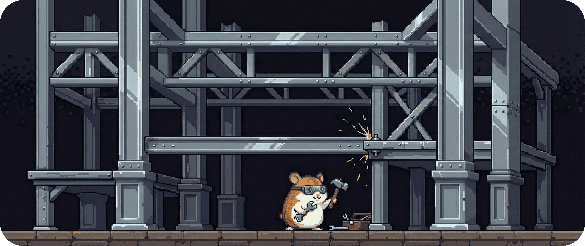

# 04.2 - Grobe Systemstruktur (Form)

Vom Plan zur Form.

Nachdem wir die **architektonischen Grundpfeiler** festgelegt haben, stellt sich die nächste logische Frage:  
Wie übersetzen wir diese Haltung in eine **tragfähige Struktur**, die langfristig stabil bleibt?

Dieses Kapitel beschreibt die **grobe Systemstruktur** von **BitGridAI**. Noch ohne Klassen, noch ohne Implementierungsdetails – aber klar genug, um zu verstehen, **welche großen Teile es gibt**, **welche Verantwortung sie tragen** und **wie sie zusammenwirken**.

&nbsp;

## Die Idee hinter der Struktur

BitGridAI folgt einer einfachen, aber strengen Ordnung:

* **Ein klarer Kern**, der entscheidet  
* **Klare Ränder**, die messen, handeln oder erklären
* **Eine Operations-Schicht**, die absichert, konfiguriert und beobachtbar macht   
* **Keine Querverbindungen**, die Verantwortung verwischen  

Diese Ordnung ist kein Selbstzweck.

Sie ist die direkte Konsequenz aus unseren Grundpfeilern:
Local First, Transparenz, Determinismus und Forschungsfähigkeit erzwingen eine Architektur, die **ruhig**, **nachvollziehbar** und **robust** ist – auch dann, wenn das System wächst.

&nbsp;

## Die fünf strukturellen Ebenen – Überblick

Auf hoher Ebene lässt sich BitGridAI in vier klar abgegrenzte Ebenen gliedern.  
Jede Ebene hat eine eindeutige Rolle – und kennt ihre Grenzen.

| Ebene | Rolle im System | Verantwortlichkeiten | Bewusste Abgrenzung |
| :--- | :--- | :--- | :--- |
| **Entscheidungskern (Core)** ⚙️ | Das Herz des Systems. Trifft fachliche Entscheidungen. | • Lesen des `EnergyState` • Zeitliche Taktung (BlockScheduler) • Auswertung der Regeln (R1–R5) • Erzeugen von DecisionEvents | • Steuert keine Geräte • Spricht keine Protokolle • Kennt keine UI |
| **Adapter-Schicht (Ports & Adapters)** 🔌 | Übersetzer zwischen System und Außenwelt. | • Lesen externer Messwerte • Übersetzen von Protokollen (Modbus, MQTT, REST) • Umsetzen von Entscheidungen in Befehle | • Keine Fachlogik • Keine Regeln • Keine Entscheidungen |
| **Interaktionsschicht (Explain & Control)** 🖥️ | Schnittstelle zum Menschen. | • Visualisierung von Zuständen und Flüssen • Erklärung von Entscheidungen • Entgegennahme von Overrides und Previews | • Trifft keine Energieentscheidungen • Verändert den Core nicht direkt |
| **Gedächtnisschicht (Data & Research)** 💾 | Nachvollziehbarkeit und Forschung. | • Operative Speicherung (Hot Data) • Historische Logs (Cold Data) • Replays und KPI-Berechnung | • Keine Steuerung • Kein Eingriff in den Betrieb |
| **Operations (Security, Config, Observability)** 🛡️ | Absicherung, Betriebsfähigkeit und Transparenz im Betrieb. | • AuthN/Z und Rollen/Policies • Konfiguration & Feature-Flags • Metriken, Logs, Alerts | • Keine Fachlogik • Keine direkten Energieentscheidungen • Kein Eingriff in den Core-Entscheidungsfluss |

&nbsp;

## Bewusste Trennlinien

Die Stabilität der Struktur entsteht durch klare Grenzen:

* Der **Core** kennt keine Hardware.  
* Adapter kennen keine Regeln.  
* Die UI erklärt, entscheidet aber nicht.  
* Forschung liest Daten – sie steuert nichts.
* Operations sorgt für Sicherheit, Konfiguration und Observability, ohne Fachlogik oder Entscheidungswege zu überlagern.    

Diese Trennlinien sind **absichtlich streng**.  

Sie verhindern implizite Abhängigkeiten und sorgen dafür, dass BitGridAI wartbar bleibt – auch dann, wenn neue Geräte, Regeln oder Auswertungen hinzukommen.

---
> **Nächster Schritt:** Die Form ist klar. Als Nächstes halten wir fest, 
> **welche zentralen Weichenstellungen diese Struktur möglich gemacht haben – und warum wir sie genau so getroffen haben.**
>
> 👉 Weiter zu **[4.3 - Zentrale Architekturentscheidungen (Weichenstellungen)](./043_decisions.md)**
> 
> 🔙 Zurück zur **[Kapitelübersicht](./README.md)**
