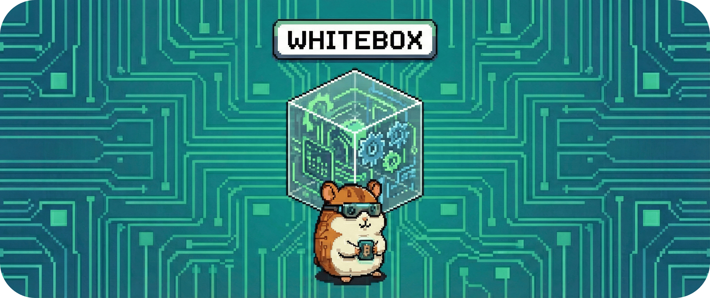

# 05.2.1.3 - Baustein: Rule Engine 

Der Entscheider.

Die Rule Engine bewertet die Regeln **R1–R5** deterministisch gegen den aktuellen
`EnergyState` und erzeugt daraus eine **konkrete Entscheidung**.

Keine Statistik. Kein Raten. Keine Magie.

&nbsp;

## Verantwortung

- Bewertung der Regeln R1–R5 gegen den aktuellen Zustand
- Priorisierung nach fachlicher Wichtigkeit
- Auflösung von Konflikten
- Erzeugung einer konsistenten `Decision` inklusive Erklärung

&nbsp;

## Struktur

- **Rule Evaluators**  
  Je eine Auswertung pro Regel (R1–R5: Start, Autarkie, Safety, Forecast, Stabilität).

- **Priorizer**  
  Ordnet Ergebnisse nach fester Reihenfolge:  
  **Safety (R3) > Autarkie (R2) > Prognose (R4) > Stabilität (R5) > Optimierung (R1)**.

- **Conflict Resolver**  
  Kombiniert oder neutralisiert konkurrierende Vorschläge und setzt sichere Fallbacks.

- **Decision Builder**  
  Erzeugt:
  - `Decision` (Aktor-Kommandos)
  - `DecisionEvent` (reason, trigger, params, valid_until)

&nbsp;

## Schnittstellen

**Provided**
- `Decision`
- `DecisionEvent` (reason / trigger / params / valid_until)
- Evaluations-Logs pro Regel

**Required**
- Aktueller `EnergyState`
- `valid_until`-Vorschlag vom Block-Scheduler
- Regelkonfiguration (Schwellen, Deadbands)
- Aktive Overrides (falls gesetzt)

&nbsp;

## Ablauf (vereinfacht)

1. Rule Evaluators prüfen R1–R5 gegen den `EnergyState` und liefern Vorschläge.
2. Der Priorizer sortiert die Vorschläge und verwirft unzulässige Kombinationen.
3. Der Conflict Resolver erzeugt eine konsistente Zielaktion.
4. Der Decision Builder erstellt:
   - `Decision` für Adapter
   - `DecisionEvent` für UI, Explain und Logging

&nbsp;

## Qualität und Betrieb

- **Deterministisch**  
  Gleicher Input führt immer zur gleichen Entscheidung.

- **Safety-first**  
  Regel R3 darf jede andere Regel überstimmen.  
  Bei Unsicherheit gilt: *Stop / Safe*.

- **Nachvollziehbar**  
  Jede Entscheidung trägt ihre Begründung.  
  Kein implizites Verhalten, kein „weil halt so“.

---
> **Nächster Schritt:** Entscheidungen sind gefällt – jetzt prüfen wir, wann und wie der Mensch eingreifen darf.
>
> 👉 Weiter zu **[5.2.1.4 - Baustein: Override Handler](./05214_override_handler.md)**
>
> 🔙 Zurück zu **[5.2.1 - Whitebox: Core-Orchestrierung](./README.md)**
> 
> 🔙 Zurück zu **[5.2 - Level-2-Whiteboxes](..//../052_whitebox/README.md)** 

