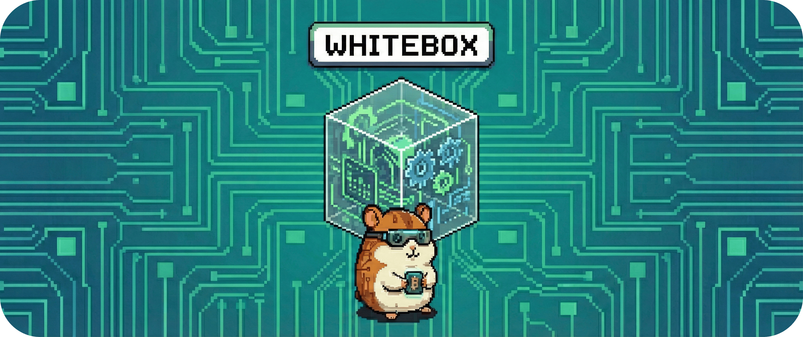

# 05.2.1.4 - Baustein: Override Handler

Der menschliche Eingriff.

Der Override Handler verarbeitet **manuelle Eingriffe** wie *Boost*, *Stop* oder *Limit*. 

Er gibt dem Nutzer gezielt Kontrolle – ohne dabei **Safety** und **Autarkie** zu kompromittieren.

&nbsp;

## Verantwortung

- Verarbeitung manueller Eingriffe (Boost / Stop / Limit)
- Setzen von Geltungsdauer (TTL) und Scope
- Prüfung auf Konflikte mit Safety- und Autarkie-Regeln
- Transparente Rückmeldung an Nutzer und Explain-Layer

&nbsp;

## Struktur

- **Override Validator**  
  Prüft Authentifizierung, Scope (Gerät / Cluster) und Parameterbereiche.

- **TTL Manager**  
  Setzt Ablaufzeit (z.B. in Blocks), erneuert oder verwirft abgelaufene Overrides.

- **Conflict Checker**  
  Gleichen Overrides mit Safety- und Autarkie-Regeln ab.  
  Kann Overrides kürzen, abschwächen oder ablehnen.

- **Feedback Builder**  
  Bestätigt Annahme oder Ablehnung mit `command_id` und `valid_until`.

&nbsp;

## Schnittstellen

**Provided**
- Aktiver Override-Status
- Rückmeldung an UI (`accepted`, `valid_until`, `command_id`)
- Events für Data- und Explain-Layer

**Required**
- User-Requests (`POST /override`)
- Regel- und Safety-Status
- Zeitquelle / Block-ID
- Policy-Konfiguration (wer darf was)

&nbsp;

## Ablauf (vereinfacht)

1. UI oder REST sendet Override-Request → Validator prüft Auth und Parameter.
2. Conflict Checker bewertet den Eingriff gegen Safety und Autarkie.
3. TTL Manager trägt Override ein und plant den Ablauf.
4. Feedback Builder sendet Bestätigung oder Ablehnung an UI, Data und Explain.

&nbsp;

## Qualität und Betrieb

- **Safety first**  
  Safety- und Autarkie-Regeln dürfen Overrides jederzeit beenden oder abschwächen.

- **Transparenz**  
  Jedes Override trägt `command_id`, `created_at`, `valid_until` und Status.

- **Begrenzung**  
  Rate Limits für Override-Requests, optionale Rollen (Operator vs. Observer).

---
> **Nächster Schritt:** Der Core ist vollständig beschrieben. Jetzt verlassen wir den Entscheidungskern und schauen nach außen – zu den Geräten.
>
> 👉 Weiter zu **[5.2.2 - Baustein: Adapter & Feld-I/O](../0522_adapters_whitebox/README.md)**
>
> 🔙 Zurück zu **[5.2.1 - Whitebox: Core-Orchestrierung](./README.md)**
> 
> 🔙 Zurück zu **[5.2 - Level-2-Whiteboxes](..//../052_whitebox/README.md)** 

