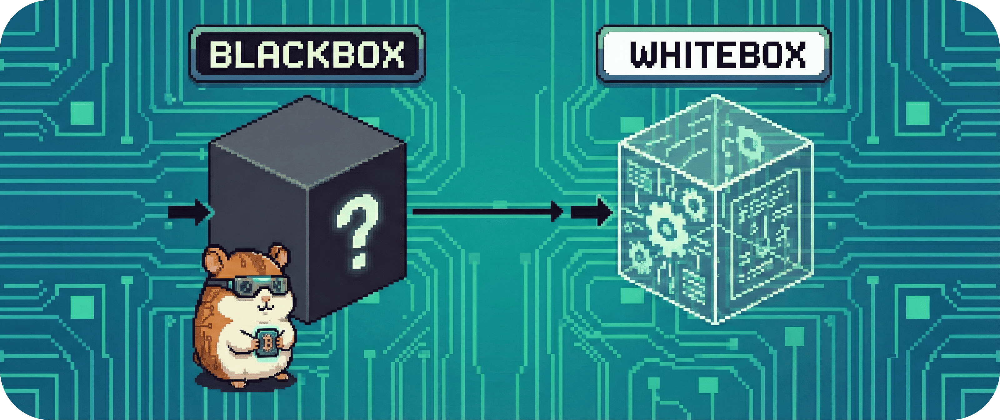

# 05 - Bausteinsicht

Jetzt gehen wir ins Innere.

Nachdem Kontext und Lösungsstrategie geklärt sind, zerlegen wir **BitGridAI** in seine konkreten Bausteine.  
Dieses Kapitel zeigt die **statische Struktur** des Systems: Welche Teile es gibt, wofür sie zuständig sind und wie sie zueinander stehen.

Wir bleiben sachlich und übersichtlich.  
Keine Abläufe, keine Timings – nur Struktur.

Wir arbeiten mit **Abstraktionsebenen**:  
von außen nach innen, von grob nach detailliert.

&nbsp;

## Inhalt dieses Kapitels

Die Bausteinsicht ist in zwei Ebenen gegliedert:

- **[5.1 - Level 1: Die Blackbox (Gesamtsicht)](./051_blackbox/README.md)**  
  * Wie erscheint BitGridAI nach außen als ein einzelner Baustein – mit klaren Systemgrenzen, Verantwortlichkeiten und externen Schnittstellen?

- **[5.2 - Level 2: Die Whitebox (Innenleben)](./052_whitebox/README.md)**  
  * Wie ist die Blackbox intern in Hauptbestandteile zerlegt, und welche klar abgegrenzten Verantwortungen tragen Core, Adapter, Explain/UI sowie Data & Research?
    
---

---
> **Nächster Schritt:** Die Struktur ist sichtbar.  
> Jetzt betrachten wir, **wie diese Bausteine im Betrieb zusammenspielen**.
>
> 👉 Weiter zu **[06 - Laufzeitsicht](../06_runtime_view/README.md)**
> 
> 🏠 Zurück zur **[Hauptübersicht](../../README.md)**
