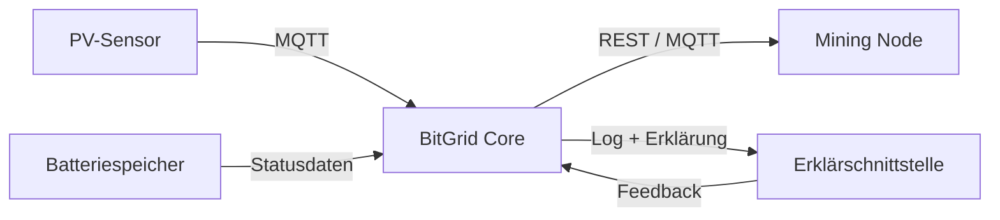
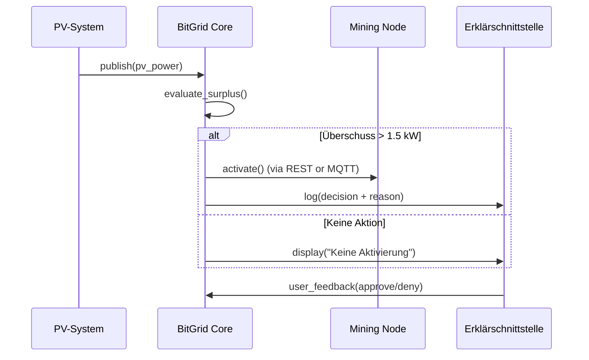

# 06 – Laufzeitsicht / Runtime View

## Überblick / Overview

Dieses Kapitel beschreibt die **Laufzeitsicht (Runtime View)** von BitGridAI – also, wie die Systemkomponenten zur Laufzeit interagieren. Der Fokus liegt auf Datenflüssen, Kommunikationsmustern und der Interaktion zwischen Energiequellen, Steuerlogik und Benutzeroberfläche.

> This chapter describes the **Runtime View** of BitGridAI, focusing on how system components interact during execution. It highlights data flow, communication patterns, and the interaction between energy sources, control logic, and user interface.

---

## Hauptszenario / Main Runtime Scenario

**Beispiel:** PV-Anlage erzeugt Energie → BitGrid Core bewertet Überschuss → Mining Node wird aktiviert.

1. **PV-Sensor meldet aktuellen Ertrag** über MQTT-Topic `sensor/pv_power`.
2. **BitGrid Core** empfängt die Nachricht und berechnet die aktuelle Lastverteilung.
3. Bei Überschuss > 1.5 kW wird die **flexible Last** (z. B. Mining Node) über eine lokale REST-API oder MQTT-Nachricht aktiviert.
4. Entscheidung wird im **Decision Log** protokolliert und an die **Erklärschnittstelle** übermittelt.
5. Nutzer sieht im UI eine Erklärung: *„PV-Ertrag über Schwelle – Mining gestartet.“*

> **Example:** PV system produces surplus → BitGrid Core evaluates → mining node activated.
>
> 1. PV sensor publishes via MQTT topic `sensor/pv_power`.
> 2. BitGrid Core processes data and calculates power balance.
> 3. If surplus > 1.5 kW → REST call or MQTT message triggers flexible load.
> 4. Decision is logged and sent to the explanation interface.
> 5. User sees explanation: *“PV power above threshold – mining activated.”*

---

## Komponenteninteraktion / Component Interaction

**Beschreibung:**

* **PV** und **Batterie** liefern Echtzeitdaten an den **Core**.
* **Core** entscheidet über Aktivierung von Lasten (z. B. Mining Node) über REST oder MQTT.
* **UI** zeigt Entscheidungen und erlaubt Nutzerfeedback.
* Entscheidungen und Energiezustände werden lokal gespeichert.

> **Description:**
>
> * **PV** and **Battery** provide real-time data to the **Core**.
> * **Core** manages activation of loads (e.g., mining) via REST or MQTT.
> * **UI** explains actions and allows user feedback.
> * All data and logs are stored locally.

---

## Nebenprozesse / Secondary Processes

| Prozess                   | Beschreibung                                                                    |
| ------------------------- | ------------------------------------------------------------------------------- |
| **Logging-Service**       | Zeichnet Systementscheidungen und Statusänderungen auf.                         |
| **Energy Forecaster**     | Prognostiziert PV-Erträge auf Basis historischer Daten.                         |
| **Health Monitor**        | Überwacht Hardwarezustand und Sensorverfügbarkeit.                              |
| **User Feedback Handler** | Nimmt Nutzerentscheidungen (z. B. Override) entgegen und bewertet Auswirkungen. |

> | Process                   | Description                                                           |
> | ------------------------- | --------------------------------------------------------------------- |
> | **Logging Service**       | Records all decisions and system state changes.                       |
> | **Energy Forecaster**     | Predicts PV yield based on historical data.                           |
> | **Health Monitor**        | Monitors hardware health and sensor availability.                     |
> | **User Feedback Handler** | Captures user actions and integrates their effects into system logic. |

---

## Ereignisflussdiagramm / Event Flow Diagram

---

## Zusammenfassung / Summary

Die Laufzeitsicht zeigt, wie BitGridAI **Energieflüsse in Echtzeit verarbeitet** und **erklärbare Entscheidungen** trifft. Der lokale, modulare Aufbau ermöglicht Transparenz und Kontrolle – auch ohne externe Server.

> The runtime view demonstrates how BitGridAI **processes energy data in real time** and makes **explainable decisions**. Its modular, local-first design ensures transparency and user control even without cloud connectivity.

* [07 Deployment-Sicht / Deployment View](./07_deployment_view.md)
