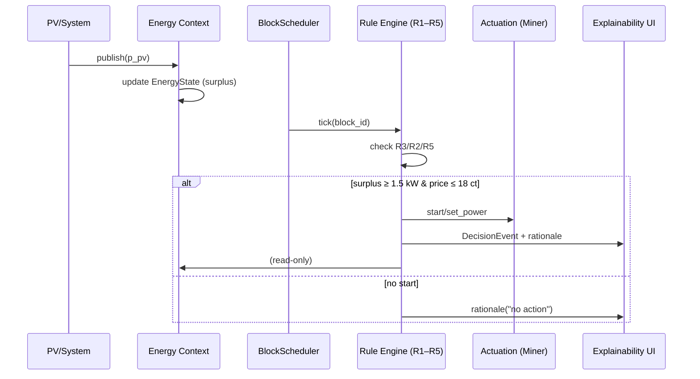
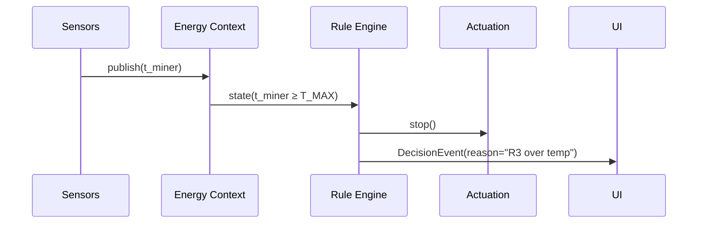

# 06 – Laufzeitsicht / Runtime View

**Kurzüberblick / TL;DR**
BitGridAI verarbeitet Energie- und Zustandsdaten **block-basiert (10 min)**, entscheidet deterministisch per **R1–R5**, steuert Aktoren und liefert **Erklärungen in Echtzeit**. Logging & KPIs laufen lokal – ohne Cloud.

> **TL;DR (EN)**
> BitGridAI operates on a **10‑minute block cadence**, evaluates deterministic rules **R1–R5**, actuates devices, and emits **real‑time explanations**. Logging & KPIs are local—no cloud.

---

## Überblick / Overview

Dieses Kapitel beschreibt die **Laufzeitsicht (Runtime View)** – also, wie Komponenten zur Laufzeit interagieren: Datenfluss, Kommunikationsmuster und die Interaktion zwischen Energiequellen, Steuerlogik und Benutzeroberfläche.

> This chapter describes the **Runtime View**—how components interact during execution: data flow, communication patterns, and the interplay between energy sources, control logic, and the user interface.

---

## Hauptszenario / Main Runtime Scenario

**Beispiel:** PV erzeugt Überschuss → BitGrid Core bewertet → Mining wird gestartet (R1) und erklärt.

1. **PV‑Sensor** publiziert aktuelle Leistung (`p_pv`) via MQTT (z. B. `sensor/pv_power`).
2. **Energy Context** aktualisiert den **EnergyState (SSoT)** und berechnet `surplus`.
3. **BlockScheduler** (10 min) triggert die **Rule Engine (R1–R5)**.
4. Bei `surplus ≥ 1.5 kW` und `price ≤ 18 ct` (Beispiel) entscheidet **R1 → start**.
5. **Actuation** sendet `start` / `set_power(level)` an den **Mining‑Controller**.
6. **Explainability** erzeugt Begründung (**Reason/Trigger/Parameter**) und **DecisionEvent**.
7. **UI** zeigt: „PV über Schwelle – **Mining gestartet** (R1). Deadband bis Block +2 (R5).“

> **Example:** PV produces surplus → Core evaluates → mining starts (R1) with an explanation.

---

## Komponenteninteraktion / Component Interaction

```mermaid
flowchart LR
    subgraph Sources
      PV[PV / Inverter]
      SM[Smart Meter]
      ES[Energy Storage]
      PR[Price/Forecast (local)]
    end
    EC[Energy Context\nEnergyState (SSoT)]
    RE[Rule Engine\nR1–R5]
    BS[BlockScheduler\n10‑min cadence]
    AC[Actuation\nMiner API / Relais]
    UI[Explainability UI\nWS/REST]
    LOG[Logging & KPI\nSQLite/Parquet]

    PV -->|MQTT/Modbus| EC
    SM -->|MQTT/SML| EC
    ES -->|MQTT/API| EC
    PR -->|file/local svc| EC
    EC --> RE
    BS --> RE
    RE --> AC
    RE --> UI
    RE --> LOG
    EC --> LOG
    UI -->|override| RE
```

**Beschreibung / Description**: Messquellen → **EnergyState** → **Regeln** (R1–R5) im Blocktakt → **Actuation**/**UI**/**Logs**.

---

## Blocktakt & Entscheidungszyklus / Block Cadence & Decision Cycle

1. **Tick**: `block_id = floor(epoch / 600)`; Scheduler triggert Evaluierung.
2. **Safety‑Checks**: **R3** (Temperatur), **R2** (SoC) haben Vorrang → ggf. **stop**.
3. **Stabilität**: **R5 Deadband** hält Zustand bis `valid_until = block_id + D`.
4. **Start‑Kandidaten**: **R1** (Überschuss+Preis) und optional **R4** (Forecast‑Stabilität).
5. **Actuation** ausführen, **DecisionEvent**+Erklärung publizieren, **Logs** schreiben.
6. **UI‑Preview**: „Was passiert im **nächsten Block**?“ inkl. Schwellen.

> Hard safety first (R3) → autonomy (R2) → stability (R5) → start (R1/R4).

---

## Alternative Szenarien / Alternate Scenarios

### A) Safety‑Stop (R3)

* **Trigger**: `t_miner ≥ T_MAX`.
* **Aktion**: sofort **stop**, Deadband ignorieren, UI meldet Übertemperatur.
* **Recovery**: Resume erst bei `t_miner ≤ T_RESUME`.

### B) Deadband‑Hold (R5)

* **Trigger**: Wechsel nahe Schwelle; Zustand wird für `D` Blöcke gehalten.
* **Aktion**: **hold** bis `valid_until`; nur **R2/R3** dürfen unterbrechen.

### C) Manueller Override

* **Trigger**: User setzt `override(start/stop, ttl)` in UI.
* **Aktion**: Core respektiert Override bis **Blockende**/TTL, loggt Reason `manual_override`.
* **Rebound**: automatische Rückkehr zur Policy, UI zeigt Countdown.

---

## Nebenprozesse / Secondary Processes

| Prozess / Process     | Beschreibung / Description                                             |
| --------------------- | ---------------------------------------------------------------------- |
| **Logging‑Service**   | Zeichnet EnergyState, Decisions, Events (append‑only) auf.             |
| **Energy Forecaster** | Lokale PV/Last‑Prognosen; liefert Eingang für **R4**.                  |
| **Health Monitor**    | Watchdog für Sensor‑Stale/Adapter‑Fehler; kann **hold/stop** auslösen. |
| **Feedback Handler**  | Bewertet User‑Feedback/Overrides und protokolliert Effekte auf KPIs.   |

---

## Ereignisfluss‑Sequenzen / Event Flow Sequences

### 1) Normaler Start (R1)



### 2) Safety‑Stop (R3)



---

## Runtime‑Kontrakte / Runtime Contracts

**MQTT Topics (Beispiele)**

* `energy/state/#` – publizierter **EnergyState** Snapshots.
* `miner/cmd/set` – Kommandos (`start|stop|set_power`).
* `miner/state/#` – Rückmeldungen (`level`, `t_miner`, `fan`).
* `explain/events/#` – **DecisionEvents** & Gründe.

**REST Endpunkte (lokal)**

* `GET /state` – aktueller **EnergyState**.
* `GET /timeline?since=…` – Decisions/Events.
* `GET /preview` – erwartete Aktion im nächsten Block.
* `POST /override {action, ttl}` – manueller Override.
* `POST /decisions` – (optional) Injection für Replays/Tests.

---

## Timing & Performance Ziele / Targets

| Ziel              | Vorgabe                             |
| ----------------- | ----------------------------------- |
| State‑Propagation | < 500 ms vom Sensor bis EnergyState |
| Decision‑Latency  | < 300 ms nach Block‑Tick            |
| UI‑Erklärung      | < 200 ms nach DecisionEvent         |
| Log‑Persistenz    | < 100 ms (async, append‑only)       |

> Werte sind Richtgrößen für MVP‑Eval; an Hardware anpassbar.

---

## Fehlerbehandlung / Failure Handling

* **Sensor‑Stale** → markiere State, **hold** statt **start**, UI Warnhinweis.
* **Adapter‑Fehler** → Retry mit Backoff; bei Persistenz → **stop → safe**.
* **Zeitdrift** → 1 Block **hold**, NTP re‑sync, dann normal weiter.
* **Inkonsistente Daten** → invalidiere Frame, letzten konsistenten State halten.

---

## Zusammenfassung / Summary

Die Laufzeitsicht zeigt, wie BitGridAI **Energie in Echtzeit block‑weise** verarbeitet und **erklärbare Entscheidungen** trifft. Der lokale, modulare Aufbau ermöglicht Transparenz & Kontrolle – **ohne externe Server**.

> The runtime view shows how BitGridAI **processes energy in real‑time, block‑wise** and makes **explainable decisions**. Local, modular design ensures transparency and control—**without external servers**.

*Weiter mit **[07 – Deployment‑Sicht / Deployment View](./07_deployment_view.md)**.*
