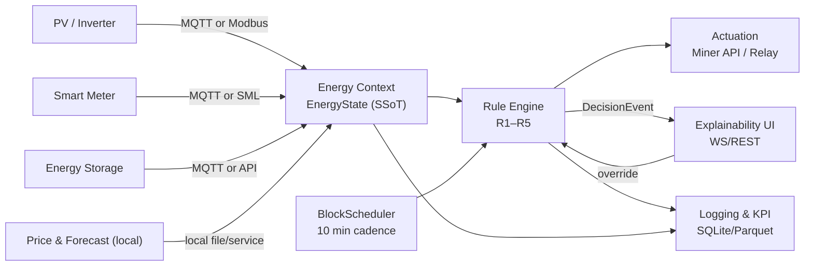
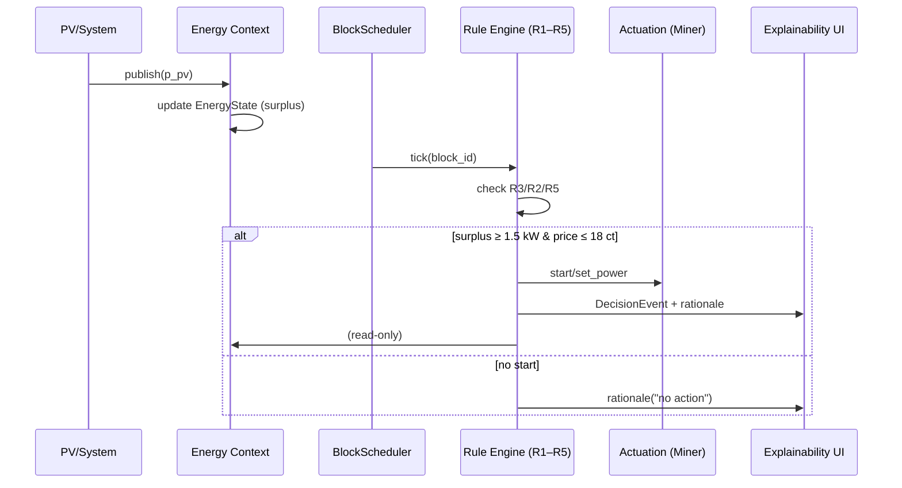
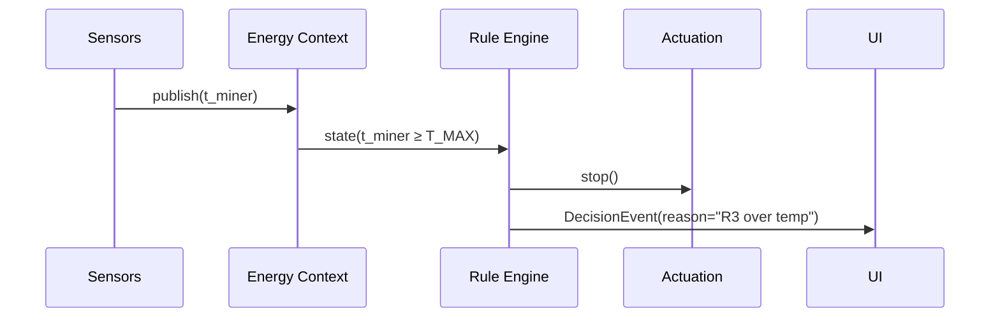

# 06 – Laufzeitsicht / Runtime View

> **Kurzüberblick:**
> 
> BitGridAI verarbeitet Energie- und Zustandsdaten **block‑basiert (10 min)**, entscheidet deterministisch per **R1–R5**, steuert Aktoren und liefert **Erklärungen in Echtzeit**. Logging & KPIs laufen lokal – ohne Cloud.

> **TL;DR (EN):**
> 
> BitGridAI operates on a **10‑minute block cadence**, evaluates deterministic rules **R1–R5**, actuates devices, and emits **real‑time explanations**. Logging & KPIs are local—no cloud.

---

## Überblick / Overview

Dieses Kapitel beschreibt die **Laufzeitsicht (Runtime View)** – also, wie Komponenten zur Laufzeit interagieren: Datenfluss, Kommunikationsmuster und die Interaktion zwischen Energiequellen, Steuerlogik und Benutzeroberfläche.

> This chapter describes the **Runtime View**—how components interact during execution: data flow, communication patterns, and the interplay between energy sources, control logic, and the user interface.

---

## Hauptszenario / Main Runtime Scenario

**Beispiel:** PV erzeugt Überschuss → BitGrid Core bewertet → Mining wird gestartet (R1) und erklärt.

1. **PV‑Sensor** publiziert aktuelle Leistung (`p_pv`) via MQTT (z. B. `sensor/pv_power`).
2. **Energy Context** aktualisiert den **EnergyState (SSoT)** und berechnet `surplus`.
3. **BlockScheduler** (10 min) triggert die **Rule Engine (R1–R5)**.
4. Bei `surplus ≥ 1.5 kW` und `price ≤ 18 ct` (Beispiel) entscheidet **R1 → start**.
5. **Actuation** sendet `start` / `set_power(level)` an den **Mining‑Controller**.
6. **Explainability** erzeugt Begründung (**Reason/Trigger/Parameter**) und **DecisionEvent**.
7. **UI** zeigt: „PV über Schwelle – **Mining gestartet** (R1). Deadband bis Block +2 (R5).“

> **Example:** PV produces surplus → core evaluates → mining starts (R1) with an explanation.
>
> 1. PV sensor publishes current power via MQTT.
> 2. **Energy Context** updates **EnergyState (SSoT)** and derives `surplus`.
> 3. **BlockScheduler** (10‑min) triggers **Rule Engine (R1–R5)**.
> 4. If `surplus ≥ 1.5 kW` and `price ≤ 18 ct`, **R1 → start**.
> 5. **Actuation** calls miner API (`start/set_power`).
> 6. **Explainability** emits rationale + **DecisionEvent**.
> 7. **UI** shows: “Above threshold — **mining started** (R1). Deadband until block +2 (R5).”

---

## Komponenteninteraktion / Component Interaction

**Beschreibung / Description:** Messquellen → **EnergyState** → **Regeln** (R1–R5) im Blocktakt → **Actuation** / **UI** / **Logs**.

---

## Blocktakt & Entscheidungszyklus / Block Cadence & Decision Cycle

1. **Tick**: `block_id = floor(epoch / 600)`; Scheduler triggert Evaluierung.
2. **Safety‑Checks**: **R3** (Temperatur), **R2** (SoC) haben Vorrang → ggf. **stop**.
3. **Stabilität**: **R5 Deadband** hält Zustand bis `valid_until = block_id + D`.
4. **Start‑Kandidaten**: **R1** (Überschuss+Preis) und optional **R4** (Forecast‑Stabilität).
5. **Actuation** ausführen, **DecisionEvent**+Erklärung publizieren, **Logs** schreiben.
6. **UI‑Preview**: „Was passiert im **nächsten Block**?“ inkl. Schwellen.

> Hard safety first (R3) → autonomy (R2) → stability (R5) → start (R1/R4).

---

## Alternative Szenarien / Alternate Scenarios

### A) Safety‑Stop (R3)

* **Trigger**: `t_miner ≥ T_MAX`.
* **Aktion**: sofort **stop**, Deadband ignorieren, UI meldet Übertemperatur.
* **Recovery**: Resume erst bei `t_miner ≤ T_RESUME`.

> **Trigger:** `t_miner ≥ T_MAX`.
> **Action:** immediate **stop**; ignore deadband; UI shows over‑temperature.
> **Recovery:** resume only when `t_miner ≤ T_RESUME`.

### B) Deadband‑Hold (R5)

* **Trigger**: Wechsel nahe Schwelle; Zustand wird für `D` Blöcke gehalten.
* **Aktion**: **hold** bis `valid_until`; nur **R2/R3** dürfen unterbrechen.

> **Trigger:** oscillation near threshold.
> **Action:** **hold** until `valid_until`; only **R2/R3** may break it.

### C) Manueller Override

* **Trigger**: User setzt `override(start/stop, ttl)` in UI.
* **Aktion**: Core respektiert Override bis **Blockende**/TTL, loggt Reason `manual_override`.
* **Rebound**: automatische Rückkehr zur Policy, UI zeigt Countdown.

> **Trigger:** user sets `override(start/stop, ttl)` in the UI.
> **Action:** core honors override until block end/TTL; logs reason `manual_override`.
> **Rebound:** automatic return to policy; UI shows countdown.

---

## Nebenprozesse / Secondary Processes

| Prozess / Process     | Beschreibung / Description                                             |
| --------------------- | ---------------------------------------------------------------------- |
| **Logging‑Service**   | Zeichnet EnergyState, Decisions, Events (append‑only) auf.             |
| **Energy Forecaster** | Lokale PV/Last‑Prognosen; liefert Eingang für **R4**.                  |
| **Health Monitor**    | Watchdog für Sensor‑Stale/Adapter‑Fehler; kann **hold/stop** auslösen. |
| **Feedback Handler**  | Bewertet User‑Feedback/Overrides und protokolliert Effekte auf KPIs.   |

> | Process               | Description                                                     |
> | --------------------- | --------------------------------------------------------------- |
> | **Logging service**   | Records EnergyState, decisions, events (append‑only).           |
> | **Energy forecaster** | Local PV/load forecasts; input for **R4**.                      |
> | **Health monitor**    | Watches sensor‑stale/adapter errors; may trigger **hold/stop**. |
> | **Feedback handler**  | Evaluates user feedback/overrides; logs KPI effects.            |

---

## Ereignisfluss‑Sequenzen / Event Flow Sequences

### 1) Normaler Start (R1)

### 2) Safety‑Stop (R3)

---

## Bitcoin‑aligned Runtime Extensions

### Energy Path / Hodl Decision Flow

1. **Energy Context** generiert für jedes Blockfenster (`block_id`) Kandidaten der Energiepfade *Export*, *Heat* und *Hodl*.
2. **Hodl Policy** (im Core) bewertet Opportunitätskosten, Deadband und Zeitpräferenz und protokolliert `energy_path_decision` in `data/energy_to_value`.
3. **DecisionEvent** erhält zusätzliche Felder (`preferred_path`, `rejected_path`, `sats_per_kWh`), sodass UI und Forschung klar sehen, warum Hodl gewählt oder verworfen wurde.
4. **UI Research Panels** zeigen Blockzeit, sats/kWh‑Effizienz sowie „was wäre passiert“-Alternativen.

> Every runtime tick therefore exposes the Bitcoin‑specific trade-off rather than hiding it in the miner adapter.

### Proof‑of‑Work Telemetry Loop

1. **Miner Controller** liefert Hashrate, Effizienz (J/TH), Temperatur und ggf. Hash‑Proben an **Energy Context**.
2. **R2/R3** verknüpfen diese Telemetrie mit Autarkie- und Thermo-Schutz; Abweichungen vom Zielbereich erzeugen Warnungen + aktiven Leistungs-Limiter.
3. **Explainability/KPI Logger** persistieren `pow_hash_sample` + Energieverbrauch als Nachweis lokaler PoW-Nutzung.
4. **Risk Monitor** prüft regulatorische Limits (Lautstärke, Zeitfenster) und setzt ggf. `stop → safe` über den Blockscheduler.

### Blockchain‑Trilemma Guardrails

* **Dezentralisierung**: Jede Entscheidung wird lokal (ohne Cloud) gefällt; Remote-Kommandos laufen via `POST /override` mit Audit-Log.
* **Sicherheit**: Safety-Pfade (R2/R3) dürfen Bitcoin-Last jederzeit stoppen; Proof-of-Work Telemetrie ist Pflicht.
* **Skalierung**: Der 10-Minuten-Takt limitiert bewusst globale Skalierungsambitionen, liefert aber deterministische Stabilität für den Haushalt.

> Runtime behavior makes the trilemma explicit: decentralization + security prioritized, scalability scoped to the household.

---

## Runtime‑Kontrakte / Runtime Contracts

**MQTT Topics (Beispiele / Examples)**

* `energy/state/#` — publizierte **EnergyState**‑Snapshots.
* `miner/cmd/set` — Kommandos (`start|stop|set_power`).
* `miner/state/#` — Rückmeldungen (`level`, `t_miner`, `fan`).
* `explain/events/#` — **DecisionEvents** & Gründe.

> **MQTT topics (examples):**
> `energy/state/#` (EnergyState snapshots), `miner/cmd/set` (commands), `miner/state/#` (feedback), `explain/events/#` (DecisionEvents & rationales).

**REST Endpunkte (lokal) / REST Endpoints (local)**

* `GET /state` — aktueller **EnergyState**.
* `GET /timeline?since=…` — Decisions/Events.
* `GET /preview` — erwartete Aktion im nächsten Block.
* `POST /override {action, ttl}` — manueller Override.
* `POST /decisions` — (optional) Injection für Replays/Tests.

> `GET /state`, `GET /timeline`, `GET /preview`, `POST /override`, `POST /decisions` (optional for replay/tests) — **local only**.

---

## Timing & Performance Ziele / Targets

| Ziel                  | Vorgabe                                 |
| --------------------- | --------------------------------------- |
| **State‑Propagation** | < **500 ms** vom Sensor bis EnergyState |
| **Decision‑Latency**  | < **300 ms** nach Block‑Tick            |
| **UI‑Erklärung**      | < **200 ms** nach DecisionEvent         |
| **Log‑Persistenz**    | < **100 ms** (async, append‑only)       |

> | Target                  | Budget                            |
> | ----------------------- | --------------------------------- |
> | **State propagation**   | < **500 ms** sensor → EnergyState |
> | **Decision latency**    | < **300 ms** after block tick     |
> | **Explanation latency** | < **200 ms** after DecisionEvent  |
> | **Log persistence**     | < **100 ms** (async, append‑only) |

> Werte sind Richtgrößen für MVP‑Eval; an Hardware anpassbar.
> Values are indicative for the MVP and may be tuned per hardware.

---

## Fehlerbehandlung / Failure Handling

* **Sensor‑Stale** → State markieren, **hold** statt **start**; UI‑Warnhinweis.
* **Adapter‑Fehler** → Retry mit Backoff; bei Persistenz → **stop → safe**.
* **Zeitdrift** → 1 Block **hold**, NTP re‑sync; danach normal.
* **Inkonsistente Daten** → Frame invalidieren; letzten konsistenten State halten.

> **Sensor stale** → mark state, **hold** instead of **start**; UI warning.
> **Adapter error** → retry with backoff; if persistent → **stop → safe**.
> **Time drift** → **hold** for 1 block, NTP re‑sync; resume normal.
> **Inconsistent data** → invalidate frame; keep last consistent state.

---

## Zusammenfassung / Summary

Die Laufzeitsicht zeigt, wie BitGridAI **Energie in Echtzeit block‑weise** verarbeitet und **erklärbare Entscheidungen** trifft. Der lokale, modulare Aufbau ermöglicht Transparenz & Kontrolle – **ohne externe Server**.

> The runtime view shows how BitGridAI **processes energy in real‑time, block‑wise** and makes **explainable decisions**. Local, modular design ensures transparency and control—**without external servers**.

*Weiter mit **[07 – Deployment‑Sicht / Deployment View](./07_deployment_view.md)**.*

