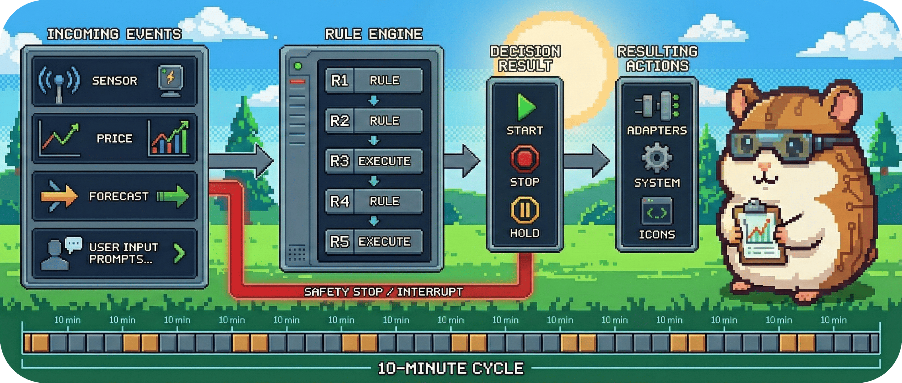

# 06.02 - Szenario: Autarkie-Schutz (Regel R2)

Das Haus hat Vorfahrt.

BitGridAI ist ein "Good Citizen" im Hausnetz. Das bedeutet: Wir klauen dem Haushalt keinen Strom. Regel **R2 (Autarkie)** ist der Wächter, der einschreitet, wenn der Hausakku leerläuft oder wir teuren Strom aus dem Netz ziehen müssten.

R2 hat eine **höhere Priorität** als R1. Selbst wenn Mining profitabel wäre (R1=True), kann R2 ein Veto einlegen ("Ja, aber wir haben keinen Strom übrig").

&nbsp;

## Der Ablauf (Sequenz)

1.  **Sensing:** Der Smart Meter meldet plötzlich hohen Netzbezug (jemand hat den Herd eingeschaltet) ODER der Batteriespeicher meldet einen niedrigen Ladestand (SoC).
2.  **Trigger:** Der 10-Minuten-Takt (oder ein Sofort-Interrupt bei kritischen Werten).
3.  **Evaluation (R2):** zweistufiger SoC-Schutz plus Netzbezugsgrenze:
    * Ist `battery_soc <= 50%` (Hard-Limit)? → **STOP MINING** (Hausreserve — darunter darf nicht gemint werden).
    * ODER ist `battery_soc <= 58%` (Soft-Limit)? → **NOOP** (kein Neustart, laufender Betrieb wird nicht zwingend gestoppt).
    * ODER ist `net_import_w` (Bezug − Einspeisung) `> 500W`? → **STOP MINING**.
4.  **Action:** Der Miner wird sanft heruntergefahren oder pausiert.
5.  **Explanation:**
    * `Reason`: "Priority to Household"
    * `Trigger`: "SoC 48% <= 50% Hard-Limit"

&nbsp;

## Konfiguration (MVP)

| Parameter | Wert (Default) | Beschreibung |
| :--- | :--- | :--- |
| `soc_hard_min_pct` | **50 %** | Hard-Limit: Auf/unter diesem Ladestand wird der laufende Betrieb sofort gestoppt. Das ist die **Hausreserve** — mit weniger kommt man nicht über die Nacht (= HA-Produktiv `mvp_soc_stop_pct`). |
| `soc_soft_min_pct` | **58 %** | Soft-Limit: Auf/unter diesem Ladestand kein Neustart (NOOP); Wiedereinstieg erst darüber (= HA-Produktiv `mvp_soc_eco_start_pct`, 8-Pkt-Hysterese). |
| `max_grid_import_w` | **500 W** | Toleranzgrenze für den **Netto**-Netzbezug (Bezug − Einspeisung). Darüber muss der Miner aus. |

> **Hinweis (SoC-Band-Strategie):** Läuft der Kern mit `strategy="soc_band"` (Produktiv-Spiegelung), besitzt die SoC-Band-Logik die Hausreserve vollständig (Stop 50 % · Eco-Start 58 %); R2 prüft dann nur den Netzbezug. Im Surplus-Modus (Studie) ist R2 die SoC-Reserve.

---
> **Nächster Schritt:** Was ist, wenn nicht der Strom fehlt, sondern die Hardware glüht? Dann greift die höchste Instanz.
>
> 👉 Weiter zu **[06.03 - Sicherheitsstopp (R3)](./0603_safety_stop.md)**
>
> 🔙 Zurück zur **[Kapitelübersicht](./README.md)**
