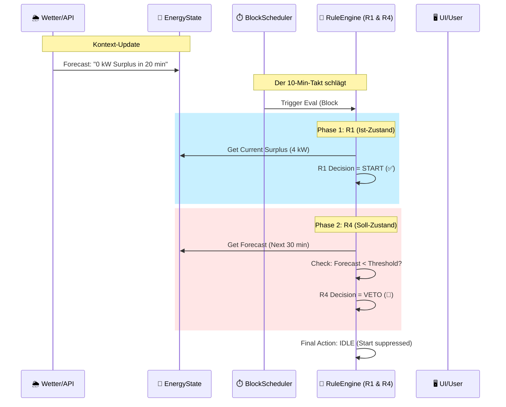

# 06.04 - Szenario: Prognose-Optimierung (Regel R4)

Der Blick in die Glaskugel.

Regel **R4 (Forecast)** macht BitGridAI intelligent. Statt nur auf den aktuellen Überschuss zu reagieren (wie R1), prüft R4, was gleich passiert.

* "Lohnt sich das Starten noch, wenn in 10 Minuten die Sonne untergeht?"
* "Sollten wir jetzt stoppen, weil der Strompreis gleich explodiert?"

R4 fungiert als **Modifikator** oder "Veto-Instanz" für R1. Sie kann einen Start verhindern ("Start Prevention") oder einen Stopp erzwingen ("Pre-emptive Stop"), um Ineffizienz zu vermeiden.

&nbsp;

## Sequenzdiagramm (Das Veto)

Hier sehen wir den klassischen Fall der "Start-Verhinderung". Aktuell sieht alles gut aus, aber die Zukunft ist düster.

```mermaid
sequenceDiagram
    participant Weather as 🌦️ Wetter/API
    participant SSoT as 🧠 EnergyState
    participant Sched as ⏱️ BlockScheduler
    participant Rules as 📜 RuleEngine (R1 & R4)
    participant UI as 🖥️ UI/User

    Note over Weather, SSoT: Kontext-Update
    Weather->>SSoT: Forecast: "0 kW Surplus in 20 min"
    
    Note over Sched, Rules: Der 10-Min-Takt schlägt
    Sched->>Rules: Trigger Eval (Block #N)
    
    rect rgb(200, 240, 255)
        Note over Rules: Phase 1: R1 (Ist-Zustand)
        Rules->>SSoT: Get Current Surplus (4 kW)
        Rules->>Rules: R1 Decision = START (✅)
    end

    rect rgb(255, 230, 230)
        Note over Rules: Phase 2: R4 (Soll-Zustand)
        Rules->>SSoT: Get Forecast (Next 30 min)
        Rules->>Rules: Check: Forecast < Threshold?
        Rules->>Rules: R4 Decision = VETO (🛑)
    end

    Rules->>Rules: Final Action: IDLE (Start suppressed)
```

&nbsp;

## Der Ablauf im Detail

1.  **Input (Der Weitblick):**
    Ein lokaler Dienst (Sidecar) oder eine externe API liefert Daten für die nahe Zukunft:
    * *Wetter:* "Dicke Wolkenfront in 15 Min".
    * *Preis:* "Strompreis steigt um 18:00 Uhr auf 45ct".

2.  **Evaluation (Der Konflikt):**
    * **R1 (Der Optimist):** Prüft das Hier und Jetzt. "Wir haben 4 kW Überschuss. Lass uns minen!" $\rightarrow$ `Proposal: START`.
    * **R4 (Der Realist):** Prüft die Prognose. "In 15 Minuten bricht die Leistung ein. Für 15 Minuten lohnt sich das Hochfahren nicht (Hardware-Stress)." $\rightarrow$ `Veto: TRUE`.

3.  **Ergebnis (Die Entscheidung):**
    Das System bleibt **aus** (oder fährt kontrolliert herunter).

4.  **Explanation (Die Transparenz):**
    Der Nutzer sieht im UI nicht einfach "Aus", sondern den Grund:
    * `Reason`: "Start suppressed by Forecast"
    * `Trigger`: "Surplus drop predicted in < 30min"

5.  **Benefit:**
    Wir vermeiden "Short Cycling" (Miner fährt mühsam hoch, wird warm, und muss 10 Minuten später wieder hart abschalten). Das verlängert die Lebensdauer der Hardware massiv.

&nbsp;

## Konfiguration (MVP)

Damit R4 nicht zu übervorsichtig agiert, müssen wir den Horizont definieren:

| Parameter | Wert (Default) | Beschreibung |
| :--- | :--- | :--- |
| `min_predicted_surplus_kw` | **2.0 kW** | Wenn die PV-Prognose unter diesen Wert fällt, wird der Start per NOOP-Veto verweigert. |
| `price_spike_threshold_ct` | **30 ct** | Wenn ein Preis-Peak hierüber erwartet wird, legt R4 ein NOOP-Veto ein (Pre-emptive Stop). |
| `forecast_lookahead_min` | **30 Min** | Konzeptioneller Prognose-Horizont. *Hinweis:* im deterministischen Kern aktuell **kein** eigener Parameter — R4 wertet die bereitgestellte `pv_forecast_kw` aus. |

---
> **Nächster Schritt:** Wir haben viele Regeln, die sich widersprechen könnten. Damit das System nicht nervös hin und her schaltet, brauchen wir einen Dämpfer.
>
> 👉 Weiter zu **[06.05 - Stabilität & Totband (R5)](./0605_deadband_stability.md)**
>
> 🔙 Zurück zur **[Kapitelübersicht](./README.md)**
