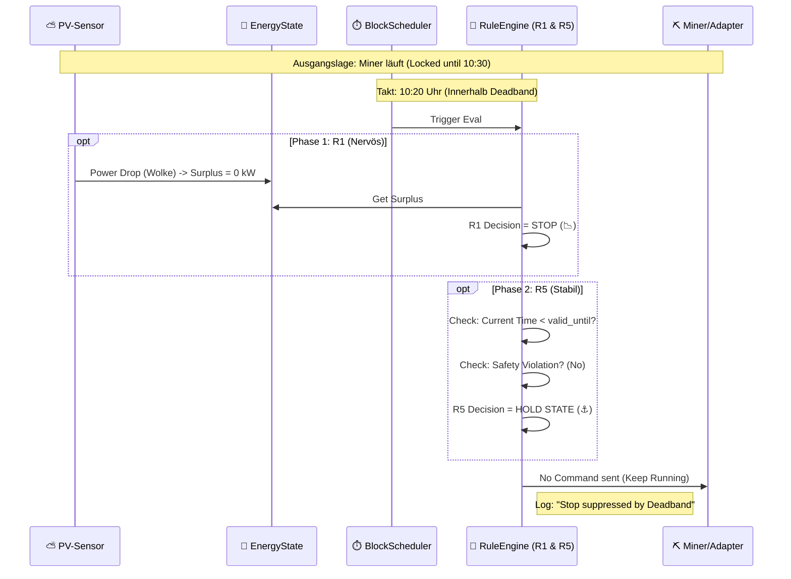

# 06.05 - Szenario: Stabilität & Totband (Regel R5)

Die Ruhe bewahren.

Nichts ist schlimmer für Hardware und Effizienz als "Flapping" (An... Aus... An... Aus...). Wenn eine kleine Wolke zieht, darf der Miner nicht sofort ausgehen, nur um 30 Sekunden später wieder zu starten. Das stresst die Chips und das Stromnetz.

Regel **R5 (Deadband/Hysteresis)** sorgt für Trägheit im System. Sie friert getroffene Entscheidungen für eine definierte Zeit ("Haltezeit") ein, es sei denn, ein Notfall (R2/R3) tritt ein.

*(Platzhalter für ein Bild: Ein Hamster, der entspannt Yoga macht und "Ommm" sagt, während um ihn herum das Chaos tobt und Warnlampen blinken.)*

&nbsp;

## Sequenzdiagramm (Der Stoiker)

Hier sehen wir, wie R5 eine nervöse Abschaltung verhindert.

&nbsp;

## Der Ablauf im Detail

1.  **Status Quo:**
    Der Miner wurde vor 10 Minuten gestartet. Regel R5 hat beim Start einen "Lock" gesetzt: `valid_until = now + 20 min`.

2.  **Event (Die Störung):**
    Eine Wolke zieht durch. Der PV-Überschuss bricht kurzzeitig auf 0 kW ein.

3.  **Evaluation (Der Konflikt):**
    * **R1 (Profitability):** Sieht den Einbruch und schreit: "Kein Strom! Sofort abschalten!" $\rightarrow$ `Proposal: STOP`.
    * **R5 (Stability):** Prüft den Timer. "Wir haben uns verpflichtet, bis 10:30 Uhr zu laufen."
    * **Safety-Check:** R5 prüft kurz, ob ein Notfall vorliegt (R2/R3). Da der Akku noch voll ist und nichts überhitzt: **Alles okay**.
    * **Ergebnis:** R5 überstimmt R1. Die Entscheidung lautet **HOLD**.

4.  **Ergebnis:**
    Der Miner läuft einfach weiter. Er bezieht kurzzeitig Strom aus dem Netz oder der Batterie (Puffer), aber die Hardware wird vor einem unnötigen Neustart bewahrt.

5.  **Auflösung:**
    Erst wenn die Zeit (`valid_until`) abgelaufen ist *oder* ein echter Notfall eintritt, gibt R5 die Kontrolle wieder frei.

&nbsp;

## Konfiguration (MVP)

Wie träge soll das System sein?

| Parameter | Wert (Beispiel) | Beschreibung |
| :--- | :--- | :--- |
| `deadband_hold_blocks` | **2 Blöcke** | (20 Min) Standard-Haltezeit nach jedem Schaltvorgang (Start oder Stop). Verhindert, dass wir öfter als 3x pro Stunde schalten. |
| `force_unlock_rules` | **R2, R3** | Welche Regeln dürfen das Totband brechen? Nur **Autarkie** (R2, Akku leer) und **Sicherheit** (R3, Feuer). R1 (Geld) und R4 (Prognose) müssen warten. |
| `max_grid_import_deadband`| **2000 W** | Wenn der Bezug *während* des Totbands diesen Wert übersteigt, wird trotzdem abgebrochen (Notbremse für den Geldbeutel). |

---
> **Nächster Schritt:** Damit haben wir den Automatik-Betrieb (R1-R5) komplett abgedeckt. Aber manchmal weiß der Mensch es besser und will eingreifen.
>
> 👉 Weiter zu **[06.06 - Manuelles Überschreiben](./0606_manual_override.md)**
>
> 🔙 Zurück zur **[Kapitelübersicht](./README.md)**

