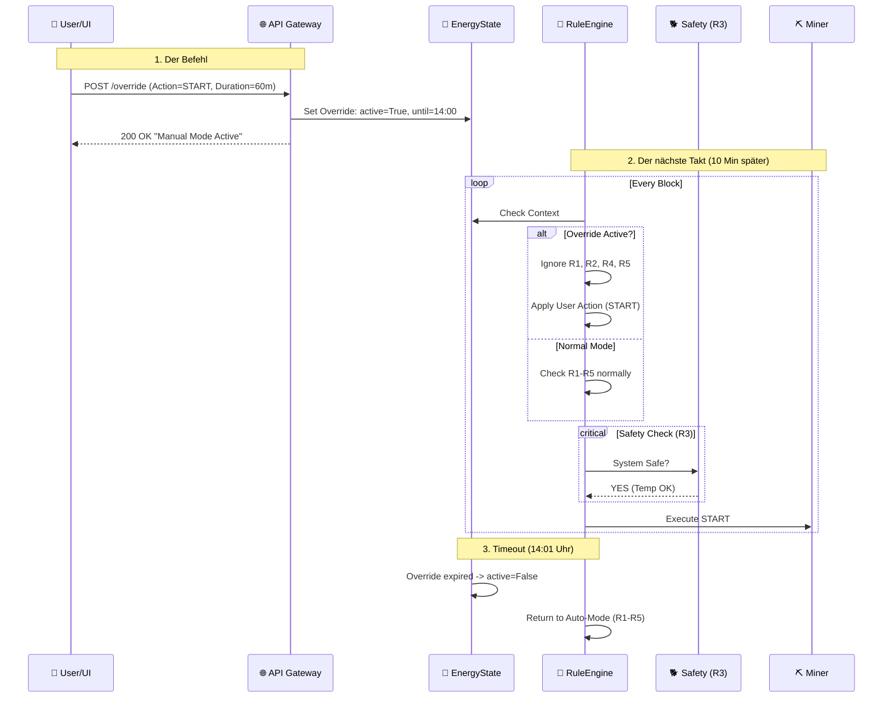

# 06.06 - Szenario: Manuelles Überschreiben (User Override)

Chef-Sache.

So gut die Automatik auch ist – manchmal weiß der Mensch es besser. Vielleicht möchtest du die Heizung testen, obwohl die Sonne nicht scheint. Oder du möchtest das Mining stoppen, weil du absolute Stille im Haus brauchst.

Dieses Szenario beschreibt, wie BitGridAI reagiert, wenn der Nutzer das Steuer übernimmt. Dabei gilt eine goldene Regel: **Der Nutzer sticht die Optimierung, aber die Sicherheit sticht den Nutzer.**

*(Platzhalter für ein Bild: Der Hamster trägt eine Kapitänsmütze und steuert das Schiff manuell mit einem großen hölzernen Steuerrad. Die Autopilot-Lampe ist aus.)*

&nbsp;

## Das Konzept: Override mit Verfallsdatum

Ein manueller Eingriff ist in BitGridAI nie "für immer" (um zu verhindern, dass man vergisst, den Miner wieder einzuschalten). Ein Override hat immer eine **TTL (Time To Live)**.

* **Der Befehl:** "Erzwinge START für 60 Minuten."
* **Die Auswirkung:** Die Regeln R1 (Profit), R2 (Autarkie), R4 (Forecast) und R5 (Totband) werden ignoriert.
* **Die Grenze:** Regel R3 (Safety) bleibt **immer** aktiv. Du kannst den Miner nicht zwingen zu laufen, wenn er brennt.

&nbsp;

## Sequenzdiagramm

Hier sehen wir, wie der Befehl die normale Logik "kurzschließt".

&nbsp;

## Der Ablauf im Detail

1.  **Eingabe (The Command):**
    Der Nutzer drückt im UI auf "Boost" oder "Pause". Die API nimmt den Befehl entgegen. Wichtig: Es muss *immer* eine Dauer mitgegeben werden (Standard z.B. 1 Stunde).

2.  **Zustandsänderung (The Flag):**
    Im `EnergyState` werden die Felder `override_action` (z.B. `START`) und `override_valid_until` gesetzt.

3.  **Regel-Verarbeitung (The Bypass):**
    Wenn die Rule Engine anläuft, prüft sie zuerst: *Gibt es einen gültigen Override?*
    * **JA:** Überspringe die Logik für Profitabilität (R1) und Batterie-Schutz (R2). Wir nehmen an, der Nutzer will den Akku jetzt bewusst entleeren.
    * **ABER:** Prüfe trotzdem die Hardware-Limits (R3). Wenn der Chip 90°C hat, wird der Override ignoriert und ein Fehler geworfen ("Override rejected: Unsafe condition").

4.  **Rückkehr zum Normalbetrieb (Back to Auto):**
    Sobald die Zeit (`override_valid_until`) abgelaufen ist, löscht das System das Flag. Im nächsten 10-Minuten-Block entscheiden wieder rein die Regeln R1–R5.

&nbsp;

## Konfiguration

Damit der Nutzer sich nicht ins Knie schießt:

| Parameter | Wert (Beispiel) | Beschreibung |
| :--- | :--- | :--- |
| `default_override_duration_min` | **60 Min** | Standard-Dauer, wenn nichts anderes gewählt wurde. |
| `max_override_duration_min` | **24 Std** | Länger darf ein manueller Override nicht dauern (Sicherheitsnetz gegen Vergesslichkeit). |
| `allow_unsafe_override` | **FALSE** | (Hardcoded) Es ist nicht möglich, R3 (Safety) zu übersteuern. |

---
> **Nächster Schritt:** Der Nutzer kann eingreifen – aber wie viel Kontrolle soll das System grundsätzlich übernehmen?
>  
> 👉 Weiter zu **[06.07 Autonomie-Stufen & Kontrollmodi](./0607_autonomy_levels.md)**
> 
> 🔙 Zurück zur **[Kapitelübersicht](./README.md)**
