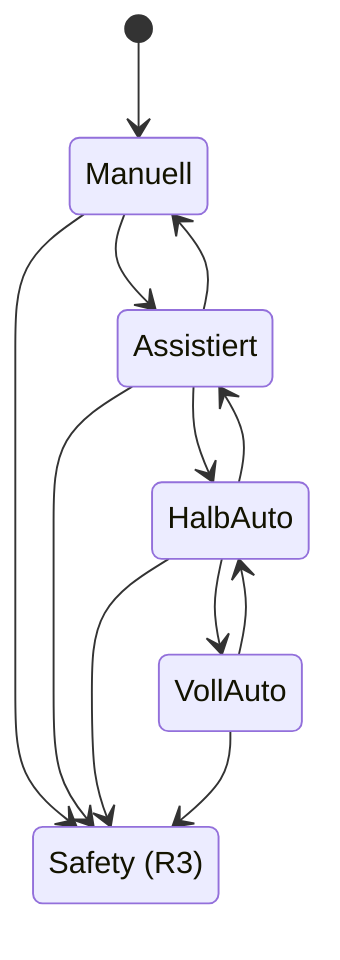

# 06.07 - Szenario: Autonomie-Stufen & Kontrollmodi

Wer entscheidet eigentlich?

BitGridAI arbeitet nicht binär nach dem Prinzip „Automatik an oder aus“.  
Stattdessen unterstützt das System explizite **Autonomie-Stufen**, die festlegen, wie viel Entscheidungsmacht beim Nutzer liegt und wie viel beim System.

Dieses Szenario beschreibt die verschiedenen Kontrollmodi und zeigt, wie BitGridAI je nach Stufe Verantwortung verteilt.  
Ziel ist es, **Selbstbestimmung und Komfort bewusst wählbar** zu machen – ein zentrales HCI-Prinzip des Systems.

&nbsp;

## Das Konzept: Kontrollierbare Autonomie statt Alles-oder-nichts

Jede Autonomie-Stufe definiert:
- wer Entscheidungen trifft (Nutzer vs. System),
- welche Aktionen erlaubt sind,
- welche Regeln automatisch greifen.

Unabhängig von der gewählten Stufe gilt:
> **Mehr Autonomie für das System bedeutet nie weniger Sicherheit.**  
> Regel R3 (Safety) bleibt in allen Modi jederzeit aktiv.

&nbsp;

## Die vier Autonomie-Stufen

### Stufe 0 — Manuell  
**Der Nutzer entscheidet immer.**

- Mining wird ausschließlich manuell über das UI gestartet oder gestoppt.
- Das System macht keine Vorschläge und trifft keine eigenen Entscheidungen.
- Sicherheitsprüfungen (R3) werden weiterhin ausgeführt und können Aktionen blockieren.

**Typischer Anwendungsfall:**  
Tests, Debugging, maximale Kontrolle.

&nbsp;

### Stufe 1 — Assistiert  
**Das System denkt mit, entscheidet aber nicht.**

- BitGridAI analysiert Kontext, Prognosen und Regeln.
- Es formuliert Vorschläge („Jetzt starten wäre sinnvoll“).
- Jede Aktion erfordert eine explizite Bestätigung durch den Nutzer („Anwenden“).

**Typischer Anwendungsfall:**  
Vertrauensaufbau, Transparenz, lernende Nutzung.

&nbsp;

### Stufe 2 — Halb-automatisch  
**Das System darf starten, aber nicht stoppen.**

- BitGridAI darf Mining automatisch starten, wenn alle Bedingungen erfüllt sind.
- Ein Stoppen des Minings ist ausschließlich manuell möglich.
- Sicherheitsmechanismen (R3) dürfen jederzeit eingreifen und den Betrieb unterbrechen.

**Typischer Anwendungsfall:**  
Komfort beim Start, volle Kontrolle beim Stoppen.

&nbsp;

### Stufe 3 — Vollautomatisch  
**Das System kontrolliert Start und Stopp vollständig.**

- Start und Stop werden autonom durch die Regeln R1–R5 gesteuert.
- Der Nutzer definiert nur noch Rahmenparameter und Präferenzen.
- Manuelle Eingriffe bleiben über zeitlich begrenzte Overrides möglich.

**Typischer Anwendungsfall:**  
Maximaler Komfort, kontinuierlich optimierter Betrieb.

&nbsp;

## Verhalten zur Laufzeit (vereinfacht)

&nbsp;

## Der Ablauf im Detail

1. **Moduswahl (The Choice):**  
   Der Nutzer wählt im UI explizit eine Autonomie-Stufe. Der aktuell aktive Modus ist jederzeit sichtbar.

2. **Zustandsablage (The Mode):**  
   Die gewählte Stufe wird zentral im `EnergyState` als `autonomy_level` gespeichert.

3. **Regelverarbeitung (The Authority):**  
   Bei jedem Auswertungszyklus berücksichtigt die Rule Engine:
   - welche Entscheidungen automatisch getroffen werden dürfen,
   - welche Aktionen eine Nutzerbestätigung erfordern.

4. **Zusammenspiel mit Overrides:**  
   Ein manueller Override (siehe 06.6) hat Vorrang vor der Autonomie-Stufe, ist jedoch immer zeitlich begrenzt.

&nbsp;

## Konfiguration

| Parameter | Wert (Beispiel) | Beschreibung |
| --- | --- | --- |
| `default_autonomy_level` | **1 (Assistiert)** | Sicherer und transparenter Startmodus |
| `allow_level_change_runtime` | **TRUE** | Wechsel der Stufe ohne Neustart |
| `min_autonomy_level` | **0** | Manuelle Kontrolle immer verfügbar |
| `max_autonomy_level` | **3** | Vollautomatik als maximale Autonomie |

---
> **Nächster Schritt:** Die Kontrolllogik ist definiert.  
> Jetzt schauen wir, **wie BitGridAI sauber startet und sich von Ausfällen erholt**.
>
> 👉 Weiter zu **[06.08 - Boot & Recovery](./0608_boot_recovery.md)**
> 
> 🔙 Zurück zur **[Kapitelübersicht](./README.md)**

