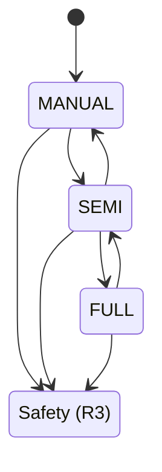

# 06.07 - Szenario: Autonomie-Stufen & Kontrollmodi

Wer entscheidet eigentlich?

BitGridAI arbeitet nicht binär nach dem Prinzip „Automatik an oder aus“.  
Stattdessen unterstützt das System explizite **Autonomie-Stufen**, die festlegen, wie viel Entscheidungsmacht beim Nutzer liegt und wie viel beim System.

Dieses Szenario beschreibt die verschiedenen Kontrollmodi und zeigt, wie BitGridAI je nach Stufe Verantwortung verteilt.  
Ziel ist es, **Selbstbestimmung und Komfort bewusst wählbar** zu machen – ein zentrales HCI-Prinzip des Systems.

&nbsp;

## Das Konzept: Kontrollierbare Autonomie statt Alles-oder-nichts

Jede Autonomie-Stufe definiert:
- wer Entscheidungen trifft (Nutzer vs. System),
- welche Aktionen erlaubt sind,
- welche Regeln automatisch greifen.

Unabhängig von der gewählten Stufe gilt:
> **Mehr Autonomie für das System bedeutet nie weniger Sicherheit.**  
> Regel R3 (Safety) bleibt in allen Modi jederzeit aktiv.

&nbsp;

## Die drei Autonomie-Stufen

Der Kern implementiert drei benannte Stufen (`AutonomyLevel = "FULL" | "SEMI" | "MANUAL"`,
`src/core/models.py`). Der Standardwert ist **FULL** (Studien-Default).

### MANUAL — Manuell  
**Der Nutzer entscheidet immer.**

- Nach R3 werden alle weiteren Regeln übersprungen; der Kern gibt `NOOP_MANUAL_MODE` zurück.
- Start und Stop erfolgen ausschließlich manuell über den Override-Button.
- Sicherheitsprüfungen (R3) werden weiterhin ausgeführt und können Aktionen blockieren.

**Typischer Anwendungsfall:**  
Tests, Debugging, maximale Kontrolle.

&nbsp;

### SEMI — Halb-automatisch  
**Das System darf starten, aber nicht selbstständig stoppen.**

- BitGridAI darf Mining automatisch starten, wenn alle Bedingungen erfüllt sind.
- Automatische Stopp-Entscheidungen (z. B. R2) werden zu `NOOP` umgewandelt — nur **R3** darf noch automatisch abschalten.
- Ein reguläres Stoppen ist sonst nur manuell möglich.

**Typischer Anwendungsfall:**  
Komfort beim Start, volle Kontrolle beim Stoppen.

&nbsp;

### FULL — Vollautomatisch (Standard)  
**Das System kontrolliert Start und Stopp vollständig.**

- Start und Stop werden autonom durch die Regeln R1–R5 gesteuert.
- Der Nutzer definiert nur noch Rahmenparameter; manuelle Eingriffe bleiben über zeitlich begrenzte Overrides möglich.

**Typischer Anwendungsfall:**  
Maximaler Komfort, kontinuierlich optimierter Betrieb; Standard während der Studie.

&nbsp;

## Verhalten zur Laufzeit (vereinfacht)

```mermaid
stateDiagram-v2
    [*] --> MANUAL
    MANUAL --> SEMI
    SEMI --> FULL

    FULL --> SEMI
    SEMI --> MANUAL

    state "Safety (R3)" as Safety
    MANUAL --> Safety
    SEMI --> Safety
    FULL --> Safety
```
&nbsp;

## Der Ablauf im Detail

1. **Moduswahl (The Choice):**  
   Der Nutzer wählt im UI explizit eine Autonomie-Stufe. Der aktuell aktive Modus ist jederzeit sichtbar.

2. **Zustandsablage (The Mode):**  
   Die gewählte Stufe wird im `OverrideHandler` als `autonomy_level` persistiert und bei jedem Block-Tick an die Rule Engine übergeben.

3. **Regelverarbeitung (The Authority):**  
   Bei jedem Auswertungszyklus berücksichtigt die Rule Engine:
   - welche Entscheidungen automatisch getroffen werden dürfen,
   - welche Aktionen eine Nutzerbestätigung erfordern.

4. **Zusammenspiel mit Overrides:**  
   Ein manueller Override (siehe 06.6) hat Vorrang vor der Autonomie-Stufe, ist jedoch immer zeitlich begrenzt.

&nbsp;

## Konfiguration

| Parameter | Wert | Beschreibung |
| --- | --- | --- |
| `autonomy_level` (Default) | **FULL** | Studien-Default; alle Regeln R1–R5 aktiv |
| Mögliche Werte | **FULL · SEMI · MANUAL** | benannte Stufen (`src/core/models.py`) |
| Laufzeit-Wechsel | **ja** | über `POST /autonomy`, ohne Neustart |
| Persistenz | **OverrideHandler** | Stufe überlebt Container-Neustart |

> **Hinweis:** R3 (Safety) bleibt in allen drei Stufen aktiv und kann nicht deaktiviert werden.

---
> **Nächster Schritt:** Die Kontrolllogik ist definiert.  
> Jetzt schauen wir, **wie BitGridAI sauber startet und sich von Ausfällen erholt**.
>
> 👉 Weiter zu **[06.08 - Boot & Recovery](./0608_boot_recovery.md)**
> 
> 🔙 Zurück zur **[Kapitelübersicht](./README.md)**

