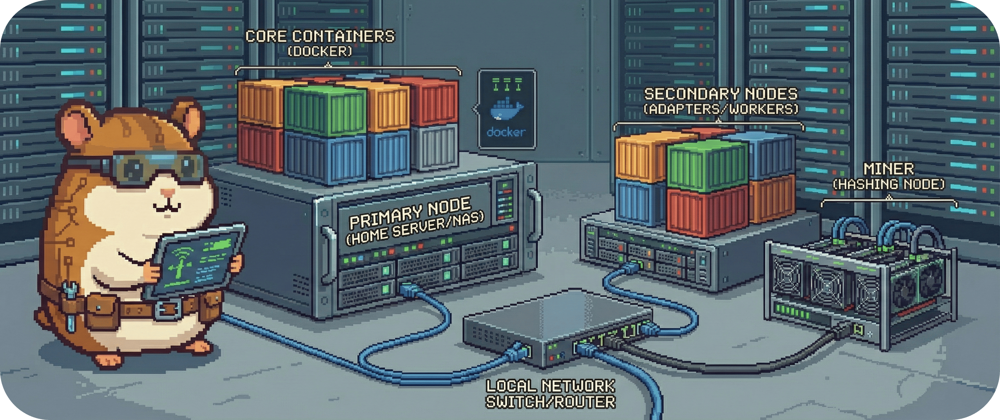

# 7.2 - Infrastruktur & Betriebsvarianten

Ein System, mehrere Einsatzformen.

Auf Basis des in Kapitel 7.1 beschriebenen lokalen Edge-Deployments lässt sich BitGridAI in unterschiedlichen **Infrastruktur- und Betriebsvarianten** betreiben.  
Diese Varianten verändern **nicht** die Kernarchitektur, sondern lediglich die **physische Verteilung einzelner Komponenten** und deren Einbettung in das lokale Netzwerk.

Ziel ist es, BitGridAI an verschiedene Hardware-Profile und Betriebsanforderungen anzupassen, ohne neue Abhängigkeiten oder Komplexität einzuführen.

*(Platzhalter für ein Bild: Ein Pixel-Art-Hamster steht vor drei kleinen Mini-Landschaften: „Standalone“, „Distributed“, „Hybrid“. Er verschiebt kleine Server-Blöcke zwischen den Landschaften wie in einem Diorama.)*  

&nbsp;

## Zielarchitektur (logische Pipeline)

Unabhängig von der konkreten Betriebsform folgt BitGridAI stets derselben logischen Pipeline:

**Sensorik → Adapter → Core → Persistenz / UI**

Der MQTT-Bus fungiert dabei als zentrales Rückgrat für:
- Zustandsübertragung
- Kommandos
- Explain- und Health-Events

Diese Pipeline bleibt in allen Varianten identisch.

&nbsp;

## Hardware-Profile

BitGridAI unterscheidet mehrere typische Rollen im lokalen Netzwerk:

| Rolle | Beschreibung |
| --- | --- |
| **Edge Node** | Zentraler Steuerknoten. Führt Core, Adapter, UI und Broker aus. |
| **Peripherie** | PV-Anlage, Speicher, Miner, Sensorik mit eigener Firmware. |
| **User Device** | Browser oder Tablet für UI-Zugriff. |
| **Research Node** | Optionaler Rechner für Exporte, Replays und Analysen. |

Nicht jede Betriebsvariante nutzt alle Rollen.

&nbsp;

## Betriebsvarianten

### Standalone (Standard)

Die empfohlene und einfachste Betriebsform.

- Alle BitGridAI-Komponenten laufen auf **einem Edge Host**
- Adapter greifen lokal oder per LAN auf die Sensorik zu
- UI, Core, Broker und Persistenz sind ko-lokalisiert

**Eigenschaften:**
- minimale Komplexität
- einfache Sicherung und Wiederherstellung
- ideal für Privathaushalte und Einzelstandorte

&nbsp;

### Distributed (Erweitert)

Die Architektur wird physisch aufgeteilt, die Logik bleibt gleich.

- Core, UI und Persistenz verbleiben auf dem zentralen Edge Node
- Adapter laufen näher an der Sensorik (z.B. separates Gateway)
- Kommunikation ausschließlich über MQTT im LAN

**Eigenschaften:**
- bessere Nähe zur Hardware
- geringere Protokolllatenz bei sensibler Sensorik
- höhere Anforderungen an Netzwerkstabilität

Diese Variante eignet sich für größere Installationen oder komplexe Gerätestrukturen.

&nbsp;

### Hybrid (Optional)

Eine bewusst begrenzte Erweiterung des Standalone-Betriebs.

- Operativer Betrieb bleibt lokal (wie Standalone)
- Zusätzlich kann eine **opt-in Datenspiegelung** erfolgen:
  - Logs
  - Exporte
  - Replays

**Wichtig:**
- keine Rückkanäle
- keine Fernsteuerung
- keine Cloud-Abhängigkeit

Der Hybrid-Modus dient ausschließlich Analyse- und Forschungszwecken.

&nbsp;

## Netzwerktopologie & Annahmen

Allen Varianten gemeinsam sind folgende Annahmen:

- Betrieb ausschließlich im **lokalen Netzwerk**
- Keine direkte WAN-Abhängigkeit für den Regelbetrieb
- Statische oder bekannte IP-Adressen für Edge Nodes
- Klare Segmentierung zwischen:
  - Steuerung
  - Beobachtung
  - Analyse

Diese Annahmen sind Grundlage für die Sicherheits- und Fail-safe-Mechanismen aus Kapitel 6.

&nbsp;

## Auswirkungen auf Betrieb und Wartung

Die gewählte Betriebsvariante beeinflusst:

- **Fehlerlokalisierung:**  
  Standalone ist am einfachsten, Distributed erfordert mehr Monitoring.

- **Updates:**  
  Alle Varianten folgen demselben Update-Modell (Volumes behalten, Replay vor Freigabe).

- **Sicherheit:**  
  Größere Verteilung erhöht Angriffsfläche, nicht aber Entscheidungsmacht.

Die Architektur bleibt bewusst **nicht horizontal skalierend**.  
BitGridAI ist ein Steuerungs- und Optimierungssystem, kein Cloud-Service.

&nbsp;

## Abgrenzungen

Bewusst **nicht Teil** dieser Sicht:

- CI/CD-Pipelines
- Container-Builds
- Home-Assistant-spezifische UI-Konfiguration
- Betriebssystem-Hardening im Detail

---

> **Nächster Schritt:** Die Verteilung ist vollständig beschrieben.  
> Nun betrachten wir die Konzepte, die **quer über alle Bausteine und Betriebsformen wirken**.
>
> 👉 Weiter zu **[08 - Querschnittliche Konzepte](../08_concepts/README.md)**
>
> 🔙 Zurück zur **[Kapitelübersicht](./README.md)**
