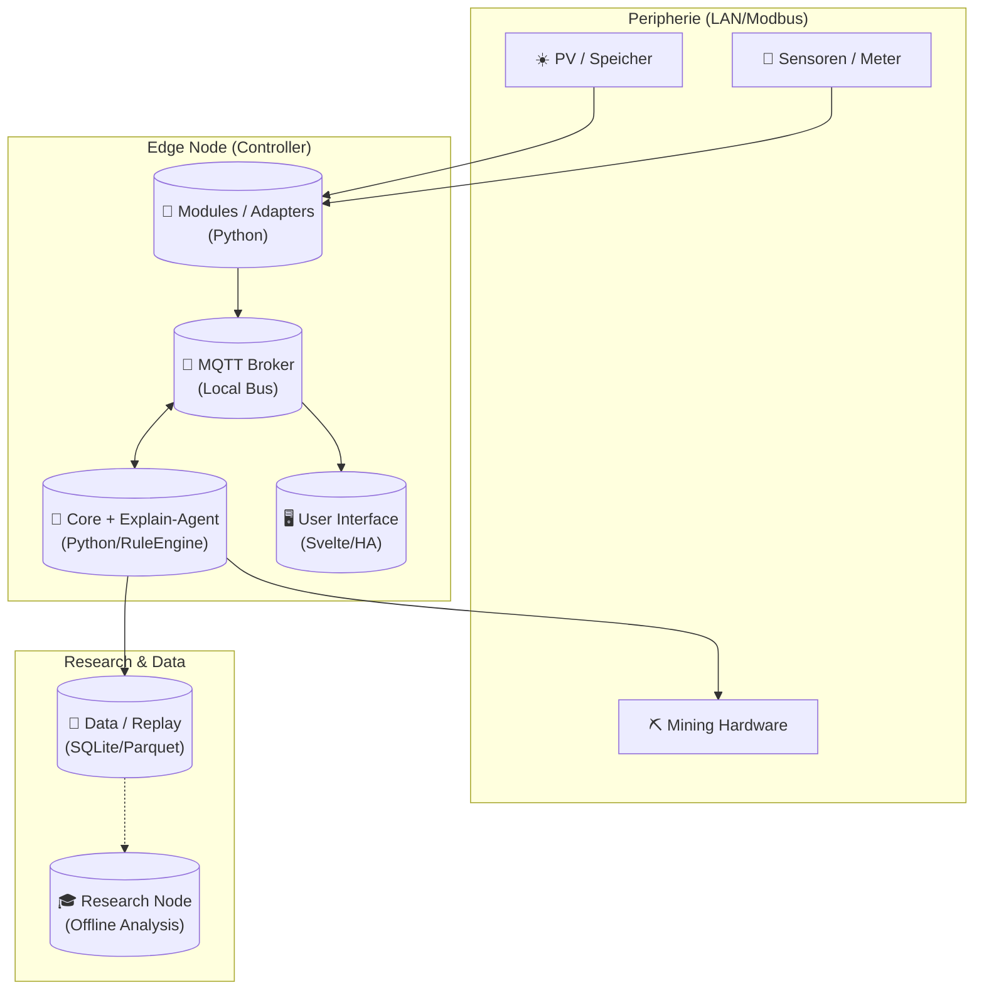

# 07.1 Infrastruktur & Deployment

Wo der Hamster wohnt.

In dieser Sicht verlassen wir den reinen Code und betrachten die physische Welt. **BitGridAI** ist konsequent als **Local-First** System im geschlossenen LAN konzipiert. Es gibt kein Cloud-Backend, kein "Phone Home" und keinen Zwang zur Internetverbindung für den Regelbetrieb.

Wir definieren hier, auf welcher Hardware die Komponenten laufen, wie sie vernetzt sind und wie wir das System gegen Ausfälle und Angriffe härten.

*(Platzhalter für ein Bild: Ein Querschnitt durch ein Haus. Im Keller steht ein Server-Rack mit einem Raspberry Pi, verbunden mit Wechselrichter und Miner. Ein dicker "No Cloud"-Stempel ist auf dem Bild.)*

## 1. Die Zielarchitektur

Das System folgt einer klaren Pipeline: Von den Sensoren über die Adapter in den Core und schließlich zur UI oder Datenbank. Der **MQTT-Broker** fungiert dabei als zentrales Nervensystem.

## 2. Hardware & Software Stack

Worauf läuft BitGridAI? Wir unterscheiden zwischen dem Steuerungs-Knoten und der Peripherie.

### Hardware-Komponenten

| Komponente | Rolle & Beschreibung |
| :--- | :--- |
| **Controller / Edge Node** 🧠 | **Der Chef.** Ein Einplatinencomputer (z.B. Raspberry Pi 4/5, Intel NUC) oder eine VM. Führt Core, Explain-Agent (On-Device LLM) und UI aus. |
| **PV & Speicher** ☀️ | **Die Quellen.** Wechselrichter und Batteriemanagementsysteme. Bleiben lokal via Modbus/TCP oder API erreichbar. |
| **Mining / Flexible Last** ⛏️ | **Der Verbraucher.** ASICs oder PCs, die dynamisch als steuerbare Last agieren. Steuerung via API (z.B. Stratum/HTTP) über den Core. |
| **Research Terminal** 🎓 | **Der Analyst.** Ein optionaler, separater Rechner (Laptop/Desktop) im LAN für Offline-Analysen, KPI-Reports und Replays der Parquet-Logs. |

### Software-Stack

| Layer | Technologie | Zweck |
| :--- | :--- | :--- |
| **Core** | Python 3.x | Beherbergt die Regel-Engine (R1–R5), den BlockScheduler und die Hodl-Policy. |
| **Module** | Python / Modbus | Adapter, die proprietäre Hardware-Protokolle auf interne Events übersetzen. |
| **Bus** | MQTT (Mosquitto) | Lokaler Austausch von State, Commands und Explain-Events in Echtzeit. |
| **UI** | Svelte / HA-Frontend | Visualisierung, Overrides und Research-Toggle. |
| **Data** | SQLite / Parquet | **SQLite:** Hot Data (aktueller EnergyState). **Parquet:** Cold Data (Langzeit-Logs, effizient & append-only). |

---

## 3. Deployment-Varianten

Je nach Ausbaustufe und Zielsetzung kann BitGridAI unterschiedlich ausgerollt werden:

| Variante | Einsatzzweck | Beschreibung |
| :--- | :--- | :--- |
| **A. Standalone** | 🏠 Standard | **"All-in-One".** Der gesamte Stack (Core, Broker, UI, DB) läuft als Docker-Compose-Verbund auf einem einzigen Edge Device (z.B. Raspberry Pi). Ideal für Prototypen und Feldstudien. |
| **B. Distributed** | 🏢 Skalierung | **"Verteilt".** Core und UI laufen getrennt von den Hardware-Adaptern (die z.B. näher an den Sensoren platziert sind). Kommunikation rein über MQTT im LAN. Gut für A/B-Tests. |
| **C. Hybrid** | ☁️ Optional | **"Backup".** Wie Standalone, aber mit einer *verschlüsselten*, unidirektionalen Spiegelung ausgewählter Logs auf einen externen Server zur Datensicherung (nur bei explizitem Opt-in). |

---

## 4. Betrieb & Sicherheit (Hardening)

Da wir physische Hardware steuern, ist Sicherheit kein Feature, sondern Pflicht.

### Netzwerk & Firewall 🛡️
* **Protokolle:** MQTT (Port 1883), REST, WebSocket. Alles **nur lokal** im LAN.
* **Firewall:** Prinzip "Deny-All".
    * *Eingehend:* Nur SSH (Key-Auth), MQTT (lokal), HTTP/UI (lokal).
    * *Ausgehend:* Nur NTP (Zeit), Updates (OS/Container), Preis-API (HTTPS).
* **Kein Cloud-Backhaul:** Es gibt keinen Tunnel nach draußen. Fernzugriff erfolgt ausschließlich via VPN (z.B. WireGuard) in das Heimnetz, nicht direkt auf das Device.

### System-Hardening 🔒
* **OS:** Minimales Linux (Debian/Ubuntu Server/Raspbian Lite). Keine unnötigen Desktop-Dienste.
* **Fail-Safe:** Bei Sensor- oder Netzwerkfehlern gilt immer: **Stop $\rightarrow$ Safe**. Das System geht in einen sicheren Zustand (Miner aus), bevor Hardware beschädigt wird.
* **Power:** Eine **USV (Unterbrechungsfreie Stromversorgung)** wird dringend empfohlen, um bei Stromausfall Datenbank-Korruption zu verhindern und einen sauberen Shutdown zu ermöglichen.

### Backup & Privacy 💾
* **Sicherung:** Tägliches Backup von `config/` und der SQLite-DB (z.B. via BorgBackup oder Duplicati auf lokales NAS).
* **Privacy:** Keine Telemetrie standardmäßig. Research-Exports erfolgen nur, wenn der "Research-Toggle" aktiv ist (Opt-in).

---
> **Nächster Schritt:** Die Hardware steht, die Container laufen. Aber was hält alles im Innersten zusammen? Im nächsten Kapitel widmen wir uns den Themen, die *alle* Bausteine betreffen.
>
> 👉 Weiter zu **[08 Querschnittliche Konzepte](../08_concepts/README.md)**
>
> 🔙 Zurück zur **[Kapitelübersicht](./README.md)**
