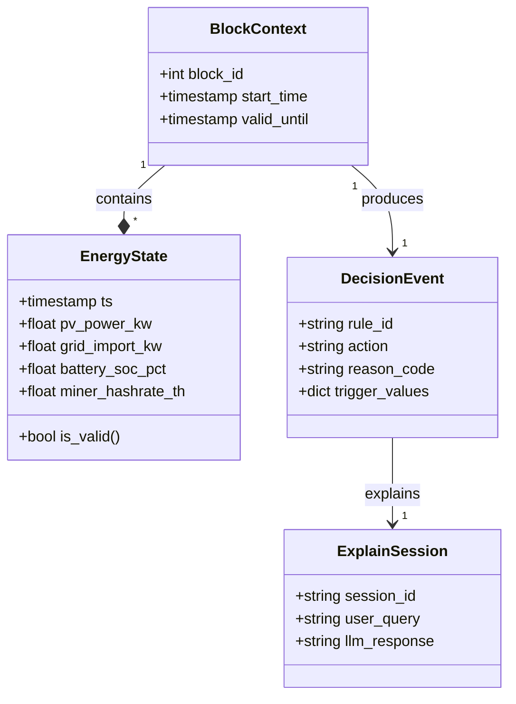

# 08.1 Fachliche Modelle (Domain Models)

Unsere gemeinsame Sprache.

Damit Code, Dokumentation und Team-Kommunikation synchron bleiben, definieren wir hier die zentralen Datenobjekte ("Domain Models"). Diese Klassen bilden das Rückgrat der Anwendung. Sie werden im gesamten System – vom Sensor-Adapter bis zur UI – einheitlich verwendet.

**Wichtiges Prinzip:** Unsere Modelle sind größtenteils **immutable** (unveränderlich). Ein `EnergyState` wird einmal gemessen und nie wieder verändert. Das garantiert die Reproduzierbarkeit für die Forschung.

*(Platzhalter für ein Bild: Der Hamster mit Brille steht vor einer Tafel und zeigt mit einem Zeigestock auf ein Klassendiagramm. "A = A" steht an der Tafel.)*


## Überblick: Das Klassendiagramm

Hier siehst du, wie die wichtigsten Objekte zusammenhängen:



## 1. Der `EnergyState` (Single Source of Truth) 🧠

Das wichtigste Objekt im System. Es ist ein Schnappschuss der Realität zu einem genauen Zeitpunkt `t`.

* **Verwendung:** Wird von Adaptern befüllt, von der Rule Engine gelesen und in Parquet gespeichert.
* **Charakter:** Immutable (Unveränderlich). Einmal gemessen, bleibt der Wert für immer so – wichtig für Replays.
* **Format:** Flat Dictionary / Pydantic Model.

| Feld | Typ | Einheit | Beschreibung |
| :--- | :--- | :--- | :--- |
| `ts` | `datetime` | UTC | Der exakte Zeitstempel der Messung. |
| `p_pv_kw` | `float` | kW | Aktuelle Erzeugungsleistung der PV-Anlage. |
| `p_load_kw` | `float` | kW | Hausverbrauch (ohne Miner/Ladung). |
| `p_grid_kw` | `float` | kW | Positiv = Bezug, Negativ = Einspeisung (Saldo). |
| `surplus_kw` | `float` | kW | Berechneter Überschuss (`pv - load`). |
| `soc_pct` | `float` | % | State of Charge der Hausbatterie (0.0 - 100.0). |
| `miner_power_w` | `int` | Watt | Tatsächlicher Verbrauch des Miners (Telemetrie). |
| `miner_temp_c` | `float` | °C | Heißester Chip-Sensorwert (für R3 Safety). |
| `price_ct_kwh` | `float` | ct | Aktueller dynamischer Strompreis (inkl. Gebühren). |

## 2. Der `BlockContext` (Der Takt) ⏱️

BitGridAI "denkt" in 10-Minuten-Blöcken. Der Kontext hält Metadaten zum aktuellen Zeitfenster.

| Feld | Typ | Beschreibung |
| :--- | :--- | :--- |
| `block_height` | `int` | Fortlaufende Nummer (ähnlich Bitcoin Block Height). Berechnet als `floor(unix_timestamp / 600)`. |
| `window_start` | `datetime` | Beginn des Blocks (z.B. 14:10:00). |
| `window_end` | `datetime` | Ende des Blocks (z.B. 14:20:00). |
| `avg_surplus` | `float` | Der gleitende Durchschnitt des Überschusses in diesem Block (geglättet, um Wolken zu ignorieren). |

## 3. Das `DecisionEvent` (Die Entscheidung) ⚖️

Wenn die Regel-Engine (R1–R5) feuert, entsteht dieses Objekt. Es ist das Ergebnis der Berechnung und enthält alle "Warum"-Informationen für die Explainability.

```python
class DecisionEvent(BaseModel):
    timestamp: datetime
    rule_applied: str      # z.B. "R1_PROFITABILITY", "R3_SAFETY", "R5_DEADBAND"
    action: ActionType     # Enum: START, STOP, PAUSE, SET_POWER, HOLD
    parameters: dict       # z.B. {"target_power_w": 1500}
    
    # Explainability Data (für den Nutzer)
    reason: str            # Human readable: "PV Surplus high enough"
    trigger_metrics: dict  # Snapshot der Werte, die ausgelöst haben: {"surplus": 4.2, "limit": 1.5}
    
    is_override: bool      # True, wenn dies durch manuellen User-Eingriff entstand
```

## 4. Die `UserConfig` (Die Vorgaben) ⚙️

Die statische Konfiguration, die der Nutzer in der `config.yaml` oder im UI einstellt. Sie definiert die Grenzen, innerhalb derer sich die Automatik bewegen darf.

| Sektion | Feld | Default | Bedeutung |
| :--- | :--- | :--- | :--- |
| **Profil** | `strategy_mode` | `eco` | `eco` (Autarkie vor Profit) vs `profit` (Aggressiv mining). |
| **Limits** | `min_home_soc` | `20` | Unter 20% Akku darf der Miner nicht laufen (Notreserve für die Nacht). |
| **Hardware** | `max_miner_temp`| `80` | Not-Aus Temperatur für den Chip (R3 Threshold). |
| **Netz** | `grid_cap_kw` | `10` | Maximale Netzanschlussleistung (Blackout-Schutz/Sicherung). |

## 5. Das `ExplainSession` Objekt (Der Dialog) 💬

Für den On-Device Agenten. Wenn der Nutzer im UI fragt "Warum läuft der Miner gerade?", wird dieses Objekt generiert.

* **Zweck:** Entkoppelt die komplexe technische Entscheidung von der menschenlesbaren Antwort.
* **Inhalt:**
    * `session_id`: Eindeutige ID für diesen Dialog.
    * `context_snapshot`: Referenz auf den `EnergyState` zum exakten Zeitpunkt der Frage.
    * `decision_ref`: Welches `DecisionEvent` ist gerade aktiv? (Die technische Basis der Antwort).
    * `generated_text`: Die finale Antwort des LLM oder der Template-Engine (z.B. *"Weil die Sonne scheint und der Akku voll ist."*).
    * `language`: `de` oder `en` (Spracheinstellung des Nutzers).

---
> **Nächster Schritt:** Wir wissen jetzt, wie die Daten *im Speicher* aussehen. Aber wie legen wir sie langfristig auf die Festplatte, damit sie einen Stromausfall überleben?
>
> 👉 Weiter zu **[08.2 Persistenz (Datenhaltung)](./082_persistency.md)**
>
> 🔙 Zurück zur **[Kapitelübersicht](./README.md)**
