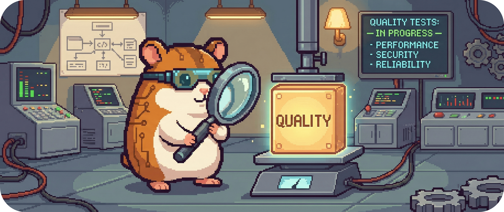

# 10.2.3 - Vorhersagbarkeit & Stabilität

Ruhe im System.

BitGridAI steuert reale Lasten in einer Umgebung voller Schwankungen:  
Wolken ziehen vorbei, Preise springen, Sensorwerte rauschen.  
Trotzdem darf sich das System **nicht hektisch verhalten**.

Dieses Qualitätsszenario beschreibt, wie BitGridAI **vorhersagbar, stabil und ruhig** bleibt –  
auch wenn sich die Welt draußen schnell ändert.

&nbsp;

## Qualitätsziel

**Stabile, vorhersehbare Entscheidungen ohne Flapping**,  
die für Nutzer verständlich, erklärbar und planbar bleiben.

Das System soll:
- nicht auf jedes Rauschen reagieren,
- Entscheidungen nur zu definierten Zeitpunkten treffen,
- und sein Verhalten im Voraus erklärbar machen.

&nbsp;

## Kontext

- Regelwerk R1–R5 ist deterministisch (Kap. 06)
- Entscheidungen erfolgen blockbasiert im 10-Minuten-Takt
- Totband / Hysterese ist explizit modelliert (R5)
- Forecasts (R4) sind unterstützend, nicht dominant
- UI zeigt Timeline und Next-Block-Preview

&nbsp;

## Szenario P-1: Kurzfristige Schwankungen (Wolkenzug)

**Stimulus:**  
PV-Leistung fällt für wenige Sekunden unter den Start-Schwellwert.

**Quelle:**  
PV-Sensor / Forecast-Abweichung

**Umgebung:**  
Laufender Betrieb mit aktivem Mining

**Erwartete Systemreaktion:**
- Keine sofortige STOP-Aktion
- Totband (R5) greift
- Entscheidung bleibt bis zum nächsten Block stabil

**Akzeptanzkriterien:**
- Kein An/Aus-Flapping innerhalb eines Blocks
- Entscheidung bleibt im UI konsistent
- Keine unnötigen Hardware-Schaltzyklen

&nbsp;

## Szenario P-2: Blockwechsel mit Grenzwertnähe

**Stimulus:**  
Überschuss liegt nahe am Schwellwert beim Blockwechsel.

**Quelle:**  
EnergyState / BlockScheduler

**Umgebung:**  
Normalbetrieb

**Erwartete Systemreaktion:**
- Entscheidung folgt klaren Prioritäten (R3 > R2 > R5 > R1/R4)
- Ergebnis ist deterministisch reproduzierbar
- Explainability zeigt verwendete Schwellen und Mittelwerte

**Akzeptanzkriterien:**
- Gleicher Input → gleiche Entscheidung
- Entscheidung ist erklärbar („wegen Durchschnitt X > Limit Y“)
- Kein zufälliges Verhalten an Grenzwerten

&nbsp;

## Szenario P-3: Forecast-Update zwischen zwei Blocks

**Stimulus:**  
Neuer Preis- oder Wetter-Forecast trifft ein.

**Quelle:**  
Forecast-Service

**Umgebung:**  
Block läuft noch

**Erwartete Systemreaktion:**
- Keine sofortige Umschaltung
- Forecast wird für nächsten Block vorgemerkt
- Optionaler Preview-Hinweis im UI

**Akzeptanzkriterien:**
- Keine Aktion ohne Block-Tick
- Nutzer kann kommende Entscheidung erkennen
- System bleibt ruhig trotz neuer Information

&nbsp;

## Szenario P-4: Nutzer fragt „Was passiert als Nächstes?“

**Stimulus:**  
Nutzer öffnet Timeline / Preview im UI.

**Quelle:**  
UI

**Umgebung:**  
Beliebiger Modus

**Erwartete Systemreaktion:**
- Anzeige der letzten Entscheidungen
- Anzeige der **erwarteten Aktion im nächsten Block**
- Klare Begründung (Rules + Werte)

**Akzeptanzkriterien:**
- Next-Block-Preview vorhanden
- Keine Überraschungsaktionen
- Verhalten ist mental modellierbar

&nbsp;

## Messbare Qualitätsmerkmale

| Merkmal | Ziel |
|------|------|
| Flapping-Rate | ≈ 0 |
| Entscheidungs-Determinismus | 100 % |
| Block-basierte Entscheidungen | 100 % |
| Preview-Abdeckung | 100 % |
| Nutzer-Überraschungen | 0 |

&nbsp;

## Bezug zur Architektur

- **BlockScheduler:** Kap. 06
- **Regel R5 (Totband):** Kap. 06.5
- **Forecast-Handling (R4):** Kap. 06.4 / 06.12
- **Explainability & UI:** Kap. 08.4
- **Testbarkeit (Replay):** Kap. 08.9

&nbsp;

## Zusammenfassung

Stabilität ist kein Nebenprodukt – sie ist ein Designziel.

BitGridAI:
- entscheidet im Takt, nicht im Affekt,
- reagiert robust auf Rauschen,
- und bleibt für den Nutzer jederzeit vorhersagbar.

---

> **Nächster Schritt:**  
> Stabilität allein reicht nicht – das System muss auch **wirtschaftlich sinnvoll** handeln.
>
> 👉 Weiter zu **[10.2.4 - Nachhaltigkeit & Wirtschaftlichkeit](./1024_sustainability_and_economics.md)**
>
> 🔙 Zurück zur **[Kapitelübersicht](./README.md)**
