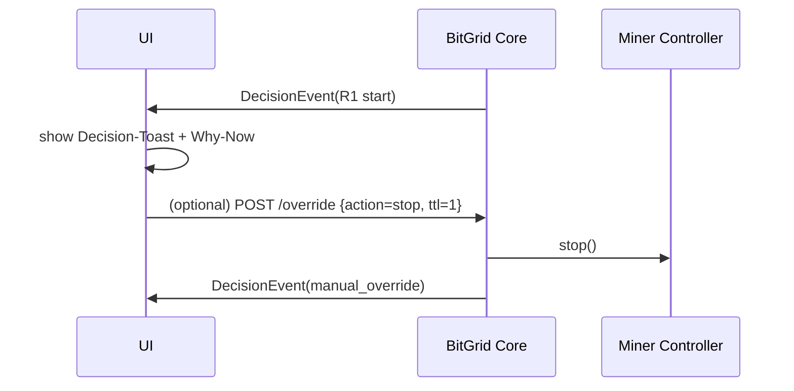

# 13 – UI‑Spezifikation / UI Specification

> **Kurzüberblick / TL;DR**
> Die UI ist **lokal, erklärbar und block‑orientiert**. Kernbausteine: **Decision‑Toast**, **Why‑Now? Panel**, **Next‑Block Preview**, **Timeline**, **Override‑Chip**, **Health‑Banner**, **KPI‑Widget**. Alle Texte sind **DE zuerst**, dann **EN**.
> Performance‑Ziele: **Explanation‑Latency < 2 s**, **Decision‑Latency < 300 ms**, **State‑Propagation < 500 ms**.

> **TL;DR (EN)**
> The UI is **local, explainable, and block‑aligned**. Core components: **decision toast**, **why‑now panel**, **next‑block preview**, **timeline**, **override chip**, **health banner**, **KPI widget**. All copy is **German first**, then **English**.
> Performance targets: **explanation latency < 2 s**, **decision latency < 300 ms**, **state propagation < 500 ms**.

---

## Überblick / Overview

Die UI übersetzt **EnergyState (SSoT)**, **R1–R5‑Entscheidungen** und **Block‑Takt** in menschenlesbare Oberflächen. Jede Aktion erklärt **Warum jetzt?**, zeigt Schwellen/Parameter und respektiert **Deadband**.

> The UI translates **EnergyState (SSoT)**, **R1–R5 decisions**, and the **block cadence** into human‑readable screens. Every action answers **Why now?**, shows thresholds/parameters, and respects **deadband**.

---

## Informationsarchitektur / Information Architecture

| Ansicht       | Zweck                             | Primäre Elemente                                        |
| ------------- | --------------------------------- | ------------------------------------------------------- |
| **Dashboard** | Schnellüberblick, aktuelle Aktion | Decision‑Toast, KPI‑Widget, Health‑Banner               |
| **Decisions** | Erklärungen & Verlauf             | Why‑Now? Panel, Timeline, Filter                        |
| **Devices**   | Gerätestatus & Steuerung          | Miner‑Kacheln (Start/Stop/Level), Temperaturen          |
| **Energy**    | Datenlage & Schwellen             | EnergyState Snapshot, Schwellenanzeige, Preis           |
| **Settings**  | Regeln & Parameter                | R1–R5‑Parameter, Deadband, Block‑Dauer, Override‑Policy |

> | View          | Purpose                      | Primary elements                                            |
> | ------------- | ---------------------------- | ----------------------------------------------------------- |
> | **Dashboard** | Quick status, current action | decision toast, KPI widget, health banner                   |
> | **Decisions** | Explanations & history       | why‑now panel, timeline, filters                            |
> | **Devices**   | Device status & control      | miner tiles (start/stop/level), temperatures                |
> | **Energy**    | Data & thresholds            | EnergyState snapshot, thresholds, price                     |
> | **Settings**  | Rules & parameters           | R1–R5 parameters, deadband, block duration, override policy |

---

## Kernkomponenten / Core Components

| Komponente             | Zweck                                   | Eingaben (Binding)                                    | Zustände                          |
| ---------------------- | --------------------------------------- | ----------------------------------------------------- | --------------------------------- |
| **Decision‑Toast**     | Sofortige Begründung einer Aktion       | `DecisionEvent{reason, trigger, params, valid_until}` | `info`, `warning`, `alarm`        |
| **Why‑Now? Panel**     | Details zu **Reason/Trigger/Parameter** | `EnergyState`, `DecisionEvent`, Schwellen             | `ok`, `blocked(R2/R3)`, `pending` |
| **Next‑Block Preview** | Erwartete Aktion im nächsten Block      | `forecast_surplus[]`, `deadband_until`                | `continue`, `start`, `stop`       |
| **Timeline**           | Verlauf der Entscheidungen              | `DecisionEvent[]`                                     | Filter, Paging                    |
| **Override‑Chip**      | Manueller Start/Stop/Level mit TTL      | `override{action, ttl}`                               | `active(countdown)`, `expired`    |
| **KPI‑Widget**         | Trust, Coverage, Flapping               | `kpi_records[]`                                       | Trendpfeile                       |
| **Health‑Banner**      | Störungen/Warnungen                     | `health{broker, drift, stale}`                        | `ok`, `warn`, `error`             |

> | Component              | Purpose                                   | Inputs (binding)                                      | States                            |
> | ---------------------- | ----------------------------------------- | ----------------------------------------------------- | --------------------------------- |
> | **Decision toast**     | Immediate rationale for an action         | `DecisionEvent{reason, trigger, params, valid_until}` | `info`, `warning`, `alarm`        |
> | **Why‑now panel**      | Details for **reason/trigger/parameters** | `EnergyState`, `DecisionEvent`, thresholds            | `ok`, `blocked(R2/R3)`, `pending` |
> | **Next‑block preview** | Expected action next block                | `forecast_surplus[]`, `deadband_until`                | `continue`, `start`, `stop`       |
> | **Timeline**           | Decision history                          | `DecisionEvent[]`                                     | filters, paging                   |
> | **Override chip**      | Manual start/stop/level with TTL          | `override{action, ttl}`                               | `active(countdown)`, `expired`    |
> | **KPI widget**         | Trust, coverage, flapping                 | `kpi_records[]`                                       | trend arrows                      |
> | **Health banner**      | Incidents/warnings                        | `health{broker, drift, stale}`                        | `ok`, `warn`, `error`             |

---

## Datenbindung / Data Binding

**Quellen:** `EnergyState`, `DecisionEvent`, `kpi_records`, `health` (lokal).
**Bindings (Beispiele):**

* Decision‑Toast ← `DecisionEvent.reason/trigger/parameters/valid_until`.
* Why‑Now? ← `EnergyState` + `R1–R5‑Schwellen` (aus `config`).
* Preview ← `forecast_surplus[]`, `deadband_until`.
* KPI‑Widget ← Aggregation aus `kpi_records` (lokal berechnet).
* Health‑Banner ← `health` (Broker down, Drift, Sensor‑Stale).

> **Sources:** `EnergyState`, `DecisionEvent`, `kpi_records`, `health` (local).
> **Examples:** toast ← `DecisionEvent`; why‑now ← `EnergyState` + thresholds; preview ← forecast + deadband; KPI ← aggregated local KPIs; health ← local health.

---

## Interaktionsflüsse / Interaction Flows



> UI reacts to **DecisionEvents** (toast + why‑now). Optional override posts to core and is logged as `manual_override`.

---

## Mikrotexte / Microcopy

**Start (R1):** „**Start**: Überschuss **1.8 kW** ≥ **1.5 kW**, Preis **16 ct** ≤ **18 ct**. **Deadband** bis **+2**.“

> **Start**: Surplus **1.8 kW** ≥ **1.5 kW**, price **16 ct** ≤ **18 ct**. **Deadband** until **+2**.

**Stop (R2/R3):** „**Stop**: SoC **24 %** ≤ **25 %** (**R2**). Sicherheit geht vor.“

> **Stop**: SoC **24 %** ≤ **25 %** (**R2**). Safety first.

**Hold (R5):** „**Stabilisierung aktiv** (**R5**): Zustand bleibt bis **Block +1**.“

> **Stabilization active** (**R5**): holding until **block +1**.

**Preview:** „**Nächster Block**: voraussichtlich **weiterlaufen**; Prognose stabil (**R4**).“

> **Next block**: expected **continue**; forecast stable (**R4**).

---

## Accessibility / Barrierefreiheit

* Tastaturbedienung (Focus‑Reihenfolge, sichtbarer Fokus).
* ARIA‑Labels für Toasts/Banner/Chips.
* Kontrast ≥ WCAG AA, skalierbare Schrift; „Bewegung reduzieren“ beachten.
* Screenreader‑freundliche Reihenfolge: **Toast → Why‑Now → Controls**.

> Keyboard operability, ARIA labels, WCAG AA contrast, respect reduce‑motion, screenreader order: **toast → why‑now → controls**.

---

## API‑Verträge / API Contracts

**REST (lokal):**

* `GET /state` – aktueller **EnergyState**.
* `GET /timeline?since=…` – **DecisionEvents**.
* `GET /preview` – Next‑Block‑Prognose.
* `POST /override {action, ttl}` – manueller Override.

**MQTT Topics:**

* `energy/state/#` (Snapshots), `explain/events/#` (DecisionEvents), `miner/state/#`, `miner/cmd/set`.

> Local REST and MQTT only; no external APIs.

---

## Fehler- & Sonderfälle / Error & Edge Cases

* **Broker down** → UI zeigt Health‑Banner „Offline‑Puffer aktiv“.
* **Time‑drift** → Hinweis „Block‑Re‑Sync“; Entscheidungen pausieren 1 Block.
* **Sensor‑stale** → Why‑Now zeigt fehlende Werte, Status „pending“.
* **Override aktiv** → Chip mit Countdown, Auto‑Rollback am Blockende.

> Clear, human‑readable status and recovery hints for each incident.

---

## Performance‑Budgets / Performance Budgets

| Ziel                | Budget                            |
| ------------------- | --------------------------------- |
| Explanation‑Latency | < **2 s** nach Decision           |
| Decision‑Latency    | < **300 ms** nach Block‑Tick      |
| State‑Propagation   | < **500 ms** Sensor → EnergyState |

> Keep UI lean; prefer incremental updates over full reloads.

---

## Navigations- & Tastenkürzel / Navigation & Shortcuts

* `?` Hilfe/Glossar, `o` Override‑Dialog, `t` Timeline, `p` Preview.
* Breadcrumbs: **Dashboard → Decisions → Detail**.

> Shortcuts accelerate expert use; always provide a discoverable help sheet.

---

## Dateien & Struktur / Files & Structure (UI)

```
ui/
  components/
    DecisionToast.vue
    WhyNowPanel.vue
    NextBlockPreview.vue
    OverrideChip.vue
    HealthBanner.vue
    KpiWidget.vue
  pages/
    Dashboard.vue
    Decisions.vue
    Devices.vue
    Energy.vue
    Settings.vue
```

> Technology‑agnostic; names reflect components and pages.

---

## Zusammenfassung / Summary

Die UI macht Entscheidungen **sichtbar, begründet und steuerbar** – im Sinne von **Explainable by Design** und **Local‑First**. Komponenten bleiben schlank, deterministisch gebunden an **EnergyState**, **DecisionEvents** und **R1–R5**.

> The UI renders decisions **visible, justified, and controllable**—aligned with **explainable by design** and **local‑first**. Components are lean, deterministically bound to **EnergyState**, **DecisionEvents**, and **R1–R5**.


