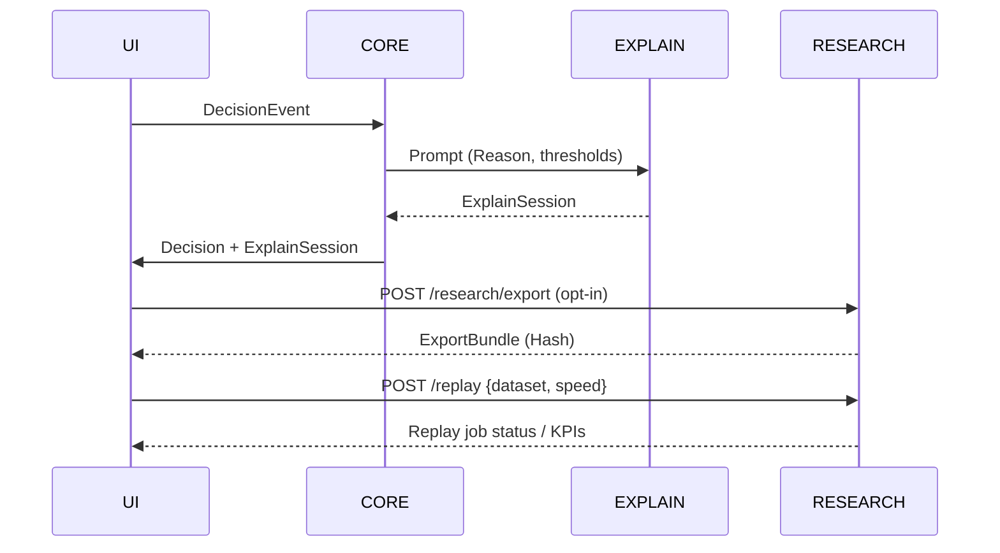

# 14 – Explain-Agent & Research Services

> **Kurzübersicht:**  
> Der Explain-Agent erzeugt lokale „Warum jetzt?“-Microcopy, Was-wäre-wenn-Simulationen und Forschungsartefakte (Export, Replay) – vollständig **on-device**, block-synchron und privacy-by-default. Research-Services (Toggle, Export, Replay) sichern Nachvollziehbarkeit und KPI-basierte Evaluation.
>
> **TL;DR (EN):**  
> The Explain-Agent delivers local “why now?” copy, what-if simulations and research artefacts (export, replay). Everything runs **on-device**, block-aligned and privacy-first. Research services (toggle, export, replay) ensure traceability and KPI-driven evaluation.

---

## Überblick / Overview
Der Explain-Agent ist ein quantisiertes On-Device-LLM, das aus Entscheidungsdaten Microcopy generiert und Was-wäre-wenn-Szenarien berechnet. Ergänzt wird er durch Research-Services, die Opt-in-Kontrolle, Exporte und deterministische Log-Replays bereitstellen – ohne Cloud oder externe Abhängigkeiten.

> The Explain-Agent is a quantised on-device LLM that creates microcopy and what-if scenarios from decision data. Research services add opt-in control, exports and deterministic log replays—no cloud required.

---

## Ziele / Objectives
1. **Explainable Microcopy:** Jede Decision erhält eine verständliche Begründung mit Schwellen und Kontext.  
2. **Was-wäre-wenn:** Nutzer können alternative Schwellen/Policies simulieren, ohne reale Aktionen auszulösen.  
3. **Research Toggle & Export:** Datenschutzwahrende Opt-in-Steuerung plus reproduzierbare Exporte.  
4. **Replay Runner:** Deterministische Wiederholbarkeit (1x–20x Speed) für Studien und Debugging.  
5. **Safety & Audit:** Explain-Agent liest nur, überschreibt keine Regelpfade und wird versioniert betrieben.

> 1. **Explainable microcopy** for each decision.  
> 2. **What-if simulations** without changing the live system.  
> 3. **Research toggle & export** for privacy-compliant studies.  
> 4. **Replay runner** for deterministic replays.  
> 5. **Safety & audit:** read-only agent, versioned prompts.

---

## Komponenten / Components

| Baustein               | Technologie                          | Verantwortung                                                    |
| ---------------------- | ------------------------------------ | ---------------------------------------------------------------- |
| **Explain-Agent**      | On-device LLM (GGML/Q4/Q5) + Adapter | Microcopy, Was-wäre-wenn, Confidence & TTL                       |
| **Prompt Registry**    | YAML/JSON                            | Versionierte Templates für R1–R5, Overrides, Safety              |
| **Research Service**   | Python (REST/CLI)                    | `/research/toggle`, `/research/export`, `/replay`                |
| **Replay Runner**      | Python + Parquet/SQLite              | Replays mit KPI-Auswertung, Speed 1x–20x                         |
| **Export Pipeline**    | JSON/CSV + ZIP                       | KPI-Berichte, Timeline, ExplainSessions (inkl. Hash)             |

> Components are modular and local-first; prompts and binaries are version controlled.

### Explain-Agent Pipeline

1. **Input Collation:** Die Regel-Engine publiziert `DecisionEvent` + `EnergyState`-Snapshot in eine Explain-Queue (`decision_id`, Schwellen, Messwerte, Lokalisation).  
2. **Prompt Composer:** `Prompt Registry` (YAML) wird mit Runtime-Daten gemerged; Policies erzwingen Pflichtfelder (z. B. Deadband-Status, Override-Herkunft).  
3. **LLM Inferencing:** Quantisiertes GGML-Modell (Q4 Default, Q5 optional) läuft isoliert als Service `bitgrid-explain`. Modelgröße < 1 GB, Token-Limit 256, Zeitbudget < 1 s auf aktueller Edge-Hardware.  
4. **Post-Processing:** Strukturierte Antwort (`reason_code`, `result_text_de`, `result_text_en`, `confidence`) wird per JSON-Schema validiert und auf max. drei Kernaussagen gekürzt.  
5. **Delivery & Cache:** Ergebnis fließt in `ExplainSession`, wird via MQTT gepusht und 24 h gecacht, damit UI/Research alte Sessions erneut anzeigen können.

> Gleiche Inputs (inkl. Prompt-/Rule-Version) erzeugen identische Explain-Ergebnisse → deterministische Replays.

### Was-wäre-wenn / Simulation Flow

| Schritt                  | Beschreibung                                                                                         |
| ------------------------ | ---------------------------------------------------------------------------------------------------- |
| **Scenario Definition**  | UI/CLI liefert Parameter (`what_if`: Regeln an/aus, neue Schwellen, alternative Preise).             |
| **Sandboxed Eval**       | Core erstellt `EnergyState`-Klon und führt Regeln mit überschriebenen Parametern aus (kein Live-Effekt). |
| **Explain Stitching**    | Explain-Agent erhält Simulationsergebnis + Delta zur echten Entscheidung (z. B. „würde R4 greifen“).   |
| **Timeline Overlay**     | Ergebnis landet als Overlay (`ExplainSession.type = what_if`) in der bestehenden Timeline.            |
| **Expiry & Cleanup**     | TTL standardmäßig 1 Block (10 min); Aufräumjob entfernt abgelaufene Szenarien.                        |

Simulationen erzeugen keine Steuerbefehle und laufen strikt im Research-Namespace (`/sim`). KPI-Deltas (Autarkie, Kosten, CO₂) können optional mitgerechnet werden.

### Research Services Deep Dive

- **Toggle Service:** Signiert Requests, schreibt Hash in Audit-Log und broadcastet über `research/toggle`. Default `false`, UI blendet Research-Controls aus.  
- **Export Service:** Filtert nach `scope` (Timeline, Config, Sessions). Jeder Export erzeugt `manifest.json` + ZIP in `exports/<ts>.zip`, inkl. Prompt-/Regelversionen und Hashes. Optional `anonymize=true`.  
- **Replay Runner:** Liest Parquet/SQLite (`data/logs/*.parquet`), spielt Blöcke in Core+Explain-Agent (Replay-Modus) ein, protokolliert KPIs und verifiziert Hashes. Ergebnis landet als `ReplayJob`-Artefakt.  
- **CLI & UI Hooks:** `bg research export --scope timeline --since 2025-01-01` sowie UI-Button „Research Export“ nutzen denselben REST-Endpunkt und zeigen Hash + Speicherort.

Research-Services laufen als separate Systemd-Units (`bitgrid-research`, `bitgrid-replay`) mit read-only Zugriff auf Produktivdaten; nur Replays nutzen `/tmp/replay/*` temporär.

---

## Datenmodelle / Data Models

| Objekt               | Felder                                               | Beschreibung                                                 |
| -------------------- | ---------------------------------------------------- | ------------------------------------------------------------ |
| `ExplainSession`     | `id`, `decision_id`, `block_id`, `prompt_version`, `result_text_de`, `result_text_en`, `confidence`, `type (live\|what_if)`, `valid_until` | Persistente Microcopy/Simulation pro Decision inkl. Version & Typ. |
| `ResearchToggleState`| `enabled`, `actor`, `ts`, `justification`            | Signierter Opt-in/Opt-out-Nachweis (Audit-Log & UI-Hinweis). |
| `ReplayJob`          | `job_id`, `dataset`, `speed`, `status`, `created_at`, `log_path` | Verwaltung laufender/wartender Replays.                      |
| `ExportBundle`       | `bundle_id`, `scope`, `kpi_summary`, `file_path`, `hash` | Paketierte Exporte (Timeline, KPIs, ExplainSessions).        |

---

## Schnittstellen / Interfaces

### REST (lokal)
- `POST /explain` – on-demand Explain-Agent (read-only, UI nutzt regulär Push).
- `POST /research/toggle {enabled}` – Opt-in/Opt-out inkl. Audit.
- `POST /research/export {scope, filters}` – erzeugt `ExportBundle`.
- `POST /replay {dataset, speed, note}` – startet ReplayJob.
- `GET /replay/{job_id}` – Status/Resultat abrufen.

### MQTT Topics
- `explain/session/#` – gestreamte `ExplainSession`-Events.
- `research/toggle` – aktueller Opt-in-Status.
- `research/replay/jobs/#` – Fortschritt der ReplayJobs.

Alle Payloads sind JSON, Signaturen optional (`hash`/`signature`).

---

## Ablauf / Workflow

---

## Governance & Sicherheit / Governance & Safety
- Explain-Agent läuft offline; Firewalls verhindern Outbound-Verbindungen.
- Prompt-Registry (`prompts/*.yaml`) ist versioniert, Änderungen via ADR.
- Token-/Zeit-Limits (z. B. 256 Tokens, 1 s) verhindern Blockade des Regelpfads.
- Research-Toggle steht default auf `off`; UI zeigt deutlich Opt-in-Status + Hinweistext.
- Exporte liegen verschlüsselt unter `exports/*.zip`, nur manuell teilbar.
- Replay Runner nutzt Kopien der Logs (Read-only) und hinterlegt Hashes.

> Security-first: read-only agent, deterministic prompts, opt-in research.

### Prompt- & Regel-Governance

1. **Change Flow:** Jede Anpassung an `prompts/*.yaml` oder `config/bitgrid_rules.yaml` benötigt einen PR + ADR mit Impact-Analyse. `scripts/validate_rules.py` prüft Grenzwerte, `scripts/prompt_snapshot.py` erzeugt Hashes für Diff-Review.
2. **Version Pinning:** Deployments referenzieren `config/version.lock` (`rules=v20250115`, `prompts=v20250112`). ExplainSessions speichern `prompt_version`, DecisionEvents `rule_version`.
3. **Rollback:** Bei Regression `bin/apply-config --version=<prev>` ausführen und via `replay --dataset=last24h` validieren. Ergebnis wird in `config/change_log.md` dokumentiert.
4. **Audit Trail:** Monatlich `/research/export` mit Scope `["config","timeline","kpi"]` erzeugen und Hash im Research-Journal notieren.

---

## Monitoring & KPIs

| KPI                     | Quelle                  | Zielwert                |
| ----------------------- | ----------------------- | ----------------------- |
| **Explain Coverage**    | ExplainSession/Decision | ≥ 95 %                  |
| **Explain Latency**     | Decision → Explain      | < 2 s                   |
| **Research Opt-in**     | ResearchToggleState     | projektspezifisch (z. B. ≥ 60 %) |
| **Replay Success Rate** | ReplayJob.status        | 100 %                   |
| **Export Integrity**    | `hash` + Verify         | 100 %                   |

KPIs werden lokal berechnet und erscheinen im Research-Panel der UI.

---

## Zusammenfassung / Summary
Der Explain-Agent und die Research-Services stellen sicher, dass BitGridAI gleichzeitig **erklärbar**, **privacy-konform** und **forschungstauglich** bleibt. Alle Artefakte entstehen lokal, sind versioniert und nur nach Opt-in exportierbar – so wird Vertrauen, Kontrolle und Reproduzierbarkeit gewahrt.

> Explain-Agent + research services keep BitGridAI explainable, privacy-safe and research-ready—fully local, fully auditable.

