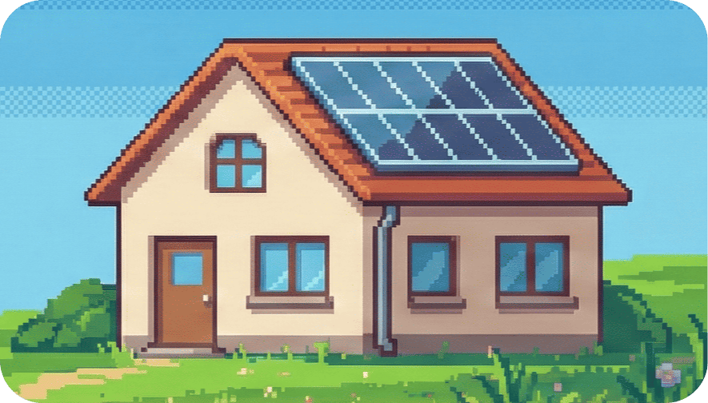

# 20.2.1 - SH-CONTEXT - Smart-Home-Kontext

Der Smart-Home-Kontext beschreibt den Kern von BitGridAI:

PV-Überschuss steuert Mining als flexible Last.

Ziel ist nicht nur Optimierung, sondern eine verständliche,
alltagstaugliche Erklärung der Entscheidungen im lokalen Dashboard.



&nbsp;

## Zielbild

- Das Haus ist das Kontrollzentrum: Nutzer sehen, was passiert und warum.
- Entscheidungen werden als klare Gründe, Trigger und Parameter erklärt.
- Die Haus-Reserve (R2) ist sichtbar und nachvollziehbar.
- Automatisierung fühlt sich wie Unterstützung an, nicht wie Kontrollverlust.

&nbsp;

## Unterseiten

### WQ1 – Transparenz
- **[20.2.1.1 - SH-WQ1 - Verstehen der Entscheidung](./2021a_transparenz.md)**
  - Warum läuft, pausiert oder stoppt der Miner?

### WQ2 – Kontrolle
- **[20.2.1.2 - SH-WQ2 - Kontrolle und Override](./2021b_kontrolle.md)**
  - Kann der Nutzer Mining schnell stoppen/starten?

### WQ3 – Vertrauen
- **[20.2.1.3 - SH-WQ3 - Vertrauen und Sicherheit](./2021c_vertrauen.md)**
  - Ist die Haus-Reserve sichtbar und vertrauenswürdig?

&nbsp;

## Kernproblem (Smart Home)

- PV-Überschuss schwankt ständig, Mining ist flexibel.
- Ohne Erklärung wirkt das Verhalten des Systems willkürlich.
- Nutzer sehen nur Status ("Miner an/aus"), aber keine Begründung.

Design-Opportunity: Ein Dashboard, das Energieflüsse visualisiert
und Entscheidungen transparent erklärt.

&nbsp;

## System-Logik und Datenbasis (Gehirn)

Eingangsdaten:
- PV-Leistung, Prognose, erwarteter Überschuss.
- Hausverbrauch, Grundlast, Speicher-SoC.
- Netzpreis und Einspeisetarif (optional).
- Miner-Telemetrie: Temperatur, Leistung, Taktzyklus.
- Nutzerpräferenzen: Ruhezeiten, max Netzbezug, Override-Timeout.

Regel-Logik (R1-R5):
1) R1: Start Mining bei PV-Überschuss und günstigen Bedingungen.
2) R2: Haus-Reserve schützt die Grundversorgung (Veto gegen Mining).
3) R3: Safety Stop bei Temperatur oder Fehlern.
4) R4: Forecast-Logik vermeidet unnötige Starts.
5) R5: Stabilität verhindert Flapping (Start/Stop im Minutenrhythmus).

&nbsp;

## User Story (Wochenend-Szenario)

Mittag: PV-Überschuss steigt, der Miner startet automatisch.
Eine Wolke zieht durch: R5 hält den Miner stabil statt hart zu stoppen.
Abends sinkt der Überschuss: R2 greift, der Miner pausiert.
Der Nutzer sieht klar, warum und wann der Miner wieder startet.

&nbsp;

## UI-Konzept: Web-Dashboard (Kontrollzentrum)

### Dashboard

- Energiefluss-Visualisierung: Haus, PV, Speicher, Miner, Netz mit aktiven Flusslinien.
- Status-Karten:
  - Miner: Status, Leistung, Temperatur.
  - Haus: Grundlast, Haus-Reserve "gesichert: Ja/Nein".
  - Preis: aktueller kWh-Preis (grün, wenn günstig).
  - Aktion: "Miner starten" oder "Miner pausieren".

### Automatik und Grenzen (Einstellungen)

- Haus-Reserve: gesperrter Bereich für die Grundversorgung.
- Ruhezeiten: Zeitfenster ohne Mining (z. B. nachts).
- Modi:
  - Eco-Optimiert (Standard)
  - Ruhe priorisiert
  - Maximaler Eigenverbrauch

### Forecast- und Preisvorschau

- 24h-Graph: PV-Prognose + Preisfenster.
- Geplante Mining-Fenster als Balken.

&nbsp;

## Beispiel-Erklärungen im Dashboard

- "Miner startet: PV-Überschuss > 3 kW."
- "Miner pausiert: Haus-Reserve erreicht."
- "Miner stoppt: Temperatur zu hoch."
- "Miner bleibt aktiv bis 10:30 (Stabilitätsfenster)."

&nbsp;

## Technischer Rahmen (Skizze)

- BitGridAI trifft regelbasierte Entscheidungen (R1-R5).
- Entscheidungen werden als Gründe und Prognosen ausgegeben.
- Ein lokales Sprachmodell kann die Begründungen in Alltagssprache übersetzen.
- Kommunikation ins UI via MQTT oder lokale API.

Beispiel Topics:
- `bitgrid/decision/reason` -> "Start Mining: PV-Überschuss > 3 kW"
- `bitgrid/prediction` -> "Nächster Check in 10 Min"

&nbsp;

## Datenmodell (Entwurf)

```json
{
  "user_id": "user_123",
  "home_setup": {
    "pv_peak_power_kw": 10.5,
    "battery_storage_home_kwh": 8.0,
    "base_load_avg_kw": 0.4
  },
  "energy_context": {
    "pv_kw": 3.6,
    "load_kw": 1.2,
    "grid_kw": 0.0,
    "storage_soc_percent": 55
  },
  "miner_status": {
    "state": "PAUSED",
    "power_kw": 0.0,
    "chip_temp_c": 62,
    "last_heartbeat_sec": 12
  },
  "energy_market": {
    "current_grid_price": 0.32,
    "feed_in_tariff": 0.08,
    "forecast_low_price_window": "2023-10-29T14:00:00"
  },
  "decision": {
    "action": "START_MINING",
    "reason": "PV_Überschuss",
    "valid_until": "2023-10-29T14:10:00"
  }
}
```

&nbsp;

## Annahmen und Risiken

| ID | Typ | Annahme/Risiko |
|----|-----|----------------|
| SH-ASSUM-01 | Annahme | Nutzer wollen verstehen, nicht optimieren. |
| SH-ASSUM-02 | Annahme | Lokales LLM und lokale Datenhaltung sind verfügbar (Privacy). |
| SH-RISK-01 | Risiko | Zu viele Meldungen können nerven. |
| SH-RISK-02 | Risiko | Falsches Timing der Meldung kann bevormundend wirken. |

&nbsp;
## Offene Fragen

- Welche Visualisierung erklärt Mining am schnellsten?
- Welche Begründung ist kurz und trotzdem hilfreich?
- Wie viel Kontrolle braucht der Nutzer im Alltag wirklich?

# Konzept
Stand ~ Skizzenhafte Vorstellung: 10.02.2026: [https://evil-markup-99217954.figma.site](https://evil-markup-99217954.figma.site)


 

---

> **Nächster Schritt:** Starte mit den Unterseiten des Smart-Home-Kontexts.
>
> 👉 Weiter zu **[20.2.1.1 - SH-WQ1 - Verstehen der Entscheidung](./2021a_transparenz.md)**
>
> 🔙 Zurück zu **[20.2 - WQ - Zentrale Arbeitsfragen](../README.md)**
>
> 🏠 Zurück zur **[Hauptübersicht](../../../../README.md)**
