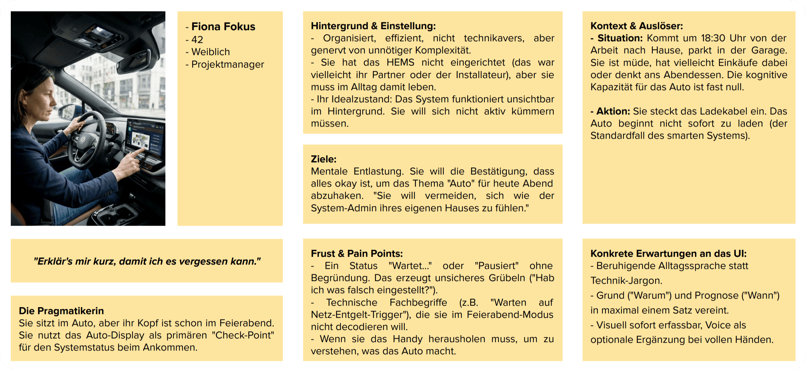
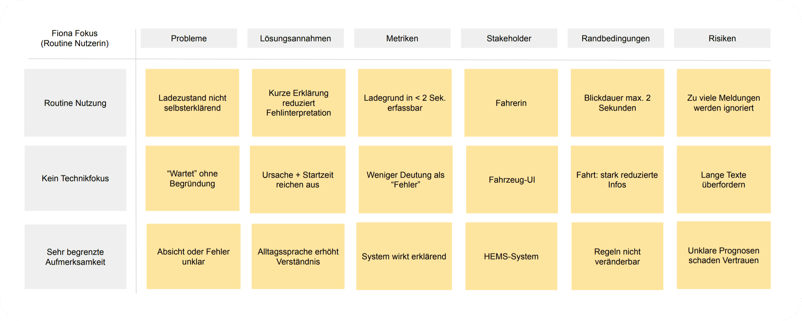
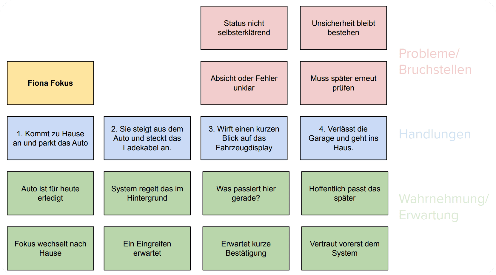
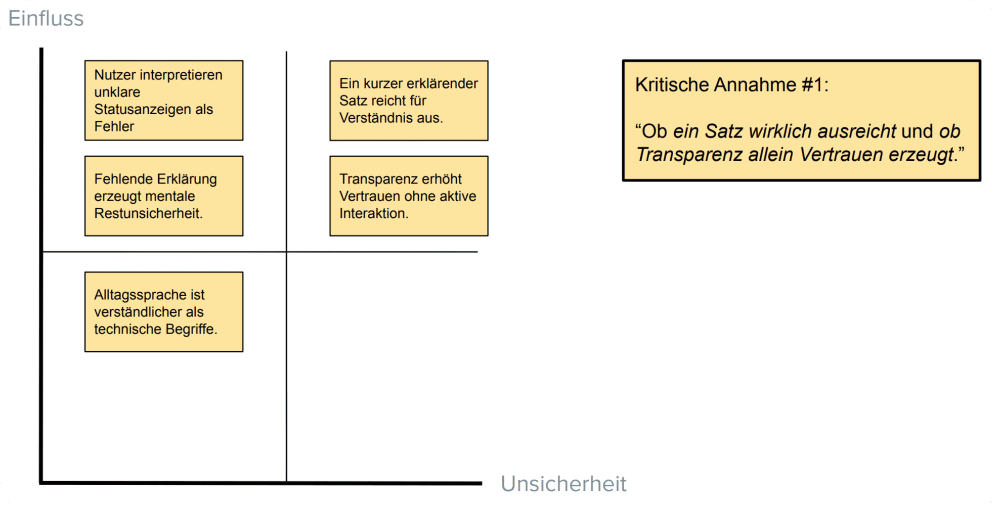
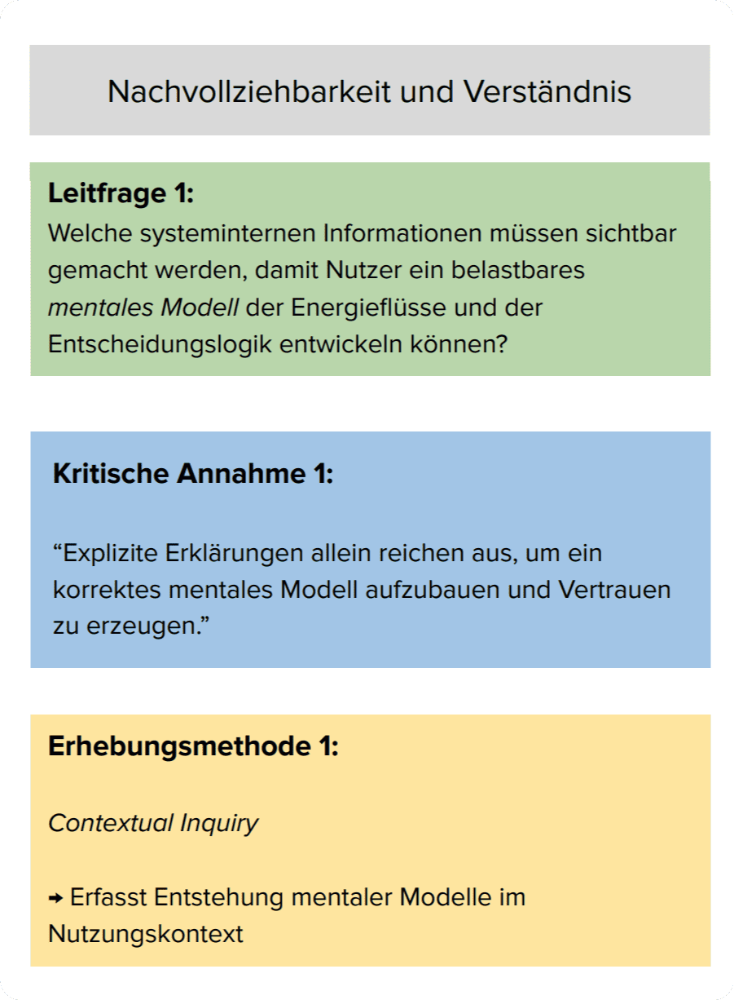

# 20.2.2.1 – AUTO-WQ1 – Verstehen der Ladeentscheidung (Transparenz)

## Ziel
Fahrende erkennen in unter **2 Sekunden**,  
dass es sich um eine **absichtsvolle, regelbasierte Entscheidung** des Systems handelt  
– und nicht um einen Fehler oder Verbindungsabbruch.

## Nutzungskontext (WQ1-relevant)

- Nutzung erfolgt beiläufig (Ankommen, Aussteigen, Einstecken).  
- Blickdauer auf das Display: maximal 1–2 Sekunden.  
- Kein Wunsch nach technischer Tiefe oder Interaktion.  
- Information muss ohne Nachdenken und ohne Kontextwissen verständlich sein.

&nbsp;

## Relevante Persona (HCI-Modell)

**Persona:** Fiona Fokus  
**Rolle:** Fahrerin im Smart-Home- und HEMS-Kontext  
**Nutzungstyp:** Routine-Nutzung  
**Technische Affinität:** gering bis mittel  
**Primärer Nutzungskontext:** Ankunft zu Hause, geringe Aufmerksamkeit  
**Mentales Modell:**  
- Das System regelt Ladeentscheidungen autonom im Hintergrund.  
- Das Fahrzeug-UI dient als kurzer Bestätigungsblick, nicht als Analysewerkzeug.  

**Ziel der Persona:**  
Die Ladeentscheidung sofort einordnen können, um das Thema „Auto“ mental abzuschließen.

**Relevante Einschränkungen:**  
- Sehr begrenzte kognitive Kapazität im Nutzungsmoment  
- Keine Bereitschaft zur Interpretation technischer Begriffe  
- Fahrzeug-UI ist der primäre (und oft einzige) Informationskanal  

&nbsp;

## Proto-Problem-Statement (WQ1 – Transparenz - Fehlinterpretation)

- Das Fahrzeug zeigt Zustände wie „Wartet“ oder „Pausiert“, ohne Ursache zu erklären.
- Für Fiona ist nicht erkennbar, ob dies eine **bewusste Systementscheidung** oder ein **Fehler** ist.
- Ohne Grund und Prognose bleibt ein Gefühl von Unsicherheit: *„Stimmt hier etwas nicht?“*
- Technische Formulierungen (z. B. Tariflogik, Netztrigger, Regelzustände) sind im Feierabendkontext kognitiv nicht zugänglich.
- Fehlende Erklärung verhindert den Aufbau eines belastbaren mentalen Modells der Ladeentscheidung.

**Kernaussage:**  
Wird der Entscheidungsgrund nicht sichtbar gemacht, wird der Systemzustand als Störung interpretiert – nicht als Optimierung.

&nbsp;

## Proto-Journey (WQ1 – Fiona Fokus)

1. Fiona kommt gegen 18:30 Uhr von der Arbeit nach Hause und parkt in der Garage.  
2. Sie steigt aus, steckt das Ladekabel an und rechnet mit einem automatischen Ablauf.  
3. Das System startet den Ladevorgang nicht sofort (Optimierung durch HEMS).  
4. Das Display zeigt lediglich einen Status wie „Wartet“ oder „Pausiert“.  
5. Fiona wirft einen kurzen Blick darauf.  
6. Sie kann nicht erkennen, ob alles korrekt funktioniert oder ob ein Problem vorliegt.  
7. Sie verlässt die Garage mit einem Restzweifel und dem Gedanken:  
   *„Ich hoffe, das passt später – ich schau nochmal nach.“*

**Ziel der Journey:**  
Der Ladezustand soll in einem einzigen Blick als **absichtsvolle, regelbasierte Entscheidung** erkennbar sein,  
sodass Fiona das Thema mental abschließen und in den Feierabend wechseln kann.

&nbsp;

## Abgeleitete Annahmen (WQ1 – Transparenz)

- Unklare Statusanzeigen werden von Routine-Nutzenden primär als **Systemfehler** interpretiert, nicht als Optimierungsentscheidung.
- Fehlende Erklärung erzeugt eine **mentale Restunsicherheit**, die über den Nutzungsmoment hinaus bestehen bleibt.
- Ein **einziger kurzer Satz** mit *Grund und Startzeit* reicht aus, um die Entscheidung kognitiv zu akzeptieren.
- Die Information **„Wann geht es weiter?“** ist für die mentale Entlastung ebenso wichtig wie der Grund selbst.
- **Alltagssprache** ist im Ankunfts- und Feierabendkontext verständlicher als technische Systembegriffe.
- **Icon + sehr kurzer Text** werden schneller erfasst als Text allein.
- Die verfügbare Aufmerksamkeit liegt bei **unter 2 Sekunden**; längere Texte werden nicht verarbeitet.
- Erklärung muss **ohne Interaktion** funktionieren; ein Blick auf das Display muss genügen.
- Bereits minimale Transparenz lässt die Entscheidung als **absichtsvoll und korrekt** erscheinen und reduziert Fehlinterpretationen.

Diese Annahmen bilden die Grundlage für die Operationalisierung von Transparenz im Fahrzeug-UI.

| ID | Annahme |
|----|--------|
| AUTO-ASSUM-TRAN-01 | Fiona hat maximal 2 Sekunden Aufmerksamkeit für Ladeinformationen. |
| AUTO-ASSUM-TRAN-02 | Ein klar formulierter Satz mit **Grund + Startzeit** reicht für Akzeptanz. |
| AUTO-ASSUM-TRAN-03 | Ohne Erklärung wird „Nicht laden“ als Systemfehler interpretiert. |
| AUTO-ASSUM-TRAN-04 | Icon + sehr kurzer Text werden schneller verstanden als Text allein. |
| AUTO-ASSUM-TRAN-05 | Eine optionale Voice-Ansage kann visuelle Information bestätigen, nicht ersetzen. |
| AUTO-ASSUM-TRAN-06 | Alltagssprache reduziert kognitive Last gegenüber technischen Begriffen. |

## Kritische Annahme (WQ1 – Transparenz)

- Ein einzelner, sehr kurzer erklärender Satz mit **Grund + Startzeit** reicht aus,  
  um die Ladeentscheidung in unter 2 Sekunden als **absichtsvolle Systementscheidung**  
  und nicht als Fehler zu interpretieren.
- Diese minimale Form von Transparenz reduziert mentale Unsicherheit  
  und verhindert die Fehlzuschreibung eines Systemproblems.

&nbsp;

## Abgeleitete Forschungsfrage (WQ1)

**Wie kann das Fahrzeug-UI Gründe und Startzeit so kurz und alltagssprachlich kommunizieren (Text, Icon, optional Voice),  
dass Routine-Fahrende die Ladeentscheidung in unter 2 Sekunden  
als absichtsvolle, regelbasierte Systementscheidung verstehen und nicht als Fehler interpretieren?**

&nbsp;

## Teilfragen

| ID | Fokus | Teilfrage | Bezug |
|----|------|----------|------|
| AUTO-TRAN-01 | Aufmerksamkeit | Welche Textlänge ist innerhalb von 2 Sekunden erfassbar? | ASSUM-01 |
| AUTO-TRAN-02 | Informationsgehalt | Reichen Grund + Startzeit für Akzeptanz aus? | ASSUM-02, 03 |
| AUTO-TRAN-03 | Darstellung | Was ist schneller verständlich: Icon + Text oder nur Text? | ASSUM-04 |
| AUTO-TRAN-04 | Modalität | Wann unterstützt eine kurze Voice-Ansage das Verständnis, ohne zu stören? | ASSUM-05 |

&nbsp;

## UI-Prinzipien (abgeleitet aus Persona & WQ1)

- **Warum + Wann**, nicht nur Status  
- Maximal **ein Satz**  
- Alltagssprache statt Systemjargon  
- Struktur: **Warum → Was passiert → Wann**  
- Sofort visuell erfassbar  
- Keine zusätzliche Interaktion erforderlich  

&nbsp;

## Zusammenfassung

Die Persona dient hier der **Operationalisierung von Aufmerksamkeit, Nutzungskontext und mentalem Modell**.  
Transparenz bedeutet nicht Detailtiefe, sondern die sofortige Wahrnehmung von **Absicht statt Fehler**.

Ein erklärender UI-Satz ersetzt technische Systemzustände durch eine verständliche Alltagsübersetzung der Regelentscheidung.

---

> **Nächster Schritt:** Als Nächstes geht es um Kontrolle im Auto.
>
> 👉 Weiter zu **[20.2.2.2 - AUTO-WQ2 - Kontrolle im Auto](./2022b_kontrolle.md)**
>
> 🔙 Zurück zu **[20.2.2 - AUTO-CONTEXT - Automotive-Kontext](./README.md)**
