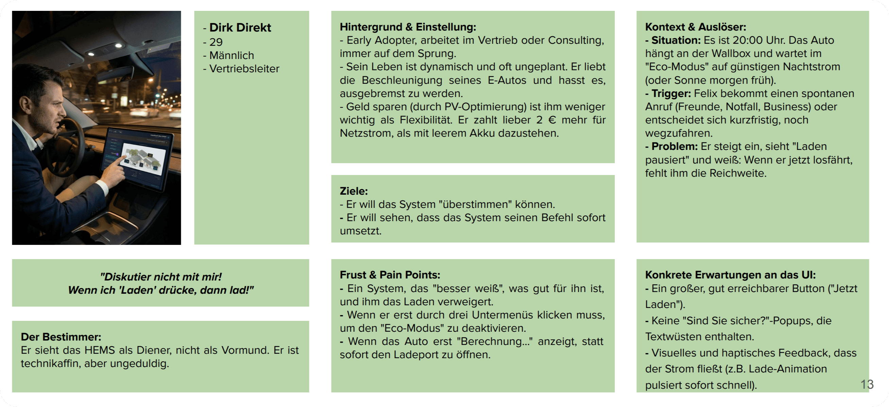
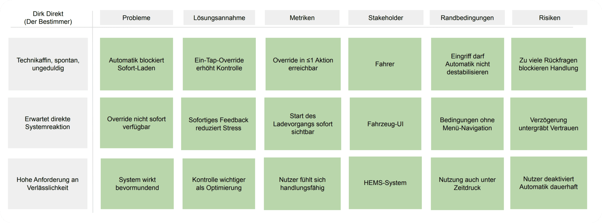
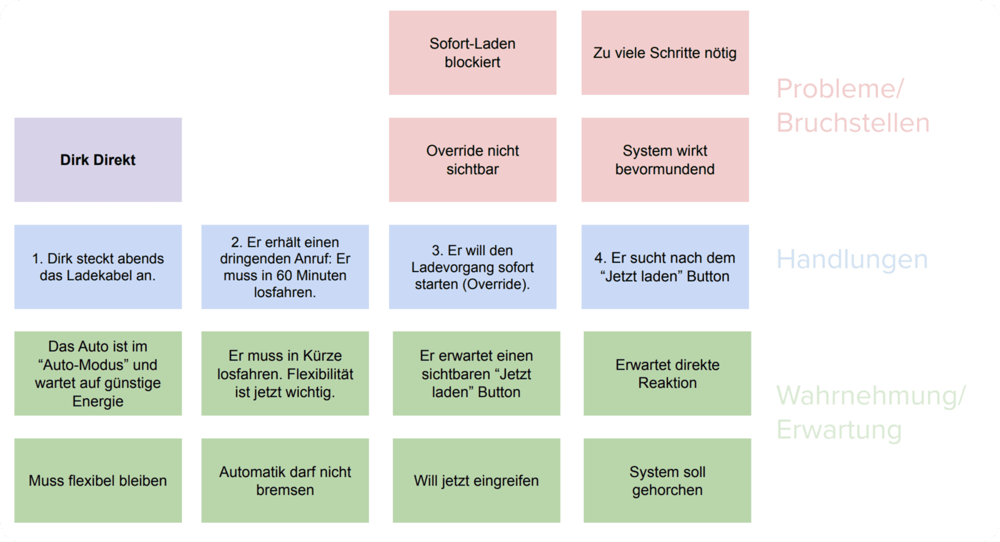
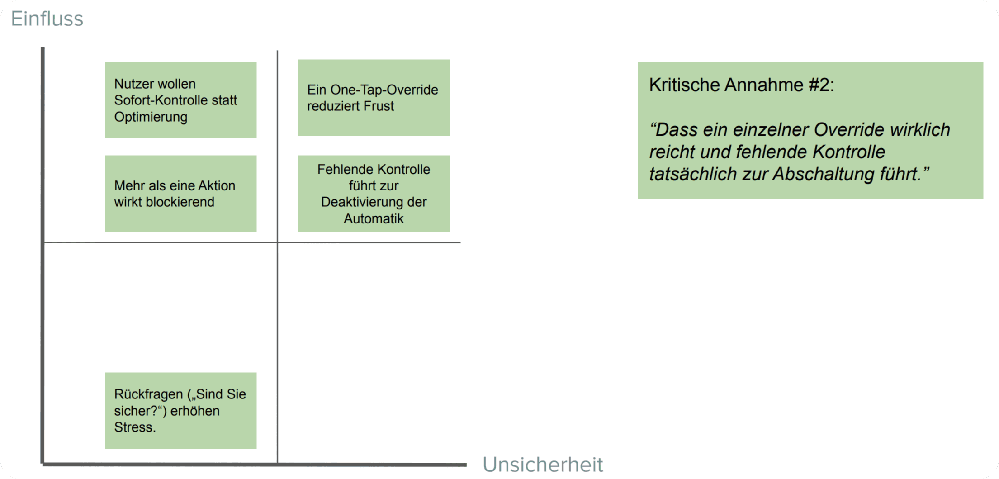
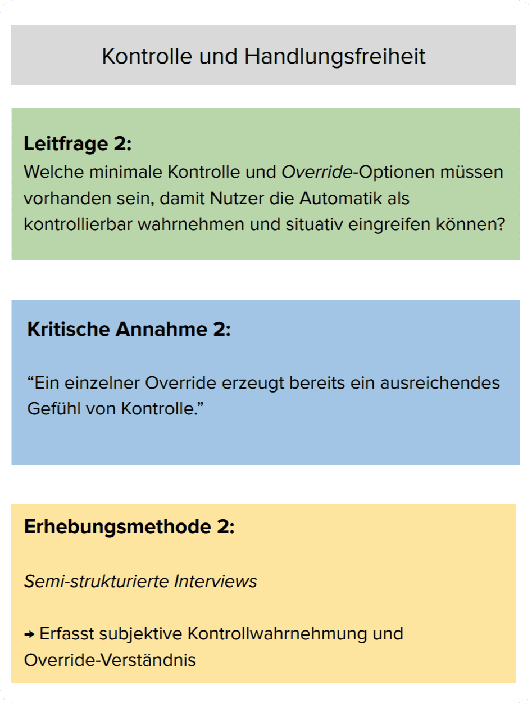

# 20.2.2.2 – AUTO-WQ2 – Kontrolle im Auto

## Ziel
Fahrende können mit **1–2 Aktionen** in den automatisierten Ladevorgang eingreifen  
und eine sofortige Reaktion des Systems auslösen, ohne kognitive oder visuelle Ablenkung.

&nbsp;

## Nutzungskontext (WQ2-relevant)

- Nutzung erfolgt situativ unter Zeitdruck (spontane Fahrt, Abfahrt in wenigen Minuten).  
- Aufmerksamkeit ist auf die Handlungsfähigkeit, nicht auf Analyse gerichtet.  
- Erwartet wird eine unmittelbare Systemreaktion ohne Wartezeiten oder Menünavigation.  
- Interaktion findet im Fahrzeug statt, oft im Sitzen, teilweise mit laufendem Motor.

&nbsp;

## Relevante Persona (HCI-Modell)

**Persona:** Dirk Direkt  
**Rolle:** Fahrer im Smart-Home- und HEMS-Kontext  
**Nutzungstyp:** Spontane Nutzung, Early Adopter  
**Technische Affinität:** hoch, aber geringe Geduld  
**Primärer Nutzungskontext:** kurzfristige Abfahrt, Zeitdruck  
**Mentales Modell:**  
- Das System optimiert automatisch, darf aber jederzeit überstimmt werden.  
- Das Fahrzeug-UI ist ein Kontrollinstrument, kein Beratungswerkzeug.

**Ziel der Persona:**  
Den Ladevorgang sofort starten können, wenn Reichweite jetzt benötigt wird.

**Relevante Einschränkungen:**  
- Sehr geringe Toleranz für Verzögerungen  
- Keine Akzeptanz für mehrstufige Interaktion  
- Erwartung unmittelbarer Rückmeldung (visuell/haptisch)

&nbsp;

## Proto-Problem-Statement (WQ2 – Kontrolle)

- Das HEMS verzögert den Ladevorgang aus Optimierungsgründen (PV, Tarif, Prognose).
- In spontanen Situationen benötigt Dirk jedoch **sofortige Reichweite**.
- Ist der Override nicht direkt sichtbar oder erfordert mehrere Schritte,  
  wird das System als **bevormundend** und blockierend wahrgenommen.
- Verzögerte oder unklare Rückmeldung („Berechnung…“) untergräbt das Gefühl von Kontrolle.
- Fehlende oder schwer erreichbare Eingriffsmöglichkeiten führen zur Ablehnung der Automatik.

**Kernaussage:**  
Ohne sofort verfügbaren Override wird Automatik als Einschränkung statt als Unterstützung erlebt.

&nbsp;

## Proto-Journey (WQ2 – Dirk Direkt)

1. Dirk kommt gegen 20:00 Uhr nach Hause und parkt das Auto.  
2. Das Fahrzeug ist angesteckt und wartet im Eco-Modus auf günstige Bedingungen.  
3. Dirk entscheidet spontan, sofort wieder loszufahren oder schnell Reichweite zu laden.  
4. Er wirft einen Blick auf das Fahrzeugdisplay und sieht „Pausiert / Eco-Modus“.  
5. Er sucht eine Möglichkeit, den Ladevorgang **jetzt** zu starten.  
6. Ist der Override nicht unmittelbar sichtbar oder reagiert verzögert, entsteht Frust.  
7. Erwartung: Ein klarer Befehl – sofortige Ausführung.

**Ziel der Journey:**  
Mit minimalem Aufwand handlungsfähig sein und das System unmittelbar überstimmen können.

&nbsp;

## Abgeleitete Annahmen (WQ2 – Kontrolle)

- Nutzer erwarten eine **direkt sichtbare One-Tap-Aktion** („Jetzt laden“) ohne Menüebenen.
- Jede Verzögerung oder Rückfrage wird als Blockade wahrgenommen.
- **Sofortiges visuelles und haptisches Feedback** reduziert Stress und bestätigt Kontrolle.
- Kontrolle ist in Ausnahmesituationen wichtiger als Optimierung.
- Mehr als eine Interaktion erhöht kognitive Last und Frustration.
- Eine optionale Sprachaktion kann physische Interaktion ersetzen, wenn Tippen ablenkt.

Diese Annahmen operationalisieren wahrgenommene Kontrolle im Fahrzeug-UI.

&nbsp;

## Kritische Annahme (WQ2 – Kontrolle)

- Ein einzelner, unmittelbar erreichbarer **Override („Jetzt laden“)**
  reicht aus, damit Nutzende die Automatik als kontrollierbar wahrnehmen  
  und situativ eingreifen können, ohne die Automatik grundsätzlich abzulehnen.

&nbsp;

## Abgeleitete Forschungsfrage (WQ2)

**Welche minimalen Kontroll- und Override-Mechanismen (One-Tap-Button, unmittelbares Feedback, optionale Voice-Interaktion)  
ermöglichen es Fahrenden, automatisierte Ladeentscheidungen im Fahrzeug  
als kontrollierbar wahrzunehmen und situativ ohne Ablenkung einzugreifen?**

&nbsp;

## Teilfragen

| ID | Fokus | Teilfrage | Bezug |
|----|------|----------|------|
| AUTO-CTRL-01 | Interaktion | Reicht ein einzelner „Jetzt laden“-Button ohne Menüs aus? | ASSUM-01,03 |
| AUTO-CTRL-02 | Feedback | Welche Rückmeldung macht den Ladestart sofort erfahrbar? | ASSUM-02 |
| AUTO-CTRL-03 | Rückfragen | Wie kurz dürfen Sicherheitsabfragen sein, ohne zu stören? | ASSUM-04 |
| AUTO-CTRL-04 | Modalität | Wann ist Sprachinteraktion schneller als Touch? | ASSUM-05 |

&nbsp;

## UI-Prinzipien (abgeleitet aus Persona & WQ2)

- **Handlung vor Erklärung**
- Maximal **eine primäre Aktion**
- Sofortiges Systemfeedback
- Keine Blockade durch Dialoge
- Optional: Sprachbefehl als Alternative

&nbsp;

## Zusammenfassung

Kontrolle bedeutet hier nicht Detailsteuerung, sondern **situative Übersteuerbarkeit**.  
Das Fahrzeug-UI muss es ermöglichen, die Automatik in Ausnahmesituationen  
mit minimalem Aufwand und maximaler Rückmeldung zu überstimmen,  
damit das System als **Diener** und nicht als **Vormund** wahrgenommen wird.

---

> **Nächster Schritt:** Als Nächstes geht es um Vertrauen und Reichweitenangst.
>
> 👉 Weiter zu **[20.2.2.3 - AUTO-WQ3 - Vertrauen und Reichweitenangst](./2022c_vertrauen.md)**
>
> 🔙 Zurück zu **[20.2.2 - AUTO-CONTEXT - Automotive-Kontext](./README.md)**
