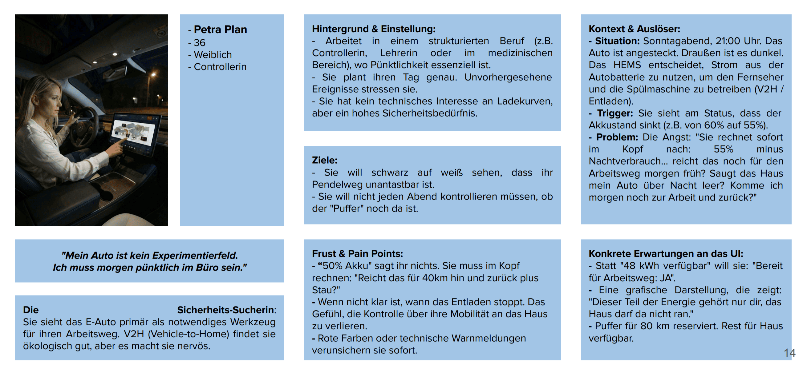
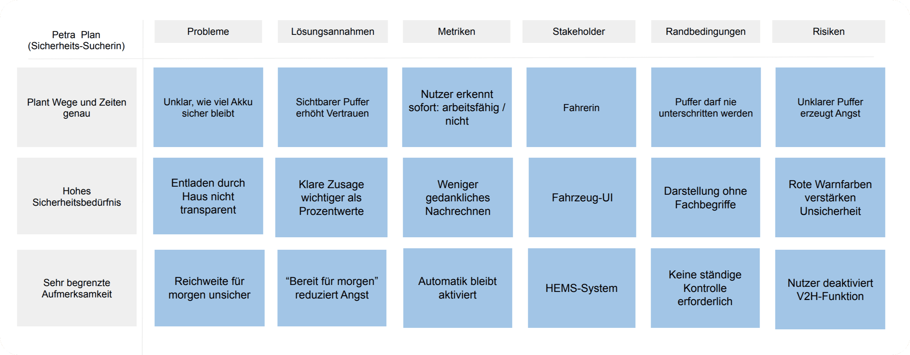
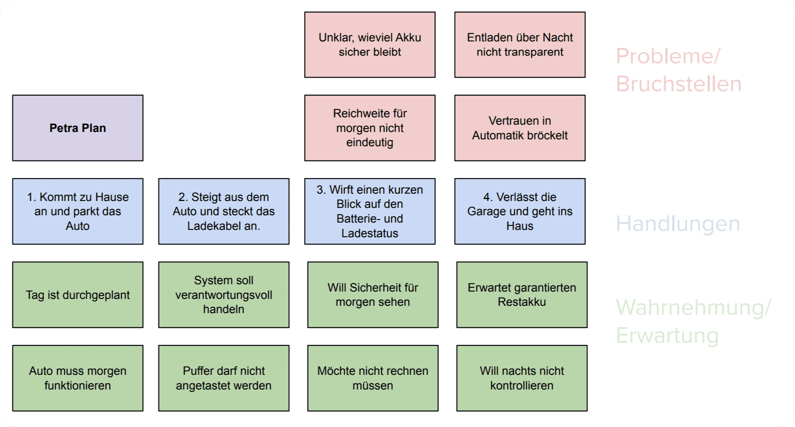
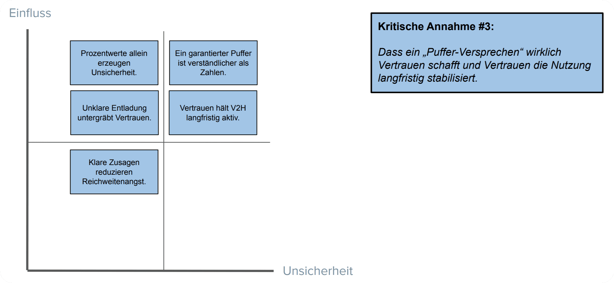
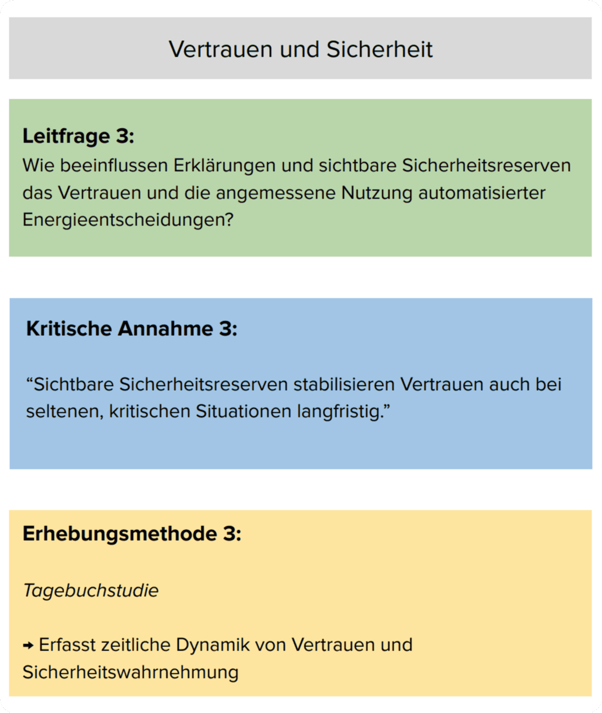

# 20.2.2.3 – AUTO-WQ3 – Vertrauen und Reichweitenangst

## Ziel
Fahrende erkennen eindeutig,  
dass **genügend garantierte Reichweite für den nächsten Tag** verbleibt  
und dass die V2H-Nutzung diese Reserve nicht gefährdet.

&nbsp;

## Nutzungskontext (WQ3-relevant)

- Nutzung erfolgt abends vor dem Schlafengehen.  
- Geringe Bereitschaft zur Kontrolle oder zum Nachrechnen.  
- Hoher Wunsch nach Sicherheit und Planbarkeit für den nächsten Morgen.  
- Das Fahrzeug-UI dient als letzter „Sicherheitsblick“ vor dem Abschalten.

&nbsp;

## Relevante Persona (HCI-Modell)

**Persona:** Petra Plan  
**Rolle:** Pendlerin im Smart-Home- und HEMS-Kontext  
**Nutzungstyp:** Regelmäßige Routine-Nutzung  
**Technische Affinität:** gering bis mittel  
**Primärer Nutzungskontext:** Abend, Vorbereitung auf den nächsten Arbeitstag  
**Mentales Modell:**  
- Das Auto ist ein sicherheitskritisches Arbeitsmittel.  
- Energie darf vom Haus genutzt werden, aber nur oberhalb einer garantierten Reserve.

**Ziel der Persona:**  
Sicher sein, dass der Arbeitsweg am nächsten Morgen ohne Einschränkung möglich ist.

**Relevante Einschränkungen:**  
- Hohes Sicherheitsbedürfnis  
- Keine Bereitschaft, mit Prozentwerten oder Prognosen zu rechnen  
- Wunsch nach klarer Zusage statt technischer Detailanzeige  

&nbsp;

## Proto-Problem-Statement (WQ3 – Vertrauen)

- Das HEMS nutzt die Fahrzeugbatterie für das Haus (V2H).  
- Der Akkustand sinkt sichtbar, ohne dass klar wird, welcher Teil „sicher“ reserviert ist.  
- Prozentwerte und Ladezustände lassen nicht erkennen,  
  ob der morgige Arbeitsweg garantiert abgedeckt ist.  
- Unklare Entladegrenzen erzeugen Reichweitenangst und Kontrollbedürfnis.  
- Fehlende Sicherheitszusage untergräbt das Vertrauen in die Automatik.

**Kernaussage:**  
Ohne sichtbaren, garantierten Pendler-Puffer wird V2H als Risiko wahrgenommen, nicht als Unterstützung.

&nbsp;

## Proto-Journey (WQ3 – Petra Plan)

1. Petra kommt abends nach Hause und steckt das Auto an.  
2. Das System beginnt, Energie für das Haus zu nutzen (V2H).  
3. Sie wirft einen Blick auf den Batteriestatus.  
4. Sie sucht die Antwort auf eine einzige Frage:  
   *„Reicht das morgen sicher für meinen Arbeitsweg?“*  
5. Ist diese Antwort nicht eindeutig, entsteht innere Unruhe.  
6. Sie überlegt, die Automatik zu deaktivieren oder den Ladezustand manuell zu prüfen.  

**Ziel der Journey:**  
Mit einem Blick erkennen, dass der **Arbeitsweg garantiert abgesichert** ist  
und die Automatik vertrauensvoll laufen lassen zu können.

&nbsp;

## Abgeleitete Annahmen (WQ3 – Vertrauen)

- Prozentwerte allein erzeugen Unsicherheit, keine Sicherheit.
- Ein klar ausgewiesener **garantierter Puffer** reduziert Reichweitenangst.
- Eine Ja/Nein-Aussage („Bereit für morgen“) ist schneller verständlich als Zahlen.
- Der Puffer muss als **unantastbare Reserve** kommuniziert werden.
- Klare Zusagen sind wichtiger als detaillierte Energieflüsse.
- Unklare Entladung untergräbt Vertrauen und führt zur Deaktivierung der Automatik.

Diese Annahmen operationalisieren Vertrauen als wahrgenommene Sicherheit des Arbeitswegs.

&nbsp;

## Kritische Annahme (WQ3 – Vertrauen)

- Ein explizites **Puffer-Versprechen** („Arbeitsweg garantiert gesichert“)  
  ist ausreichend, um Reichweitenangst zu reduzieren  
  und die V2H-Automatik langfristig akzeptabel zu machen.

&nbsp;

## Abgeleitete Forschungsfrage (WQ3)

**Wie müssen Sicherheitsreserven und Pendler-Puffer im Fahrzeug-UI dargestellt werden  
(Text, Symbolik, Garantieaussage),  
damit Fahrende Reichweitenangst verlieren  
und der automatisierten V2H-Nutzung vertrauen?**

&nbsp;

## Teilfragen

| ID | Fokus | Teilfrage | Bezug |
|----|------|----------|------|
| AUTO-TRUST-01 | Kernbotschaft | Ist „Bereit für morgen: Ja/Nein“ schneller verständlich als Prozentwerte? | ASSUM-01,02 |
| AUTO-TRUST-02 | Visualisierung | Welche Darstellung erzeugt das höchste Sicherheitsgefühl? | ASSUM-04 |
| AUTO-TRUST-03 | Regeltransparenz | Wie muss kommuniziert werden, dass der Puffer nie unterschritten wird? | ASSUM-03 |
| AUTO-TRUST-04 | Vertrauen | Wann bleibt die Automatik aktiviert? | ASSUM-05 |

&nbsp;

## UI-Prinzipien (abgeleitet aus Persona & WQ3)

- **Sicherheitszusage vor Detailanzeige**  
- Klare Trennung: *Reserve* vs. *frei nutzbare Energie*  
- Ja/Nein-Logik statt Prozentrechnen  
- Keine alarmistischen Farben  
- Garantie statt Prognose

&nbsp;

## Zusammenfassung

Vertrauen entsteht hier nicht durch Detailwissen,  
sondern durch eine **explizite Sicherheitsgarantie**.

Das Fahrzeug-UI muss nicht erklären, wie optimiert wird,  
sondern zusichern, dass ein definierter Teil der Energie  
**ausschließlich der Mobilität gehört** und nicht angetastet wird.

---

> **Nächster Schritt:** Danach folgen die Kontext- und Diskussionsfragen.
>
> 👉 Weiter zu **[20.3 - DQ - Kontext- und Diskussionsfragen](../../203_discussion_questions/README.md)**
>
> 🔙 Zurück zu **[20.2.2 - AUTO-CONTEXT - Automotive-Kontext](./README.md)**
