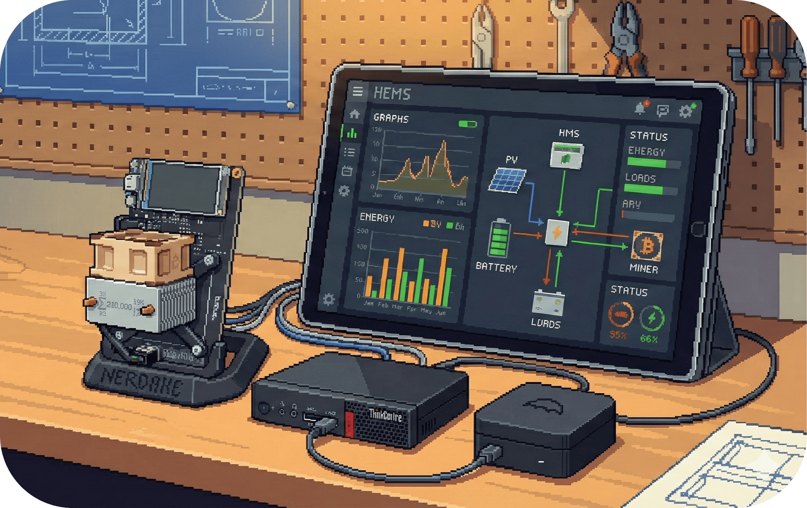

# 20.2.3 - SIM-CONTEXT - Simulation-Lab-Kontext

Der Simulation-Lab-Kontext modelliert das Energiemanagement als physisches Tisch-Setup.
Ziel ist es, Regeln, Schwellen und Sicherheitslogiken haptisch und auditiv erlebbar zu
machen: Relais klicken, LEDs zeigen Reserven, Schalter provozieren Lastsprünge.
Teilnehmende können die Entscheidungslogik provozieren, beobachten und erklären.

&nbsp;

## Zielbild

- Regeln werden sichtbar und hörbar: Relais-Klicks, LEDs und Displays spiegeln das Regelwerk.
- Jede Systemreaktion ist begründet: "Warum gerade so?" wird als kurzer Grund + Prognose angezeigt.
- Eingriffe sind erlaubt und begrenzt: Override-Schalter zeigen sofortige Wirkung und Grenzen.
- Sicherheit bleibt sichtbar: Reserve (R2) und Safety-Stops sind als rote Sperren erkennbar.

&nbsp;

## Unterseiten

- **[20.2.3.1 - SIM-WQ1 - Sichtbarkeit der Entscheidungslogik](./2023a_transparenz.md)**
  - Warum schaltet das System im Lab gerade? Schwellen, Prioritäten, Prognosen zeigen.
- **[20.2.3.2 - SIM-WQ2 - Eingriff und Override im Labor](./2023b_kontrolle.md)**
  - Wie können Teilnehmende eingreifen, ohne das System instabil zu machen?
- **[20.2.3.3 - SIM-WQ3 - Vertrauen durch physische Rückmeldung](./2023c_vertrauen.md)**
  - Wie baut sicht- und hörbare Sicherheit Vertrauen in die Automatik auf?

&nbsp;

## Lab-Setup (kurz)

- Tischaufbau mit PV-Simulator, Lasten, Haus-Reserve-Anzeige und Miner-Attrappe.
- Regel-Engine läuft lokal, Relais und LEDs spiegeln Entscheidungen (R1-R5).
- Override-Schalter: Start/Stop, Reserve-Bypass, Stabilisierungsfenster provozieren.
- Logging-Screen: Grund, Datenbasis, Prognose und nächster Check.

&nbsp;

## Beobachtungsziele

- Wird die Regel-Logik ohne technische Erklärung erkannt?
- Fühlen sich Eingriffe kontrollierbar, aber begrenzt an?
- Verstärken physische Signale (LED, Klick, Vibrationsmotor) das Vertrauen?

---

> **Nächster Schritt:** Steige in die Unterseiten ein und prüfe die Fragen am Lab-Aufbau.
>
> 👉 Weiter zu **[20.2.3.1 - SIM-WQ1 - Sichtbarkeit der Entscheidungslogik](./2023a_transparenz.md)**
>
> 🔙 Zurück zu **[20.2 - WQ - Zentrale Arbeitsfragen](../README.md)**
>
> 🏠 Zurück zur **[Hauptübersicht](../../../../README.md)**
