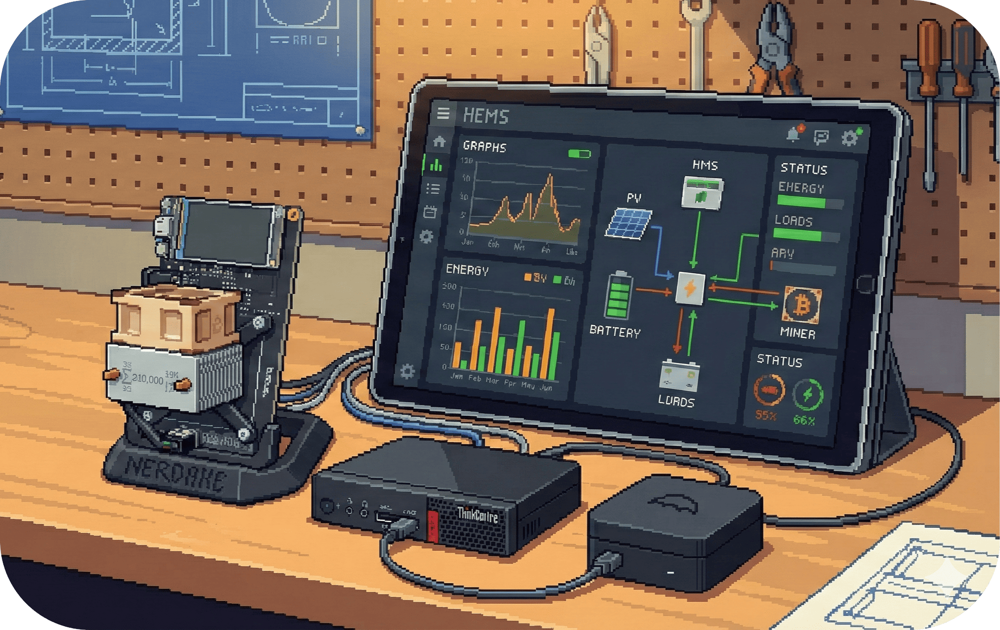

# 20.2.3 - SIM-CONTEXT - Simulation-Lab-Kontext

Der Simulation-Lab-Kontext modelliert das Energiemanagement als physisches Tisch-Setup.
Ziel ist es, Regeln, Schwellen und Sicherheitslogiken haptisch und auditiv erlebbar zu
machen: Relais klicken, LEDs zeigen Reserven, Schalter provozieren Lastsprünge.
Teilnehmende können die Entscheidungslogik provozieren, beobachten und erklären.

&nbsp;

## Zielbild

- Regeln werden sichtbar und hörbar: Relais-Klicks, LEDs und Displays spiegeln das Regelwerk.
- Jede Systemreaktion ist begründet: "Warum gerade so?" wird als kurzer Grund plus Prognose angezeigt.
- Eingriffe sind erlaubt und begrenzt: Override-Schalter zeigen sofortige Wirkung und Grenzen.
- Sicherheit bleibt sichtbar: Reserve (R2) und Safety-Stops sind als rote Sperren erkennbar.

&nbsp;

## Unterseiten

- **[20.2.3.1 - SIM-WQ1 - Home Assistant: Regelwerk, UI und Relais](./2023a_home_assistant_exploration.md)**
- **[20.2.3.2 - Simulations- und Systementwicklung](./2023b_simulation_system_development.md)**
- **[20.2.3.3 - Interface, Explainability und Demonstratorentwicklung](./2023c_interface_explainability_demonstrator.md)**
- **[20.2.3.4 - SIM-WQ3 - Vertrauensdimensionen: Fundierung und Operationalisierung](./2023d_trust_dimensions_operationalization.md)**

&nbsp;

## Lab-Setup (kurz)

- Tischaufbau mit PV-Simulator, Lasten, Haus-Reserve-Anzeige und Miner-Attrappe.
- Regel-Engine läuft lokal, Relais und LEDs spiegeln Entscheidungen (R1-R5).
- Override-Schalter für Start/Stop, Reserve-Bypass und Stabilisierungsfenster.
- Logging-Screen mit Grund, Datenbasis, Prognose und nächstem Check.

&nbsp;

## Beobachtungsziele

- Wird die Regel-Logik ohne technische Erklärung erkannt?
- Fühlen sich Eingriffe kontrollierbar, aber begrenzt an?
- Verstärken physische Signale (LED, Klick, Vibrationsmotor) das Vertrauen?

---

> **Nächster Schritt:** Steige in die Unterseiten ein und prüfe die Fragen am Lab-Aufbau.
>
> Weiter zu **[20.2.3.1 - SIM-WQ1 - Home Assistant: Regelwerk, UI und Relais](./2023a_home_assistant_exploration.md)**
>
> Zurück zu **[20.2 - WQ - Zentrale Arbeitsfragen](../README.md)**
>
> Zurück zur **[Hauptübersicht](../../../../README.md)**
