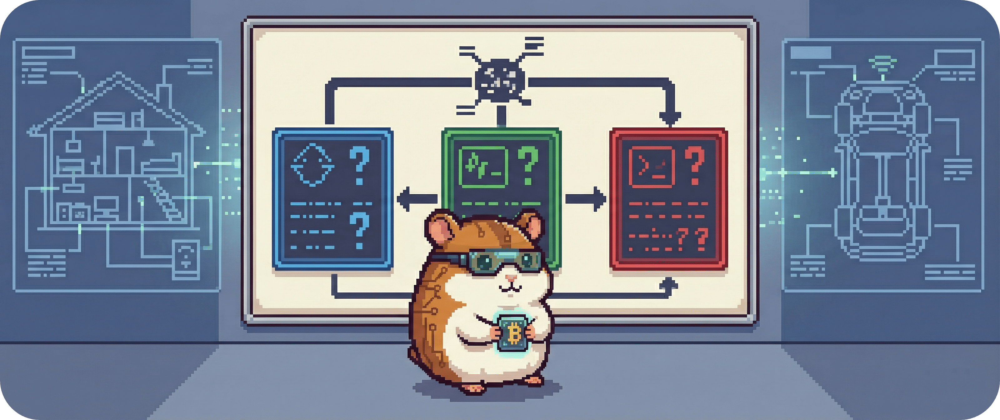

# 20.2 - WQ – Zentrale Arbeitsfragen

Die zentrale Forschungsfragen beschreibt den thematischen Rahmen des Projekts.
Um sie konkret bearbeiten zu können,
wird sie in wenige, gezielt formulierte Arbeitsfragen übersetzt.

Diese Fragen leiten Gestaltung, Implementierung
und Analyse des Systems unmittelbar.
Sie legen fest, welche Aspekte untersucht werden
– und welche bewusst ausgeklammert bleiben.

&nbsp;

## Zentrale Arbeitsfragen

| ID  | Fokus                         | Arbeitsfrage                                                                 | Betrachtete Aspekte |
|-----|-------------------------------|--------------------------------------------------------------------------------|---------------------|
| WQ1 | Nachvollziehbarkeit von Entscheidungen | Welche systeminternen Informationen müssen sichtbar gemacht werden, damit Nutzer ein belastbares mentales Modell der Energieflüsse und der Entscheidungslogik entwickeln können? | Regeln, Systemzustände, Schwellenwerte, zeitliche Abhängigkeiten, mentale Modelle |
| WQ2 | Kontrolle und Handlungsfreiheit | Welche minimale Kontrolle und Override-Optionen müssen vorhanden sein, damit Nutzer die Automatik als kontrollierbar wahrnehmen und situativ eingreifen können? | Override, Handlungsfreiheit, Rückgängig, Aufwand, Kostenhinweis |
| WQ3 | Vertrauen und Sicherheit | Wie beeinflussen Erklärungen und sichtbare Sicherheitsreserven das Vertrauen und die angemessene Nutzung automatisierter Energieentscheidungen? | Vertrauen, wahrgenommene Sicherheit, angemessene Nutzung, Risikoempfinden |

&nbsp;

## Nutzungskontexte der Arbeitsfragen

Die Arbeitsfragen werden in klar getrennten,  
aber auf einer gemeinsamen Systemlogik basierenden Kontexten betrachtet:

- **[20.2.1 - SH-CONTEXT - *Smart-Home*-Kontext](./2021_smart_home_context/README.md)**  
  Wenn Energieentscheidungen zwischen Kaffeemaschine, Waschmaschine und Miner fallen: Erklärbare, regelbasierte Automatik im häuslichen Umfeld (App / Web-Dashboard) mit Fokus auf Transparenz, Kontrolle und ein mentales Modell, das auch nach drei Wochen noch Sinn ergibt.  
  - [20.2.1.1 - SH-WQ1 - Verstehen der Entscheidung](./2021_smart_home_context/2021a_transparenz.md)  
  - [20.2.1.2 - SH-WQ2 - Kontrolle und Override](./2021_smart_home_context/2021b_kontrolle.md)  
  - [20.2.1.3 - SH-WQ3 - Vertrauen und Sicherheit](./2021_smart_home_context/2021c_vertrauen.md)  

- **[20.2.2 - AUTO-CONTEXT - *Automotive*-Kontext](./2022_automotive_context/README.md)**  
  Wenn Reichweite, Ladeleistung und Nervosität zusammenkommen: Verständliche Erklärungen für automatisierte Ladeentscheidungen im aufmerksamkeitssensitiven Fahrzeugkontext (z. B. *„Warum lädt er jetzt nicht – und soll ich panisch werden?“*), reduziert, vertrauenswürdig und ohne den  Fahrer in den Infomodus zu schicken.  
  - [20.2.2.1 - AUTO-WQ1 - Verstehen der Ladeentscheidung](./2022_automotive_context/2022a_transparenz.md)  
  - [20.2.2.2 - AUTO-WQ2 - Kontrolle im Auto](./2022_automotive_context/2022b_kontrolle.md)  
  - [20.2.2.3 - AUTO-WQ3 - Vertrauen und Reichweitenangst](./2022_automotive_context/2022c_vertrauen.md)  

- **[20.2.3 - SIM-CONTEXT - *Simulations*-Kontext](./2023_simulation_context/README.md)**  
  Wenn Regeln hörbar klicken und Miner sichtbar anspringen: Physische Tischsimulation im HCI-Labor, in der Schwellen, Prioritäten und Sicherheitslogiken nicht nur erklärt, sondern provoziert, beobachtet und begriffen werden können.  
  - [20.2.3.1 - SIM-WQ1 - Sichtbarkeit der Entscheidungslogik](./2023_simulation_context/2023a_transparenz.md)  
  - [20.2.3.2 - SIM-WQ2 - Eingriff und Override im Labor](./2023_simulation_context/2023b_kontrolle.md)  
  - [20.2.3.3 - SIM-WQ3 - Vertrauen durch physische Rückmeldung](./2023_simulation_context/2023c_vertrauen.md)  

Das zugrunde liegende Energiemanagementsystem bleibt identisch.
Unterschiedlich sind ausschließlich
Interaktionskontext, Aufmerksamkeitssituation
und Anforderungen an Darstellung und Tonalität.

&nbsp;

## Rolle der Arbeitsfragen

Die Arbeitsfragen sind kein Abarbeitungskatalog.
Sie dienen als analytische Leitlinie,
um Entwurfsentscheidungen, Systemverhalten
und Nutzungserfahrungen einzuordnen.

Nicht jede Frage wird isoliert beantwortet.
Erst ihr Zusammenspiel macht sichtbar,
wie Erklärbarkeit, Systemkomplexität
und Nutzerwahrnehmung zusammenhängen.

---

> **Nächster Schritt:** Die Arbeitsfragen sind festgelegt.
> Im nächsten Kapitel werden weiterführende Aspekte gesammelt,
> die der Einordnung und Reflexion der Ergebnisse dienen.
>
> 👉 Weiter zu **[20.3 - DQ - Kontext- und Diskussionsfragen](../203_discussion_questions/README.md)**
>
> 🔙 Zurück zu **[20 - Forschungsfragen](../README.md)**
>
> 🏠 Zurück zur **[Hauptübersicht](../../../README.md)**
